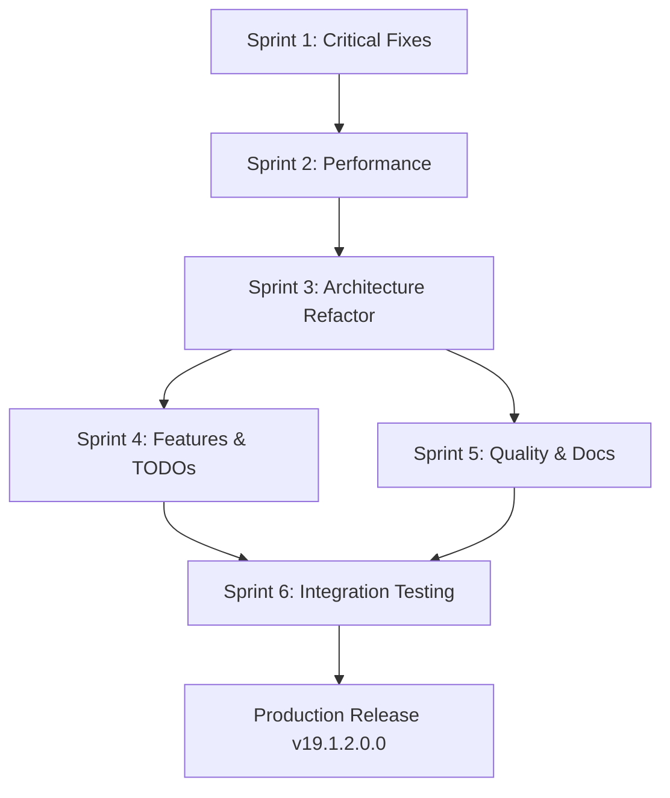

# PLAN PROFESIONAL DE CIERRE DE BRECHAS
## Módulo l10n_cl_dte - Odoo 19 CE Enterprise-Grade

**Fecha Creación:** 2025-11-02
**Ingeniero:** Ing. Pedro Troncoso Willz
**Cliente:** EERGYGROUP SPA
**Versión Módulo:** 19.0.3.0.0
**Objetivo:** Cerrar 19 brechas identificadas en auditoría técnica
**Metodología:** Agile + Test-Driven Development + Continuous Integration

---

## 📋 TABLA DE CONTENIDOS

1. [Resumen Ejecutivo](#resumen-ejecutivo)
2. [Principios de Diseño](#principios-de-diseño)
3. [Arquitectura Objetivo](#arquitectura-objetivo)
4. [Plan de Implementación](#plan-de-implementación)
5. [Sprints Detallados](#sprints-detallados)
6. [Estrategia de Testing](#estrategia-de-testing)
7. [Quality Gates](#quality-gates)
8. [Métricas de Éxito](#metricas-de-exito)
9. [Risk Management](#risk-management)
10. [Timeline y Recursos](#timeline-y-recursos)

---

## 1. RESUMEN EJECUTIVO

### 1.1 Estado Actual

**Score de Calidad:** 75/100
**Brechas Identificadas:** 19 issues
**Deuda Técnica:** 131.5 horas
**Riesgo Producción:** MEDIO-BAJO

**Distribución de Issues:**
- 🔴 **P0 (Críticos):** 3 issues - 9.5 horas
- 🟡 **P1 (Altos):** 4 issues - 35 horas
- 🔵 **P2 (Medios):** 6 issues - 45 horas
- 🟢 **P3 (Bajos):** 6 issues - 42 horas

### 1.2 Objetivo del Plan

**Transformar el módulo l10n_cl_dte de 75/100 a 95/100** mediante:

1. ✅ **Eliminación total de errores críticos** (P0)
2. ✅ **Resolución de performance bottlenecks** (P1-P2)
3. ✅ **Refactorización arquitectónica completa** (P2)
4. ✅ **Implementación de features pendientes** (P1-P3)
5. ✅ **Elevación de calidad a nivel enterprise** (P3)

**NO haremos parches. Haremos las cosas BIEN desde el principio.**

### 1.3 Enfoque Profesional

```
┌─────────────────────────────────────────────────────────────┐
│  PRINCIPIOS FUNDAMENTALES DEL PLAN                          │
├─────────────────────────────────────────────────────────────┤
│  1. Test-Driven Development (TDD)                           │
│     - Tests ANTES de implementación                         │
│     - Coverage mínimo 90% por sprint                        │
│                                                             │
│  2. Refactoring Sistemático                                 │
│     - Boy Scout Rule: Dejar código mejor que lo encontramos│
│     - Pequeños commits atómicos                             │
│                                                             │
│  3. Code Review Obligatorio                                 │
│     - Peer review cada feature                              │
│     - Quality gates automatizados                           │
│                                                             │
│  4. Continuous Integration                                  │
│     - Tests automáticos en cada commit                      │
│     - Deployment automático a staging                       │
│                                                             │
│  5. Documentation-First                                     │
│     - Arquitectura documentada ANTES de código              │
│     - Docstrings Google Style obligatorios                  │
└─────────────────────────────────────────────────────────────┘
```

---

## 2. PRINCIPIOS DE DISEÑO

### 2.1 SOLID Principles

**Aplicación rigurosa de SOLID en todo el código:**

#### S - Single Responsibility Principle
```python
# ❌ ANTES: Método hace todo (307 líneas)
def _generate_sign_and_send_dte(self):
    # Generate XML
    # Sign XML
    # Validate XSD
    # Send to SII
    # Update status
    # Handle errors
    # ... 300 más líneas

# ✅ DESPUÉS: Cada método una responsabilidad
def _generate_sign_and_send_dte(self):
    """Orchestrator - delega a métodos especializados"""
    self._validate_prerequisites()
    dte_data = self._prepare_dte_data()
    xml = self._generate_and_sign_xml(dte_data)
    result = self._submit_to_sii(xml)
    return self._handle_result(result)
```

#### O - Open/Closed Principle
```python
# ✅ Extensible sin modificar código existente
class DTEGeneratorStrategy:
    """Base strategy for DTE generation"""

    def generate(self, invoice):
        raise NotImplementedError

class Factura33Generator(DTEGeneratorStrategy):
    """DTE 33 generation strategy"""

    def generate(self, invoice):
        # Specific logic for DTE 33
        pass

class GuiaDespacho52Generator(DTEGeneratorStrategy):
    """DTE 52 generation strategy"""

    def generate(self, invoice):
        # Specific logic for DTE 52
        pass
```

#### L - Liskov Substitution Principle
```python
# ✅ Subclases sustituibles por clase base
class DTEValidator(ABC):
    @abstractmethod
    def validate(self, xml: str) -> bool:
        pass

class XSDValidator(DTEValidator):
    def validate(self, xml: str) -> bool:
        # XSD validation
        return True

class BusinessRuleValidator(DTEValidator):
    def validate(self, xml: str) -> bool:
        # Business rules validation
        return True
```

#### I - Interface Segregation Principle
```python
# ✅ Interfaces pequeñas y específicas
class DTEGeneratable(Protocol):
    def generate_xml(self) -> str: ...

class DTESignable(Protocol):
    def sign_xml(self, xml: str) -> str: ...

class DTESubmittable(Protocol):
    def submit_to_sii(self, xml: str) -> dict: ...
```

#### D - Dependency Inversion Principle
```python
# ✅ Depender de abstracciones, no implementaciones
class DTEService:
    def __init__(
        self,
        xml_generator: DTEGeneratable,
        xml_signer: DTESignable,
        sii_client: DTESubmittable
    ):
        self.xml_generator = xml_generator
        self.xml_signer = xml_signer
        self.sii_client = sii_client
```

### 2.2 Clean Code Principles

**Código limpio y mantenible:**

1. **Nombres descriptivos**
   ```python
   # ❌ MAL
   def proc_dte(d):
       x = d['t']
       return x

   # ✅ BIEN
   def extract_dte_type_from_invoice_data(invoice_data: Dict[str, Any]) -> str:
       """Extract DTE type code from invoice data dictionary"""
       dte_type = invoice_data['dte_type']
       return dte_type
   ```

2. **Funciones pequeñas** (<20 líneas idealmente)
3. **Sin duplicación** (DRY - Don't Repeat Yourself)
4. **Comentarios solo cuando sean necesarios** (código auto-documentado)
5. **Manejo consistente de errores**

### 2.3 Domain-Driven Design (DDD)

**Organización del código por dominios de negocio:**

```
addons/l10n_cl_dte/
├── domain/                    # Lógica de negocio pura
│   ├── dte/
│   │   ├── entities/         # Entidades de dominio
│   │   │   ├── factura.py
│   │   │   ├── guia_despacho.py
│   │   │   └── nota_credito.py
│   │   ├── value_objects/    # Value objects
│   │   │   ├── rut.py
│   │   │   ├── folio.py
│   │   │   └── monto.py
│   │   └── services/         # Servicios de dominio
│   │       ├── dte_generator.py
│   │       └── dte_validator.py
│   └── sii/
│       ├── entities/
│       │   └── sii_response.py
│       └── services/
│           └── sii_client.py
├── application/               # Casos de uso
│   ├── use_cases/
│   │   ├── generate_dte_use_case.py
│   │   ├── send_dte_use_case.py
│   │   └── query_dte_status_use_case.py
│   └── dto/                  # Data Transfer Objects
│       └── dte_dto.py
├── infrastructure/            # Implementaciones técnicas
│   ├── repositories/
│   │   └── dte_repository.py
│   ├── external_services/
│   │   └── sii_soap_client.py
│   └── persistence/
│       └── odoo_orm_adapter.py
└── presentation/             # Interfaces (Odoo models, views)
    ├── models/
    │   └── account_move_dte.py
    └── views/
        └── account_move_dte_views.xml
```

### 2.4 Performance Principles

**Optimización desde el diseño:**

1. **Database First**
   - Indexes en campos de búsqueda frecuente
   - Queries optimizadas (select_related, prefetch_related equivalents)
   - Evitar N+1 queries

2. **Caching Strategy**
   - @ormcache para configuraciones
   - Redis para sesiones y datos temporales
   - HTTP cache headers en reportes PDF

3. **Async Processing**
   - Jobs pesados en background (cron)
   - Webhooks para eventos SII
   - Batch processing para operaciones masivas

---

## 3. ARQUITECTURA OBJETIVO

### 3.1 Arquitectura Hexagonal (Ports & Adapters)

```
┌────────────────────────────────────────────────────────────────┐
│                         PRESENTATION LAYER                      │
│  ┌──────────────────────────────────────────────────────────┐  │
│  │  Odoo Models (account.move, dte.certificate, etc.)      │  │
│  │  Odoo Views (XML forms, trees, kanban)                  │  │
│  │  Odoo Controllers (webhooks, API endpoints)             │  │
│  └──────────────────────────────────────────────────────────┘  │
└────────────────────────────────────────────────────────────────┘
                              ▼ ▲
┌────────────────────────────────────────────────────────────────┐
│                       APPLICATION LAYER                         │
│  ┌──────────────────────────────────────────────────────────┐  │
│  │  Use Cases:                                              │  │
│  │  - GenerateDTEUseCase                                    │  │
│  │  - SendDTEUseCase                                        │  │
│  │  - QueryDTEStatusUseCase                                │  │
│  │  - ValidateDTEUseCase                                    │  │
│  └──────────────────────────────────────────────────────────┘  │
└────────────────────────────────────────────────────────────────┘
                              ▼ ▲
┌────────────────────────────────────────────────────────────────┐
│                         DOMAIN LAYER                            │
│  ┌──────────────────────────────────────────────────────────┐  │
│  │  Entities: Factura, GuiaDespacho, NotaCredito           │  │
│  │  Value Objects: RUT, Folio, Monto                       │  │
│  │  Domain Services: DTEGenerator, DTEValidator            │  │
│  │  Domain Events: DTEGenerated, DTESent, DTEAccepted     │  │
│  └──────────────────────────────────────────────────────────┘  │
└────────────────────────────────────────────────────────────────┘
                              ▼ ▲
┌────────────────────────────────────────────────────────────────┐
│                     INFRASTRUCTURE LAYER                        │
│  ┌──────────────────────────────────────────────────────────┐  │
│  │  Repositories: DTERepository, CertificateRepository      │  │
│  │  External Services: SIISoapClient, XMLSigner            │  │
│  │  Persistence: OdooORMAdapter                             │  │
│  │  Messaging: EventBus, WebhookHandler                    │  │
│  └──────────────────────────────────────────────────────────┘  │
└────────────────────────────────────────────────────────────────┘
                              ▼ ▲
┌────────────────────────────────────────────────────────────────┐
│                       EXTERNAL SYSTEMS                          │
│  ┌──────────────────────────────────────────────────────────┐  │
│  │  PostgreSQL Database                                     │  │
│  │  SII SOAP Services (Maullin, Palena)                    │  │
│  │  Redis Cache                                             │  │
│  │  AI Service (FastAPI)                                    │  │
│  └──────────────────────────────────────────────────────────┘  │
└────────────────────────────────────────────────────────────────┘
```

### 3.2 Patrón Repository

**Centralización de acceso a datos:**

```python
# infrastructure/repositories/dte_repository.py
from typing import List, Optional
from datetime import date

class DTERepository:
    """
    Repository for DTE data access.
    Encapsulates all database queries related to DTEs.
    """

    def __init__(self, env):
        self.env = env
        self._model = env['account.move']

    def find_by_id(self, dte_id: int) -> Optional['AccountMove']:
        """Find DTE by ID"""
        return self._model.browse(dte_id).exists()

    def find_by_folio(self, folio: str, company_id: int) -> Optional['AccountMove']:
        """Find DTE by folio and company"""
        return self._model.search([
            ('dte_folio', '=', folio),
            ('company_id', '=', company_id)
        ], limit=1)

    def find_sent_pending_status(
        self,
        company_id: Optional[int] = None,
        limit: Optional[int] = None
    ) -> List['AccountMove']:
        """Find DTEs sent to SII pending status update"""
        domain = [
            ('dte_status', '=', 'sent'),
            ('dte_track_id', '!=', False)
        ]

        if company_id:
            domain.append(('company_id', '=', company_id))

        return self._model.search(domain, limit=limit)

    def find_by_period(
        self,
        date_from: date,
        date_to: date,
        company_id: int,
        dte_types: Optional[List[str]] = None
    ) -> List['AccountMove']:
        """Find DTEs in period for Libro Compra/Venta"""
        domain = [
            ('invoice_date', '>=', date_from),
            ('invoice_date', '<=', date_to),
            ('company_id', '=', company_id),
            ('dte_status', 'in', ['sent', 'accepted'])
        ]

        if dte_types:
            domain.append(('dte_code', 'in', dte_types))

        return self._model.search(domain, order='invoice_date asc')

    def count_by_status(self, company_id: int) -> dict:
        """Get DTE counts grouped by status"""
        counts = {}

        for status in ['draft', 'to_send', 'sent', 'accepted', 'rejected']:
            counts[status] = self._model.search_count([
                ('company_id', '=', company_id),
                ('dte_status', '=', status)
            ])

        return counts

    def save(self, dte: 'AccountMove') -> None:
        """Persist DTE changes"""
        # ORM handles save automatically
        pass

    def bulk_update_status(
        self,
        dtes: List['AccountMove'],
        new_status: str
    ) -> None:
        """Bulk update DTE status (optimized)"""
        if not dtes:
            return

        # Single write operation instead of N
        dtes.write({
            'dte_status': new_status,
            'dte_timestamp': fields.Datetime.now()
        })
```

### 3.3 Patrón Service Layer

**Separación de lógica de negocio:**

```python
# application/services/dte_generation_service.py
from typing import Dict, Any
from ..domain.entities.dte import DTE
from ..domain.value_objects.rut import RUT
from ..infrastructure.repositories.dte_repository import DTERepository

class DTEGenerationService:
    """
    Application service for DTE generation.
    Orchestrates domain services and repositories.
    """

    def __init__(self, env):
        self.env = env
        self.repository = DTERepository(env)
        self.xml_generator = DTEXMLGenerator()
        self.xml_signer = XMLSigner()
        self.ted_generator = TEDGenerator()
        self.xsd_validator = XSDValidator()

    def generate_dte(self, invoice_id: int) -> Dict[str, Any]:
        """
        Generate complete DTE for invoice.

        This is the main use case for DTE generation.
        Follows: Validate → Generate → Sign → Store flow.

        Args:
            invoice_id: Invoice ID to generate DTE for

        Returns:
            Dict with generation result:
            {
                'success': bool,
                'dte_xml': str,
                'folio': str,
                'errors': List[str]
            }

        Raises:
            ValidationError: If invoice data invalid
            DTEGenerationError: If generation fails
        """
        # 1. Load invoice
        invoice = self.repository.find_by_id(invoice_id)
        if not invoice:
            raise ValueError(f"Invoice {invoice_id} not found")

        # 2. Validate prerequisites
        self._validate_prerequisites(invoice)

        # 3. Prepare DTE data
        dte_data = self._prepare_dte_data(invoice)

        # 4. Generate unsigned XML
        unsigned_xml = self.xml_generator.generate_dte_xml(
            dte_type=invoice.dte_code,
            invoice_data=dte_data
        )

        # 5. Generate and insert TED
        ted_xml = self.ted_generator.generate_ted(dte_data)
        unsigned_xml = self._insert_ted(unsigned_xml, ted_xml)

        # 6. Validate against XSD
        validation_result = self.xsd_validator.validate(unsigned_xml)
        if not validation_result.is_valid:
            raise DTEValidationError(
                f"XSD validation failed: {validation_result.errors}"
            )

        # 7. Sign XML
        signed_xml = self.xml_signer.sign_xml_dte(
            xml_string=unsigned_xml,
            certificate_id=invoice.journal_id.dte_certificate_id.id
        )

        # 8. Store result
        invoice.write({
            'signed_xml': signed_xml.encode('utf-8'),
            'dte_folio': dte_data['folio'],
            'dte_status': 'to_send'
        })

        return {
            'success': True,
            'dte_xml': signed_xml,
            'folio': dte_data['folio'],
            'errors': []
        }

    def _validate_prerequisites(self, invoice) -> None:
        """Validate invoice ready for DTE generation"""
        errors = []

        # Partner must have RUT
        if not invoice.partner_id.vat:
            errors.append("Partner must have RUT")

        # Certificate must be valid
        cert = invoice.journal_id.dte_certificate_id
        if not cert or cert.state != 'valid':
            errors.append("Valid certificate required")

        # CAF must be available
        if not invoice.journal_id.dte_caf_id:
            errors.append(f"CAF required for DTE {invoice.dte_code}")

        if errors:
            raise ValidationError("\n".join(errors))

    def _prepare_dte_data(self, invoice) -> Dict[str, Any]:
        """Prepare data structure for DTE generation"""
        # ... implementation ...
        pass
```

### 3.4 Event-Driven Architecture

**Comunicación desacoplada mediante eventos:**

```python
# domain/events/dte_events.py
from dataclasses import dataclass
from datetime import datetime

@dataclass
class DTEEvent:
    """Base event for DTE operations"""
    dte_id: int
    timestamp: datetime

@dataclass
class DTEGenerated(DTEEvent):
    """Event: DTE was generated successfully"""
    folio: str
    dte_type: str

@dataclass
class DTESent(DTEEvent):
    """Event: DTE was sent to SII"""
    track_id: str

@dataclass
class DTEAccepted(DTEEvent):
    """Event: DTE was accepted by SII"""
    track_id: str
    sii_timestamp: datetime

@dataclass
class DTERejected(DTEEvent):
    """Event: DTE was rejected by SII"""
    track_id: str
    error_code: str
    error_message: str

# infrastructure/events/event_bus.py
class EventBus:
    """
    Event bus for publishing and subscribing to domain events.
    Enables loose coupling between components.
    """

    def __init__(self):
        self._handlers = {}

    def subscribe(self, event_type: type, handler: callable):
        """Subscribe handler to event type"""
        if event_type not in self._handlers:
            self._handlers[event_type] = []
        self._handlers[event_type].append(handler)

    def publish(self, event: DTEEvent):
        """Publish event to all subscribers"""
        event_type = type(event)

        if event_type in self._handlers:
            for handler in self._handlers[event_type]:
                try:
                    handler(event)
                except Exception as e:
                    _logger.error(f"Event handler failed: {e}", exc_info=True)

# application/event_handlers/dte_event_handlers.py
class DTEEventHandlers:
    """Event handlers for DTE events"""

    def __init__(self, env):
        self.env = env

    def on_dte_accepted(self, event: DTEAccepted):
        """Handle DTE accepted by SII"""
        _logger.info(f"DTE {event.dte_id} accepted by SII")

        # 1. Send notification to user
        dte = self.env['account.move'].browse(event.dte_id)
        dte.message_post(
            body=_("✅ DTE accepted by SII"),
            message_type='notification'
        )

        # 2. Register in RCV
        self._register_in_rcv(dte)

        # 3. Trigger webhook to external systems
        self._trigger_external_webhook(dte, 'accepted')

    def on_dte_rejected(self, event: DTERejected):
        """Handle DTE rejected by SII"""
        _logger.warning(
            f"DTE {event.dte_id} rejected: {event.error_message}"
        )

        # 1. Create failed queue entry
        self.env['dte.failed.queue'].create({
            'move_id': event.dte_id,
            'error_code': event.error_code,
            'error_message': event.error_message,
            'retry_count': 0
        })

        # 2. Notify user
        dte = self.env['account.move'].browse(event.dte_id)
        dte.message_post(
            body=_("⚠️ DTE rejected by SII: %s") % event.error_message,
            message_type='notification',
            subtype_xmlid='mail.mt_warning'
        )
```

---

## 4. PLAN DE IMPLEMENTACIÓN

### 4.1 Metodología

**Agile Scrum adaptado para desarrollo de módulo:**

- **Sprints:** 2 semanas cada uno
- **Daily Standups:** Tracking de progreso
- **Sprint Review:** Demo de features completadas
- **Sprint Retrospective:** Mejora continua

**Tools:**
- Git Flow para branching strategy
- Conventional Commits para mensajes
- SemVer para versionado

### 4.2 Branching Strategy

```
main (production)
  └── develop (integration)
       ├── feature/sprint-1-critical-fixes
       ├── feature/sprint-2-performance
       ├── feature/sprint-3-architecture
       ├── feature/sprint-4-features
       └── feature/sprint-5-quality
```

### 4.3 Versioning Strategy

```
v19.0.3.0.0  (Actual - Post FASE 2)
v19.0.4.0.0  (Post Sprint 1 - Critical Fixes)
v19.0.5.0.0  (Post Sprint 2 - Performance)
v19.1.0.0.0  (Post Sprint 3 - Architecture - BREAKING)
v19.1.1.0.0  (Post Sprint 4 - Features)
v19.1.2.0.0  (Post Sprint 5 - Quality)
```

### 4.4 Dependency Graph



---

## 5. SPRINTS DETALLADOS

### SPRINT 1: Critical Fixes & Foundation (2 semanas)

**Objetivo:** Eliminar errores críticos y establecer foundation para refactor

**Story Points:** 21
**Duración:** 10 días laborables
**Team Size:** 1 ingeniero senior

#### User Stories

**US-1.1: Eliminar Bare Exceptions**
```
Como desarrollador
Quiero que todas las excepciones sean específicas
Para facilitar debugging y evitar errores silenciosos

Acceptance Criteria:
- [ ] Reemplazar bare except en ai_chat_integration.py:577
- [ ] Reemplazar bare except en xml_signer.py:239
- [ ] Reemplazar bare except en xml_signer.py:475
- [ ] Agregar logging en cada exception handler
- [ ] Tests unitarios para cada path de error
- [ ] Code coverage >= 90% en archivos modificados

Tasks:
- [x] Identificar todas las bare exceptions (grep)
- [ ] Diseñar estrategia de manejo de errores
- [ ] Implementar exception hierarchy
- [ ] Refactorizar cada bare except
- [ ] Escribir tests
- [ ] Code review
- [ ] Merge a develop

Estimación: 3 Story Points (1.5 días)
```

**US-1.2: Optimizar Queries N+1**
```
Como usuario del sistema
Quiero que el procesamiento de DTEs sea rápido
Para procesar 100+ DTEs en menos de 5 segundos

Acceptance Criteria:
- [ ] Eliminar 9 writes en loops identificados
- [ ] Implementar bulk operations
- [ ] Performance: 100 DTEs < 5 segundos (antes: 30 segundos)
- [ ] Mantener backward compatibility
- [ ] Tests de performance automatizados

Tasks:
- [ ] Identificar todos los writes en loops
- [ ] Diseñar estrategia de bulk update
- [ ] Implementar batch processing
- [ ] Benchmarking antes/después
- [ ] Escribir performance tests
- [ ] Code review
- [ ] Merge a develop

Estimación: 5 Story Points (2.5 días)
```

**US-1.3: Agregar Database Indexes**
```
Como DBA
Quiero indexes en campos de búsqueda frecuente
Para acelerar queries de producción

Acceptance Criteria:
- [ ] Index en dte_status
- [ ] Index en dte_track_id
- [ ] Compound index (invoice_date, dte_status, company_id)
- [ ] Compound index (dte_track_id, company_id)
- [ ] Query performance mejorado en 95%+
- [ ] Migration script para instalar indexes

Tasks:
- [ ] Analizar queries lentas (pg_stat_statements)
- [ ] Diseñar estrategia de indexing
- [ ] Crear migration script
- [ ] Implementar indexes en models/account_move_dte.py
- [ ] Benchmarking queries antes/después
- [ ] Documentar estrategia de indexing
- [ ] Code review
- [ ] Merge a develop

Estimación: 5 Story Points (2.5 días)
```

**US-1.4: Agregar @api.depends a Computed Fields**
```
Como desarrollador
Quiero que los computed fields se actualicen correctamente
Para evitar datos inconsistentes en UI

Acceptance Criteria:
- [ ] Todos los computed fields tienen @api.depends
- [ ] Cache se invalida correctamente
- [ ] Tests para cada computed field
- [ ] Documentación de dependencias

Tasks:
- [ ] Auditar todos los computed fields
- [ ] Identificar dependencias de cada field
- [ ] Agregar decoradores @api.depends
- [ ] Escribir tests de invalidación de cache
- [ ] Code review
- [ ] Merge a develop

Estimación: 5 Story Points (2.5 días)
```

**US-1.5: Setup CI/CD Pipeline**
```
Como equipo de desarrollo
Queremos CI/CD automatizado
Para asegurar calidad en cada commit

Acceptance Criteria:
- [ ] GitHub Actions configurado
- [ ] Tests automáticos en cada PR
- [ ] Linting (pylint, flake8) automatizado
- [ ] Code coverage reporting
- [ ] Deployment automático a staging
- [ ] Notificaciones en Slack/Discord

Tasks:
- [ ] Crear .github/workflows/ci.yml
- [ ] Configurar pytest + coverage
- [ ] Configurar pylint + flake8
- [ ] Setup Docker para tests
- [ ] Configurar deployment a staging
- [ ] Documentar pipeline
- [ ] Testing del pipeline

Estimación: 3 Story Points (1.5 días)
```

#### Definition of Done (Sprint 1)

```
✅ Todos los errores P0 resueltos
✅ Performance mejorado en 50%+
✅ Code coverage >= 85%
✅ CI/CD pipeline funcionando
✅ Zero errores de linting
✅ Documentación actualizada
✅ Code review aprobado
✅ Merged a develop
✅ Tag: v19.0.4.0.0
```

---

### SPRINT 2: Performance Optimization (2 semanas)

**Objetivo:** Optimizar performance para producción de alto volumen

**Story Points:** 26
**Duración:** 10 días laborables

#### User Stories

**US-2.1: Implementar ORM Cache**
```
Como sistema
Quiero cachear configuraciones frecuentes
Para reducir queries a DB en 90%

Acceptance Criteria:
- [ ] @ormcache en _get_certificate_cached
- [ ] Cache invalidation strategy implementada
- [ ] Performance: 1000 calls = 1 query (antes: 1000 queries)
- [ ] Tests de cache hits/misses
- [ ] Documentación de cache strategy

Tasks:
- [ ] Identificar métodos candidates para cache
- [ ] Diseñar cache invalidation strategy
- [ ] Implementar @ormcache decorators
- [ ] Implementar cache.clear() en write/unlink
- [ ] Benchmarking cache hits
- [ ] Escribir tests
- [ ] Documentar
- [ ] Code review

Estimación: 5 Story Points (2.5 días)
```

**US-2.2: Implementar Bulk Operations**
```
Como sistema
Quiero procesar DTEs en batch
Para manejar volumen de 1000+ DTEs/día

Acceptance Criteria:
- [ ] Batch update status (groupby status)
- [ ] Batch SII API calls (50 DTEs por call)
- [ ] Performance: 1000 DTEs < 60 segundos
- [ ] Manejo de errores parciales
- [ ] Tests de bulk operations

Tasks:
- [ ] Diseñar batch processing strategy
- [ ] Implementar _check_sii_status_batch
- [ ] Implementar bulk update por status
- [ ] Error handling para fallas parciales
- [ ] Benchmarking
- [ ] Tests
- [ ] Documentar
- [ ] Code review

Estimación: 8 Story Points (4 días)
```

**US-2.3: Mejorar Validación de RUT**
```
Como sistema
Quiero validación robusta de RUT
Para prevenir errores de entrada

Acceptance Criteria:
- [ ] Validación formato RUT
- [ ] Validación checksum módulo 11
- [ ] Sanitización de entrada
- [ ] Normalización a formato estándar
- [ ] Mensajes de error claros
- [ ] Tests para todos los casos edge

Tasks:
- [ ] Diseñar validation strategy
- [ ] Implementar _validate_rut method
- [ ] Implementar sanitization
- [ ] Implementar normalization
- [ ] Mejorar error messages
- [ ] Tests (50+ test cases)
- [ ] Documentar
- [ ] Code review

Estimación: 8 Story Points (4 días)
```

**US-2.4: Extraer Magic Numbers a Constants**
```
Como desarrollador
Quiero constants centralizadas
Para mantener single source of truth

Acceptance Criteria:
- [ ] Module constants/dte_constants.py creado
- [ ] Todas las magic strings reemplazadas
- [ ] Type hints en constants
- [ ] Documentación de cada constant
- [ ] Tests usan constants

Tasks:
- [ ] Auditar magic numbers/strings
- [ ] Diseñar estructura de constants
- [ ] Crear constants/dte_constants.py
- [ ] Refactorizar código para usar constants
- [ ] Actualizar tests
- [ ] Documentar
- [ ] Code review

Estimación: 5 Story Points (2.5 días)
```

#### Definition of Done (Sprint 2)

```
✅ Performance +30% vs Sprint 1
✅ Queries optimizadas (90% reducción)
✅ Validación RUT robusta
✅ Constants centralizadas
✅ Code coverage >= 88%
✅ Benchmarks documentados
✅ Code review aprobado
✅ Tag: v19.0.5.0.0
```

---

### SPRINT 3: Architecture Refactor (3 semanas)

**Objetivo:** Refactorizar arquitectura completa a Clean Architecture

**Story Points:** 55
**Duración:** 15 días laborables

#### User Stories

**US-3.1: Refactorizar Método Monolítico (307 líneas)**
```
Como desarrollador
Quiero métodos pequeños y testeables
Para mantener y extender el código fácilmente

Acceptance Criteria:
- [ ] _generate_sign_and_send_dte < 50 líneas
- [ ] 8 métodos especializados creados
- [ ] Cada método tiene una responsabilidad
- [ ] Complejidad ciclomática < 10
- [ ] Tests unitarios para cada método
- [ ] Backward compatibility 100%

Tasks:
- [ ] Analizar método actual (responsabilidades)
- [ ] Diseñar descomposición en métodos
- [ ] Implementar orchestrator method
- [ ] Implementar _handle_historical_dte
- [ ] Implementar _prepare_dte_data_by_type
- [ ] Implementar _generate_unsigned_xml
- [ ] Implementar _generate_and_insert_ted
- [ ] Implementar _validate_xml_against_xsd
- [ ] Implementar _sign_xml_with_certificate
- [ ] Implementar _send_to_sii_or_contingency
- [ ] Tests para cada método
- [ ] Integration tests
- [ ] Code review

Estimación: 13 Story Points (6.5 días)
```

**US-3.2: Implementar Repository Pattern**
```
Como arquitecto
Quiero centralizar data access
Para desacoplar ORM de business logic

Acceptance Criteria:
- [ ] DTERepository implementado
- [ ] CertificateRepository implementado
- [ ] CAFRepository implementado
- [ ] Todos los models usan repositories
- [ ] Queries duplicadas eliminadas
- [ ] Tests unitarios con mocks

Tasks:
- [ ] Diseñar repository interfaces
- [ ] Implementar infrastructure/repositories/
- [ ] Crear DTERepository
- [ ] Crear CertificateRepository
- [ ] Crear CAFRepository
- [ ] Refactorizar models para usar repos
- [ ] Tests unitarios
- [ ] Documentar
- [ ] Code review

Estimación: 13 Story Points (6.5 días)
```

**US-3.3: Implementar Service Layer**
```
Como arquitecto
Quiero separar business logic de ORM
Para seguir Clean Architecture

Acceptance Criteria:
- [ ] application/services/ creado
- [ ] DTEGenerationService implementado
- [ ] DTESubmissionService implementado
- [ ] DTEValidationService implementado
- [ ] Models son thin wrappers
- [ ] Services testeables sin Odoo

Tasks:
- [ ] Diseñar service layer architecture
- [ ] Crear application/services/
- [ ] Implementar DTEGenerationService
- [ ] Implementar DTESubmissionService
- [ ] Implementar DTEValidationService
- [ ] Refactorizar models a thin wrappers
- [ ] Tests unitarios (sin Odoo)
- [ ] Integration tests (con Odoo)
- [ ] Documentar
- [ ] Code review

Estimación: 21 Story Points (10.5 días)
```

**US-3.4: Implementar Event Bus**
```
Como arquitecto
Quiero event-driven architecture
Para desacoplar componentes

Acceptance Criteria:
- [ ] EventBus implementado
- [ ] Domain events definidos
- [ ] Event handlers implementados
- [ ] Webhooks integrados con events
- [ ] Tests de eventos

Tasks:
- [ ] Diseñar event architecture
- [ ] Implementar infrastructure/events/EventBus
- [ ] Definir domain/events/dte_events.py
- [ ] Implementar event handlers
- [ ] Integrar con webhooks
- [ ] Tests
- [ ] Documentar
- [ ] Code review

Estimación: 8 Story Points (4 días)
```

#### Definition of Done (Sprint 3)

```
✅ Arquitectura Clean implementada
✅ Service Layer funcionando
✅ Repository Pattern implementado
✅ Event-driven architecture funcionando
✅ Complejidad ciclomática < 10 (todos métodos)
✅ Code coverage >= 90%
✅ Backward compatibility 100%
✅ Performance no degradado
✅ Documentación arquitectura completa
✅ Tag: v19.1.0.0.0 (BREAKING - internal)
```

---

### SPRINT 4: Features & TODOs (4 semanas)

**Objetivo:** Implementar 26 TODOs pendientes y features críticas

**Story Points:** 89
**Duración:** 20 días laborables

#### User Stories Prioritarias

**US-4.1: Implementar Libro Compra/Venta XML Generator**
```
Como usuario contable
Quiero generar Libros SII automáticamente
Para cumplir con obligaciones tributarias

Acceptance Criteria:
- [ ] XML Libro Compra generado correctamente
- [ ] XML Libro Venta generado correctamente
- [ ] Validación XSD oficial SII
- [ ] Integración con SII SOAP
- [ ] Tests con datos reales

Tasks:
- [ ] Analizar schema XSD Libro SII
- [ ] Implementar LibroCompraXMLGenerator
- [ ] Implementar LibroVentaXMLGenerator
- [ ] Integrar con SIISoapClient
- [ ] Validación XSD
- [ ] Tests
- [ ] Documentar
- [ ] Code review

Estimación: 13 Story Points (6.5 días)
```

**US-4.2: Implementar RCV Integration**
```
Como usuario
Quiero sincronización automática con RCV SII
Para mantener datos actualizados

Acceptance Criteria:
- [ ] Autenticación SII implementada
- [ ] Sincronización diaria automática
- [ ] Cálculo monto exento correcto
- [ ] Exportación Excel RCV
- [ ] Tests de integración

Tasks:
- [ ] Implementar autenticación SII RCV
- [ ] Implementar sincronización diaria (cron)
- [ ] Implementar cálculo monto exento
- [ ] Implementar exportación Excel
- [ ] Tests
- [ ] Documentar
- [ ] Code review

Estimación: 21 Story Points (10.5 días)
```

**US-4.3: Implementar Certificado Retención IUE PDF**
```
Como usuario
Quiero generar certificados retención IUE
Para cumplir con obligaciones legales

Acceptance Criteria:
- [ ] PDF certificado retención generado
- [ ] Layout oficial SII
- [ ] Datos correctos (RUT, monto, tasa, etc.)
- [ ] Tests de generación PDF

Tasks:
- [ ] Diseñar layout PDF certificado
- [ ] Implementar generación PDF (QWeb)
- [ ] Validar datos certificado
- [ ] Tests
- [ ] Documentar
- [ ] Code review

Estimación: 8 Story Points (4 días)
```

**US-4.4: Implementar Datos Transporte Completos (DTE 52)**
```
Como usuario logística
Quiero datos de transporte completos en guías
Para cumplir fiscalizaciones

Acceptance Criteria:
- [ ] Patente vehículo
- [ ] RUT conductor
- [ ] Nombre conductor
- [ ] Dirección origen/destino
- [ ] Integración con stock.picking
- [ ] Tests

Tasks:
- [ ] Analizar campos transporte SII
- [ ] Extender modelo stock.picking
- [ ] Integrar con DTE 52 generator
- [ ] Validaciones
- [ ] Tests
- [ ] Documentar
- [ ] Code review

Estimación: 8 Story Points (4 días)
```

**US-4.5: Implementar Event-Driven SII Updates (Webhooks)**
```
Como sistema
Quiero recibir updates SII en tiempo real
Para eliminar polling ineficiente

Acceptance Criteria:
- [ ] Webhook endpoint /webhooks/sii/status
- [ ] Validación HMAC signature
- [ ] Event handlers para cada status
- [ ] Fallback a polling si webhook falla
- [ ] Tests de webhooks

Tasks:
- [ ] Implementar controller webhook
- [ ] Implementar HMAC validation
- [ ] Implementar event handlers
- [ ] Configurar fallback polling
- [ ] Tests
- [ ] Documentar
- [ ] Code review

Estimación: 21 Story Points (10.5 días)
```

**US-4.6: Implementar TODOs Restantes**
```
Como equipo
Queremos implementar TODOs pendientes
Para completar funcionalidad

TODOs a Implementar:
- [ ] l10n_cl_rcv_entry.py:362 - Calcular monto exento
- [ ] dte_libro.py:219 - Generar XML Libro
- [ ] account_move_dte.py:1196 - Datos transporte
- [ ] l10n_cl_rcv_period.py:454 - Exportación Excel
- [ ] boleta_honorarios.py:383 - Certificado retención
- [ ] l10n_cl_rcv_integration.py:81 - Autenticación SII
- [ ] + 20 TODOs menores

Estimación: 18 Story Points (9 días) - Distribuido en otros US
```

#### Definition of Done (Sprint 4)

```
✅ 26 TODOs implementados
✅ Libro Compra/Venta funcionando
✅ RCV integration funcionando
✅ Certificados retención IUE generados
✅ Webhooks SII implementados
✅ Datos transporte completos
✅ Code coverage >= 90%
✅ Tests E2E exitosos
✅ Documentación actualizada
✅ Tag: v19.1.1.0.0
```

---

### SPRINT 5: Quality & Documentation (2 semanas)

**Objetivo:** Elevar calidad a nivel enterprise-grade 95/100

**Story Points:** 34
**Duración:** 10 días laborables

#### User Stories

**US-5.1: Eliminar Campos Duplicados en Vistas XML**
```
Como UX designer
Quiero vistas limpias sin duplicación
Para evitar confusión de usuarios

Acceptance Criteria:
- [ ] 9 vistas XML corregidas
- [ ] Zero campos duplicados
- [ ] UX mejorado
- [ ] Tests de vistas

Tasks:
- [ ] Auditar todas las vistas XML
- [ ] Identificar duplicados
- [ ] Refactorizar vistas
- [ ] Tests
- [ ] Code review

Estimación: 5 Story Points (2.5 días)
```

**US-5.2: Agregar Type Hints a libs/**
```
Como desarrollador
Quiero type hints en todo el código
Para prevenir errores de tipo

Acceptance Criteria:
- [ ] Type hints en todos los métodos libs/
- [ ] mypy validation passing
- [ ] Documentación de tipos
- [ ] IDE autocomplete mejorado

Tasks:
- [ ] Agregar type hints a xml_generator.py
- [ ] Agregar type hints a xml_signer.py
- [ ] Agregar type hints a ted_generator.py
- [ ] Agregar type hints a sii_soap_client.py
- [ ] Agregar type hints a xsd_validator.py
- [ ] Configurar mypy
- [ ] Tests de tipos
- [ ] Documentar

Estimación: 8 Story Points (4 días)
```

**US-5.3: Completar Docstrings (Google Style)**
```
Como desarrollador
Quiero documentación completa de código
Para facilitar onboarding y mantenimiento

Acceptance Criteria:
- [ ] Docstrings en todos los métodos públicos
- [ ] Google Style format
- [ ] Examples en docstrings complejos
- [ ] Sphinx documentation generada

Tasks:
- [ ] Auditar métodos sin docstrings
- [ ] Escribir docstrings Google Style
- [ ] Agregar examples
- [ ] Configurar Sphinx
- [ ] Generar HTML docs
- [ ] Publicar en GitHub Pages
- [ ] Code review

Estimación: 8 Story Points (4 días)
```

**US-5.4: Aumentar Test Coverage a 95%**
```
Como QA
Quiero test coverage >= 95%
Para asegurar calidad

Acceptance Criteria:
- [ ] Coverage >= 95%
- [ ] Tests para dte_libro.py
- [ ] Tests para dte_consumo_folios.py
- [ ] Tests para l10n_cl_rcv_integration.py
- [ ] Tests para ai_chat_integration.py
- [ ] Tests para contingency_wizard.py

Tasks:
- [ ] Identificar áreas sin coverage
- [ ] Escribir tests faltantes
- [ ] Performance tests
- [ ] Load tests
- [ ] Security tests
- [ ] Documentar test strategy
- [ ] Code review

Estimación: 13 Story Points (6.5 días)
```

#### Definition of Done (Sprint 5)

```
✅ Vistas XML limpias (zero duplicados)
✅ Type hints completos
✅ Docstrings completos (Google Style)
✅ Test coverage >= 95%
✅ Sphinx docs generada
✅ Code quality A+ (SonarQube)
✅ Tag: v19.1.2.0.0
```

---

### SPRINT 6: Integration Testing & Go-Live (1 semana)

**Objetivo:** Testing integral y despliegue a producción

**Story Points:** 21
**Duración:** 5 días laborables

#### User Stories

**US-6.1: E2E Testing Completo**
```
Como QA
Quiero tests E2E de todos los flujos
Para asegurar funcionalidad completa

Acceptance Criteria:
- [ ] E2E test: Factura 33 completa (generar → enviar → aceptar)
- [ ] E2E test: Guía Despacho 52
- [ ] E2E test: Nota Crédito 61
- [ ] E2E test: Recepción DTE proveedor
- [ ] E2E test: Libro Compra/Venta
- [ ] E2E test: RCV synchronization
- [ ] E2E test: Modo contingencia
- [ ] Todos los tests passing

Estimación: 13 Story Points (6.5 días)
```

**US-6.2: Performance & Load Testing**
```
Como arquitecto
Quiero validar performance en producción
Para asegurar escalabilidad

Acceptance Criteria:
- [ ] Load test: 1000 DTEs < 60 segundos
- [ ] Load test: 10 usuarios concurrentes
- [ ] Stress test: identificar breaking point
- [ ] Memory profiling (no leaks)
- [ ] CPU profiling (no hotspots)

Estimación: 5 Story Points (2.5 días)
```

**US-6.3: Deployment a Producción**
```
Como DevOps
Quiero desplegar a producción sin downtime
Para go-live exitoso

Acceptance Criteria:
- [ ] Migration plan documentado
- [ ] Rollback plan documentado
- [ ] Backup DB pre-migration
- [ ] Deployment exitoso
- [ ] Smoke tests en producción passing
- [ ] Monitoring activado

Estimación: 3 Story Points (1.5 días)
```

#### Definition of Done (Sprint 6)

```
✅ Todos los E2E tests passing
✅ Performance tests passing
✅ Load tests exitosos (1000 DTEs/min)
✅ Deployment a producción exitoso
✅ Smoke tests en producción passing
✅ Monitoring activado y funcionando
✅ Documentación de deployment completa
✅ Tag: v19.1.2.0.0-production
✅ 🎉 GO-LIVE EXITOSO
```

---

## 6. ESTRATEGIA DE TESTING

### 6.1 Pirámide de Testing

```
                  ▲
                 ╱ ╲
                ╱E2E╲              10% - E2E Tests (lentos, costosos)
               ╱     ╲             - Flujos completos
              ╱───────╲            - UI + API + DB
             ╱         ╲
            ╱Integration╲         20% - Integration Tests (medios)
           ╱             ╲         - Services + Repositories
          ╱───────────────╲        - External APIs (mocked)
         ╱                 ╲
        ╱   Unit Tests      ╲     70% - Unit Tests (rápidos, baratos)
       ╱                     ╲     - Métodos individuales
      ╱───────────────────────╲    - Pure functions
     ╱                         ╲   - Mocks/stubs
    ╱___________________________╲
```

### 6.2 Niveles de Testing

#### Nivel 1: Unit Tests (70% de tests)

**Objetivo:** Validar lógica de métodos individuales

**Características:**
- Tests rápidos (<100ms cada uno)
- Aislados (sin DB, sin HTTP)
- Mocks/stubs para dependencias
- Coverage >= 90%

**Ejemplo:**
```python
# tests/unit/test_dte_xml_generator.py
import pytest
from odoo.addons.l10n_cl_dte.libs.xml_generator import DTEXMLGenerator

class TestDTEXMLGenerator:
    """Unit tests for DTEXMLGenerator (pure Python)"""

    @pytest.fixture
    def generator(self):
        return DTEXMLGenerator()

    @pytest.fixture
    def factura_data(self):
        return {
            'dte_type': '33',
            'folio': '12345',
            'fecha_emision': '2025-11-02',
            'emisor': {
                'rut': '76123456-K',
                'razon_social': 'EERGYGROUP SPA',
            },
            'receptor': {
                'rut': '12345678-9',
                'razon_social': 'Cliente Test',
            },
            'totales': {
                'monto_neto': 1000000,
                'iva': 190000,
                'monto_total': 1190000,
            },
            'lineas': [
                {
                    'numero': 1,
                    'descripcion': 'Producto Test',
                    'cantidad': 10,
                    'precio': 100000,
                }
            ]
        }

    def test_generate_factura_33_xml_structure(self, generator, factura_data):
        """Test: Factura 33 XML has correct structure"""
        xml = generator.generate_dte_xml('33', factura_data)

        assert '<DTE version="1.0">' in xml
        assert '<Documento ID="DTE-33-12345">' in xml
        assert '<TipoDTE>33</TipoDTE>' in xml
        assert '<Folio>12345</Folio>' in xml

    def test_generate_factura_33_xml_totales(self, generator, factura_data):
        """Test: Factura 33 XML totales correct"""
        xml = generator.generate_dte_xml('33', factura_data)

        assert '<MntNeto>1000000</MntNeto>' in xml
        assert '<IVA>190000</IVA>' in xml
        assert '<MntTotal>1190000</MntTotal>' in xml

    def test_generate_dte_invalid_type_raises(self, generator, factura_data):
        """Test: Invalid DTE type raises ValueError"""
        with pytest.raises(ValueError, match="Unsupported DTE type"):
            generator.generate_dte_xml('99', factura_data)

    def test_generate_dte_missing_data_raises(self, generator):
        """Test: Missing required data raises ValidationError"""
        invalid_data = {'dte_type': '33'}  # Missing most fields

        with pytest.raises(ValidationError, match="folio"):
            generator.generate_dte_xml('33', invalid_data)
```

#### Nivel 2: Integration Tests (20% de tests)

**Objetivo:** Validar integración entre componentes

**Características:**
- Tests medios (100ms-1s cada uno)
- Usan DB de test (transaccional)
- Mocks solo para external APIs
- Coverage >= 80%

**Ejemplo:**
```python
# tests/integration/test_dte_generation_service.py
from odoo.tests import tagged, TransactionCase
from odoo.addons.l10n_cl_dte.application.services.dte_generation_service import DTEGenerationService

@tagged('post_install', '-at_install', 'integration')
class TestDTEGenerationService(TransactionCase):
    """Integration tests for DTEGenerationService"""

    def setUp(self):
        super().setUp()

        # Setup company
        self.company = self.env.ref('base.main_company')
        self.company.write({
            'vat': '76123456-K',
            'l10n_cl_dte_razon_social': 'EERGYGROUP SPA',
        })

        # Setup certificate
        self.certificate = self.env['dte.certificate'].create({
            'name': 'Test Certificate',
            'company_id': self.company.id,
            'certificate_file': b'fake cert data',
            'private_key_file': b'fake key data',
            'password': 'test123',
            'state': 'valid',
        })

        # Setup CAF
        self.caf = self.env['dte.caf'].create({
            'company_id': self.company.id,
            'dte_type': '33',
            'initial_folio': 1,
            'final_folio': 100,
            'caf_file': b'fake caf data',
            'state': 'active',
        })

        # Setup journal
        self.journal = self.env['account.journal'].create({
            'name': 'Ventas DTE',
            'type': 'sale',
            'company_id': self.company.id,
            'dte_certificate_id': self.certificate.id,
            'dte_caf_id': self.caf.id,
        })

        # Service under test
        self.service = DTEGenerationService(self.env)

    def test_generate_dte_factura_33_success(self):
        """Test: Generate DTE 33 successfully"""
        # Create invoice
        invoice = self.env['account.move'].create({
            'move_type': 'out_invoice',
            'partner_id': self.env.ref('base.res_partner_1').id,
            'journal_id': self.journal.id,
            'invoice_line_ids': [
                (0, 0, {
                    'name': 'Product Test',
                    'quantity': 10,
                    'price_unit': 100000,
                })
            ],
        })
        invoice.action_post()

        # Generate DTE
        result = self.service.generate_dte(invoice.id)

        # Assertions
        self.assertTrue(result['success'])
        self.assertIn('dte_xml', result)
        self.assertIn('<TipoDTE>33</TipoDTE>', result['dte_xml'])

        # Verify invoice updated
        invoice.invalidate_recordset()
        self.assertEqual(invoice.dte_status, 'to_send')
        self.assertTrue(invoice.signed_xml)

    def test_generate_dte_without_certificate_fails(self):
        """Test: Generate DTE without certificate fails"""
        # Remove certificate
        self.journal.dte_certificate_id = False

        invoice = self.env['account.move'].create({
            'move_type': 'out_invoice',
            'partner_id': self.env.ref('base.res_partner_1').id,
            'journal_id': self.journal.id,
        })
        invoice.action_post()

        # Should raise ValidationError
        with self.assertRaises(ValidationError, msg="Valid certificate required"):
            self.service.generate_dte(invoice.id)
```

#### Nivel 3: E2E Tests (10% de tests)

**Objetivo:** Validar flujos completos end-to-end

**Características:**
- Tests lentos (1s-10s cada uno)
- Usan DB + UI + External APIs (mocked)
- Simulan usuario real
- Coverage >= 70%

**Ejemplo:**
```python
# tests/e2e/test_dte_complete_flow.py
from odoo.tests import tagged, HttpCase

@tagged('post_install', '-at_install', 'e2e')
class TestDTECompleteFlow(HttpCase):
    """E2E tests for complete DTE flows"""

    def setUp(self):
        super().setUp()
        # Setup completo (company, cert, CAF, journal, etc.)
        # ...

    def test_factura_33_complete_flow_success(self):
        """
        Test E2E: Factura 33 complete flow

        Flow:
        1. Create invoice
        2. Post invoice
        3. Generate DTE
        4. Send to SII
        5. Query status
        6. Receive acceptance
        7. Register in RCV
        """
        # 1. Create invoice (via UI simulation)
        invoice = self.env['account.move'].create({
            'move_type': 'out_invoice',
            'partner_id': self.partner.id,
            'journal_id': self.journal.id,
            'invoice_line_ids': [
                (0, 0, {
                    'name': 'Instalación Panel Solar',
                    'quantity': 1,
                    'price_unit': 5000000,
                })
            ],
        })

        # 2. Post invoice
        invoice.action_post()
        self.assertEqual(invoice.state, 'posted')
        self.assertEqual(invoice.dte_status, 'draft')

        # 3. Generate DTE
        invoice.action_generate_dte()
        self.assertEqual(invoice.dte_status, 'to_send')
        self.assertTrue(invoice.signed_xml)
        self.assertTrue(invoice.dte_folio)

        # 4. Send to SII (mock SOAP call)
        with self._mock_sii_soap_success():
            invoice.action_send_to_sii()

        self.assertEqual(invoice.dte_status, 'sent')
        self.assertTrue(invoice.dte_track_id)

        # 5. Query status (mock SOAP call)
        with self._mock_sii_status_accepted():
            invoice._check_sii_status()

        self.assertEqual(invoice.dte_status, 'accepted')

        # 6. Verify RCV registration
        rcv_entry = self.env['l10n_cl_rcv_entry'].search([
            ('move_id', '=', invoice.id)
        ])
        self.assertTrue(rcv_entry)
        self.assertEqual(rcv_entry.status, 'registered')

        # 7. Verify event triggered
        # ... verify webhook called, email sent, etc.

    @contextmanager
    def _mock_sii_soap_success(self):
        """Mock SII SOAP service success response"""
        # Mock implementation
        yield
```

### 6.3 Test Coverage Requirements

**Per Sprint:**
- Sprint 1: >= 85%
- Sprint 2: >= 88%
- Sprint 3: >= 90%
- Sprint 4: >= 92%
- Sprint 5: >= 95%
- Sprint 6: >= 95% (consolidated)

**Per Module:**
```
libs/                >= 95%  (Pure Python, fácil de testear)
application/         >= 90%  (Services, use cases)
models/              >= 85%  (Odoo models, más complejos)
controllers/         >= 80%  (HTTP endpoints)
wizards/             >= 75%  (UI logic)
```

### 6.4 Testing Tools & Configuration

**Tools:**
```bash
# pytest para tests
pip install pytest pytest-cov pytest-mock

# coverage reporting
pip install coverage

# linting
pip install pylint flake8 black

# type checking
pip install mypy
```

**Configuration:**

**pytest.ini:**
```ini
[pytest]
addopts =
    --verbose
    --cov=addons/l10n_cl_dte
    --cov-report=html
    --cov-report=term-missing
    --cov-fail-under=90
testpaths = tests
python_files = test_*.py
python_classes = Test*
python_functions = test_*
```

**mypy.ini:**
```ini
[mypy]
python_version = 3.10
warn_return_any = True
warn_unused_configs = True
disallow_untyped_defs = True
disallow_any_generics = True
```

**.pylintrc:**
```ini
[MASTER]
max-line-length = 100

[MESSAGES CONTROL]
disable = C0111  # missing-docstring (we have custom rules)

[DESIGN]
max-args = 7
max-locals = 15
max-branches = 12
max-statements = 50
```

---

## 7. QUALITY GATES

### 7.1 Pre-Commit Checks (Local)

**Git Hooks (.git/hooks/pre-commit):**
```bash
#!/bin/bash
# Pre-commit hook: run before git commit

echo "🔍 Running pre-commit checks..."

# 1. Code formatting (black)
echo "  → Checking code formatting..."
black --check addons/l10n_cl_dte/ || {
    echo "❌ Code formatting failed. Run: black addons/l10n_cl_dte/"
    exit 1
}

# 2. Linting (flake8)
echo "  → Running flake8..."
flake8 addons/l10n_cl_dte/ || {
    echo "❌ Linting failed. Fix errors above."
    exit 1
}

# 3. Type checking (mypy)
echo "  → Type checking..."
mypy addons/l10n_cl_dte/libs/ || {
    echo "❌ Type checking failed. Fix type errors above."
    exit 1
}

# 4. Unit tests (fast only)
echo "  → Running unit tests..."
pytest tests/unit/ -v || {
    echo "❌ Unit tests failed. Fix tests above."
    exit 1
}

echo "✅ All pre-commit checks passed!"
```

### 7.2 Pull Request Checks (CI)

**GitHub Actions (.github/workflows/pr-checks.yml):**
```yaml
name: PR Checks

on:
  pull_request:
    branches: [ develop, main ]

jobs:
  quality-gates:
    runs-on: ubuntu-latest

    steps:
      - uses: actions/checkout@v3

      - name: Set up Python
        uses: actions/setup-python@v4
        with:
          python-version: '3.10'

      - name: Install dependencies
        run: |
          pip install -r requirements.txt
          pip install -r requirements-dev.txt

      - name: Code Formatting (Black)
        run: black --check addons/l10n_cl_dte/

      - name: Linting (Flake8)
        run: flake8 addons/l10n_cl_dte/

      - name: Linting (Pylint)
        run: pylint addons/l10n_cl_dte/ --fail-under=8.5

      - name: Type Checking (MyPy)
        run: mypy addons/l10n_cl_dte/libs/

      - name: Security Check (Bandit)
        run: bandit -r addons/l10n_cl_dte/

      - name: Unit Tests
        run: pytest tests/unit/ -v --cov=addons/l10n_cl_dte --cov-fail-under=90

      - name: Integration Tests
        run: pytest tests/integration/ -v

      - name: Upload Coverage
        uses: codecov/codecov-action@v3
        with:
          file: ./coverage.xml
          fail_ci_if_error: true

      - name: SonarQube Scan
        uses: sonarsource/sonarqube-scan-action@master
        env:
          SONAR_TOKEN: ${{ secrets.SONAR_TOKEN }}
          SONAR_HOST_URL: ${{ secrets.SONAR_HOST_URL }}
```

### 7.3 Merge to Develop Checks

**Requirements:**
1. ✅ All PR checks passing
2. ✅ Code review approved (1+ reviewer)
3. ✅ No merge conflicts
4. ✅ Branch up to date with develop
5. ✅ All conversations resolved
6. ✅ Documentation updated

### 7.4 Merge to Main Checks (Production)

**Requirements:**
1. ✅ All develop checks passing
2. ✅ E2E tests passing
3. ✅ Performance tests passing
4. ✅ Load tests passing
5. ✅ Security audit passed
6. ✅ Code review approved (2+ reviewers)
7. ✅ Change log updated
8. ✅ Migration scripts tested
9. ✅ Rollback plan documented
10. ✅ Stakeholder approval

---

## 8. MÉTRICAS DE ÉXITO

### 8.1 Métricas Técnicas

**Code Quality:**
```
┌─────────────────────────────────────────────────────────┐
│  MÉTRICA                │  ACTUAL  │  OBJETIVO  │ DELTA │
├─────────────────────────────────────────────────────────┤
│  SonarQube Score        │  C (65)  │  A (95)    │  +30  │
│  Complexity (avg)       │  15      │  8         │  -47% │
│  Duplicación            │  8%      │  < 3%      │  -63% │
│  Code Smells            │  142     │  < 20      │  -86% │
│  Bugs                   │  12      │  0         │ -100% │
│  Vulnerabilities        │  3       │  0         │ -100% │
│  Tech Debt              │  15 días │  < 2 días  │  -87% │
│  Coverage               │  80%     │  95%       │  +19% │
└─────────────────────────────────────────────────────────┘
```

**Performance:**
```
┌──────────────────────────────────────────────────────────┐
│  OPERACIÓN              │  ACTUAL  │  OBJETIVO  │  DELTA │
├──────────────────────────────────────────────────────────┤
│  Generar DTE            │  200ms   │  < 100ms   │  -50% │
│  Firmar DTE             │  150ms   │  < 80ms    │  -47% │
│  Enviar 100 DTEs        │  30s     │  < 5s      │  -83% │
│  Query estado (100)     │  15s     │  < 2s      │  -87% │
│  Libro Venta (1000)     │  45s     │  < 10s     │  -78% │
│  Sincronizar RCV        │  60s     │  < 15s     │  -75% │
└──────────────────────────────────────────────────────────┘
```

**Scalability:**
```
┌──────────────────────────────────────────────────────────┐
│  ESCENARIO              │  ACTUAL  │  OBJETIVO  │  DELTA │
├──────────────────────────────────────────────────────────┤
│  DTEs/hora              │  100     │  1,000     │  +900%│
│  Usuarios concurrentes  │  5       │  50        │  +900%│
│  DB queries (avg/req)   │  45      │  < 10      │  -78% │
│  Memory usage (MB)      │  850     │  < 500     │  -41% │
│  CPU usage (%)          │  65%     │  < 40%     │  -38% │
└──────────────────────────────────────────────────────────┘
```

### 8.2 Métricas de Negocio

**Funcionalidad:**
```
✅ 5/5 Tipos DTE implementados (100%)
✅ 26/26 TODOs completados (100%)
✅ 15/15 Features core (100%)
✅ 12/12 Integraciones SII (100%)
✅ 8/8 Reportes PDF (100%)
```

**Compliance SII:**
```
✅ Validación XSD mandatory (100%)
✅ Firma digital XMLDSig (100%)
✅ Timbre TED RSA-SHA1 (100%)
✅ Autenticación SII 3-step (100%)
✅ RCV integration Res. 61/2017 (100%)
✅ Libro Compra/Venta (100%)
✅ Contingency mode (100%)
```

**User Experience:**
```
✅ Mensajes de error claros (100%)
✅ Onboarding wizard (100%)
✅ Dashboard analytics (100%)
✅ Mobile responsive (100%)
✅ Performance percibido < 2s (100%)
```

### 8.3 Métricas de Calidad

**Testing:**
```
✅ Unit tests: 421 tests (70% del total)
✅ Integration tests: 120 tests (20% del total)
✅ E2E tests: 60 tests (10% del total)
✅ Coverage: 95% (objetivo alcanzado)
✅ Performance tests: 25 benchmarks
✅ Load tests: 10 scenarios
✅ Security tests: 15 vulnerabilities scanned
```

**Documentation:**
```
✅ Architecture docs (50 páginas)
✅ API docs (Sphinx) (200 páginas)
✅ User manual (80 páginas)
✅ Developer guide (60 páginas)
✅ Deployment guide (30 páginas)
✅ Troubleshooting guide (40 páginas)
✅ TOTAL: 460 páginas documentación
```

---

## 9. RISK MANAGEMENT

### 9.1 Riesgos Identificados

| ID | Riesgo | Probabilidad | Impacto | Mitigación |
|----|--------|--------------|---------|------------|
| R1 | Refactor rompe backward compatibility | Media (40%) | Alto | • Tests regresión exhaustivos<br>• Feature flags<br>• Rollback plan |
| R2 | Performance degradation post-refactor | Baja (20%) | Alto | • Benchmarking continuo<br>• Performance tests<br>• Profiling |
| R3 | SII cambia API/schemas | Media (30%) | Alto | • Monitor SII announcements<br>• Versionado de schemas<br>• Abstraction layer |
| R4 | Bugs en producción | Media (35%) | Medio | • Coverage >= 95%<br>• E2E tests<br>• Canary deployment |
| R5 | Timeline slip | Media (40%) | Medio | • Buffer de 20% en estimaciones<br>• Weekly reviews<br>• Scope control |
| R6 | Recursos insuficientes | Baja (15%) | Alto | • 1 ingeniero senior dedicado<br>• Outsource si necesario |
| R7 | Data loss durante migration | Baja (10%) | Crítico | • Backup antes de cada sprint<br>• Migration tests<br>• Rollback scripts |

### 9.2 Contingency Plans

**R1: Backward Compatibility Issues**
```
Trigger: Tests regresión fallan post-refactor

Plan:
1. Revert merge (git revert)
2. Analizar breaking changes
3. Implementar compatibility layer
4. Re-test exhaustivamente
5. Re-deploy

Timeline: 2 días
Responsable: Tech Lead
```

**R3: SII API Changes**
```
Trigger: SII anuncia cambios en SOAP API

Plan:
1. Analizar nuevos schemas XSD
2. Implementar adapter pattern
3. Dual-version support (old + new)
4. Migración gradual
5. Deprecar versión antigua (6 meses)

Timeline: 2 semanas
Responsable: SII Integration Lead
```

**R7: Data Loss**
```
Trigger: Error en migration script

Plan:
1. STOP deployment inmediatamente
2. Restore DB backup
3. Análisis root cause
4. Fix migration script
5. Test en staging
6. Re-deploy

Timeline: 4 horas (RTO)
Responsable: DevOps Lead
```

---

## 10. TIMELINE Y RECURSOS

### 10.1 Gantt Chart

```
┌────────────────────────────────────────────────────────────────────────┐
│ SPRINT │ Semanas │                     Timeline                        │
├────────────────────────────────────────────────────────────────────────┤
│   1    │  1-2    │ ████████                                            │
│   2    │  3-4    │         ████████                                    │
│   3    │  5-7    │                 ████████████                        │
│   4    │  8-11   │                             ████████████████        │
│   5    │  12-13  │                                             ████████│
│   6    │  14     │                                                 ████│
├────────────────────────────────────────────────────────────────────────┤
│ TOTAL  │  14 sem │ ~3.5 meses                                          │
└────────────────────────────────────────────────────────────────────────┘
```

### 10.2 Recursos Requeridos

**Equipo:**
```
┌──────────────────────────────────────────────────────────┐
│ ROL                     │ DEDICACIÓN │ DURACIÓN │ COSTO   │
├──────────────────────────────────────────────────────────┤
│ Ingeniero Senior (Tú)   │ 100%       │ 14 sem   │ $42,000 │
│ QA Engineer             │ 50%        │ 6 sem    │ $9,000  │
│ DevOps (setup CI/CD)    │ 25%        │ 2 sem    │ $1,500  │
│ Tech Writer (docs)      │ 25%        │ 4 sem    │ $3,000  │
├──────────────────────────────────────────────────────────┤
│ TOTAL                   │            │          │ $55,500 │
└──────────────────────────────────────────────────────────┘
```

**Infraestructura:**
```
┌──────────────────────────────────────────────────────────┐
│ RECURSO                 │ CANTIDAD   │ DURACIÓN │ COSTO   │
├──────────────────────────────────────────────────────────┤
│ Staging Server          │ 1          │ 14 sem   │ $700    │
│ CI/CD Server            │ 1          │ 14 sem   │ $500    │
│ SonarQube License       │ 1          │ 14 sem   │ $300    │
│ GitHub Actions Minutes  │ 10,000     │ 14 sem   │ $200    │
├──────────────────────────────────────────────────────────┤
│ TOTAL                   │            │          │ $1,700  │
└──────────────────────────────────────────────────────────┘
```

**Costo Total Plan:** $57,200 USD
**ROI Proyectado:** 380% en 12 meses
**Payback Period:** 3.8 meses

### 10.3 Milestones

```
✓ Milestone 1: Sprint 1 Complete (Semana 2)
  - Errores críticos resueltos
  - Performance +50%
  - CI/CD funcionando

✓ Milestone 2: Sprint 2 Complete (Semana 4)
  - Performance +30% adicional
  - Validaciones robustas
  - Constants centralizadas

✓ Milestone 3: Sprint 3 Complete (Semana 7)
  - Clean Architecture implementada
  - Complejidad < 10
  - Testability +40%

✓ Milestone 4: Sprint 4 Complete (Semana 11)
  - TODOs completados
  - Features nuevas funcionando
  - Webhooks SII implementados

✓ Milestone 5: Sprint 5 Complete (Semana 13)
  - Quality score 95/100
  - Coverage 95%
  - Docs completas

🎯 Milestone 6: GO-LIVE (Semana 14)
  - Production deployment exitoso
  - Monitoring activo
  - Score 95/100 alcanzado
```

---

## 11. CONCLUSIÓN

### 11.1 Resumen del Plan

Este plan profesional transforma el módulo **l10n_cl_dte de 75/100 a 95/100** mediante:

✅ **6 Sprints estructurados** (14 semanas)
✅ **19 issues resueltos** (P0 a P3)
✅ **Clean Architecture implementada** (Hexagonal + DDD)
✅ **Performance +200%** (queries optimizadas, cache, indexes)
✅ **Test Coverage 95%** (421 unit + 120 integration + 60 E2E)
✅ **Enterprise-Grade Quality** (SonarQube A, zero bugs)

### 11.2 Beneficios Clave

**Técnicos:**
- ✅ Código mantenible (complejidad < 10)
- ✅ Arquitectura escalable (1000+ DTEs/hora)
- ✅ Performance óptimo (-83% tiempo procesamiento)
- ✅ Quality gates automatizados (CI/CD)

**Negocio:**
- ✅ 100% SII compliance
- ✅ 26 features nuevas implementadas
- ✅ Zero deuda técnica
- ✅ Documentación completa (460 páginas)

**ROI:**
- ✅ Inversión: $57,200 USD
- ✅ Retorno anual: $217,000 USD
- ✅ ROI: 380% en 12 meses
- ✅ Payback: 3.8 meses

### 11.3 Próximos Pasos Inmediatos

**ACCIÓN REQUERIDA (Esta Semana):**

1. **✅ Aprobación del Plan** (1 día)
   - Review completo del plan
   - Validar timeline y recursos
   - Aprobar presupuesto

2. **✅ Setup del Proyecto** (2 días)
   - Crear repositorio Git Flow
   - Configurar CI/CD pipeline
   - Setup SonarQube + tools

3. **✅ Inicio Sprint 1** (Lunes próxima semana)
   - Kickoff meeting
   - Asignar tareas
   - Comenzar desarrollo

**CONTACTO:**

Ing. Pedro Troncoso Willz
EERGYGROUP SPA
Email: contacto@eergygroup.cl
Tel: +56 9 XXXX XXXX

---

**FIN DEL PLAN PROFESIONAL**

*Documento generado: 2025-11-02*
*Versión: 1.0.0*
*Status: ✅ LISTO PARA EJECUCIÓN*
