# 🏗️ ARQUITECTURA TÉCNICA: Disaster Recovery + Contingency Mode

**Documento:** Especificación Técnica Enterprise-Grade
**Versión:** 1.0.0
**Fecha:** 2025-10-24
**Audiencia:** Desarrolladores, DevOps, Arquitectos

---

## 📐 ARQUITECTURA GENERAL

### **Stack Simplificado (Post-Migración)**

```
┌─────────────────────────────────────────────────────────────────┐
│                         ODOO 19 CE                              │
│                                                                 │
│  ┌──────────────────────────────────────────────────────────┐  │
│  │  UI Layer (Views + Wizards)                              │  │
│  │  - dte_backup_views.xml                                  │  │
│  │  - dte_failed_queue_views.xml                            │  │
│  │  - dte_contingency_views.xml                             │  │
│  │  - contingency_wizard.py                                 │  │
│  └──────────────────────────────────────────────────────────┘  │
│                           ↓                                     │
│  ┌──────────────────────────────────────────────────────────┐  │
│  │  Business Logic Layer (Models)                           │  │
│  │  - account_move_dte.py (DTE generation + integration)    │  │
│  │  - dte_backup.py (Backup manager)                        │  │
│  │  - dte_failed_queue.py (Retry queue)                     │  │
│  │  - dte_contingency.py (Contingency status)               │  │
│  └──────────────────────────────────────────────────────────┘  │
│                           ↓                                     │
│  ┌──────────────────────────────────────────────────────────┐  │
│  │  Technical Library Layer (libs/)                         │  │
│  │  - xml_generator.py (DTE XML generation)                 │  │
│  │  - xml_signer.py (XMLDSig signature)                     │  │
│  │  - sii_soap_client.py (SOAP client)                      │  │
│  │  - ted_generator.py (TED timbre)                         │  │
│  │  - xsd_validator.py (XSD validation)                     │  │
│  └──────────────────────────────────────────────────────────┘  │
│                           ↓                                     │
│  ┌──────────────────────────────────────────────────────────┐  │
│  │  Scheduler Layer (ir.cron)                               │  │
│  │  - Retry Failed DTEs (every 1h)                          │  │
│  │  - Cleanup Old Backups (every 1w, optional)              │  │
│  └──────────────────────────────────────────────────────────┘  │
└─────────────────────────────────────────────────────────────────┘
                           ↓
┌─────────────────────────────────────────────────────────────────┐
│                    PostgreSQL 15                                │
│  - dte.backup (backups table)                                   │
│  - dte.failed.queue (retry queue)                               │
│  - dte.contingency (status global)                              │
│  - dte.contingency.pending (DTEs pendientes)                    │
│  - ir.attachment (XML files)                                    │
└─────────────────────────────────────────────────────────────────┘
                           ↓
                    ┌──────────┐
                    │   SII    │
                    │ (SOAP)   │
                    └──────────┘
```

---

## 🔄 FLUJO 1: DTE EXITOSO (Happy Path)

```mermaid
sequenceDiagram
    participant U as Usuario Odoo
    participant M as account.move
    participant L as libs/ (Native)
    participant B as dte.backup
    participant P as PostgreSQL
    participant A as ir.attachment
    participant S as SII SOAP

    U->>M: action_send_to_sii()
    M->>M: _validate_dte_data()
    M->>M: _generate_sign_and_send_dte()

    M->>L: generate_dte_xml()
    L-->>M: unsigned_xml

    M->>L: sign_xml()
    L-->>M: signed_xml

    M->>S: send_dte_to_sii()
    S-->>M: {success: true, track_id: 'ABC123'}

    M->>B: backup_dte(signed_xml, track_id)
    B->>P: INSERT INTO dte_backup
    B->>A: CREATE ir.attachment (XML file)
    B-->>M: backup_id

    M->>M: UPDATE dte_status='sent'
    M-->>U: ✅ DTE enviado exitosamente
```



**Código:**
```python
# account_move_dte.py:464
if sii_result.get('success'):
    # ✅ ÉXITO - Backup automático
    self.env['dte.backup'].backup_dte(
        dte_type=self.dte_code,
        folio=dte_data['folio'],
        xml_content=signed_xml,
        track_id=sii_result.get('track_id'),
        move_id=self.id,
        rut_emisor=self.company_id.vat
    )
```

---

## ⚠️ FLUJO 2: DTE FALLIDO (Error Path + Retry)

```mermaid
sequenceDiagram
    participant U as Usuario Odoo
    participant M as account.move
    participant F as dte.failed.queue
    participant C as ir.cron (1h)
    participant P as PostgreSQL
    participant S as SII SOAP
    participant B as dte.backup

    U->>M: action_send_to_sii()
    M->>M: _generate_sign_and_send_dte()
    M->>S: send_dte_to_sii()
    S-->>M: {success: false, error: 'SII Timeout'}

    M->>F: add_failed_dte(xml, error_type='timeout')
    F->>P: INSERT INTO dte_failed_queue
    F->>F: next_retry = now() + 1h
    F-->>M: failed_queue_id

    M->>M: UPDATE dte_status='rejected'
    M-->>U: ⚠️ DTE falló, será reintentado en 1h

    Note over C: 1 hora después...

    C->>F: _cron_retry_failed_dtes()
    F->>F: SEARCH next_retry_date <= now
    F->>F: retry_send()
    F->>S: send_dte_to_sii() [RETRY 1]

    alt Retry Success
        S-->>F: {success: true, track_id: 'XYZ789'}
        F->>B: backup_dte(xml, track_id)
        F->>M: UPDATE dte_status='sent'
        F->>F: UPDATE state='success'
    else Retry Fail
        S-->>F: {success: false, error: 'Still timeout'}
        F->>F: retry_count++
        F->>F: next_retry = now() + 2h (exponential backoff)
        F->>F: UPDATE state='pending'
    end
```



**Código:**
```python
# account_move_dte.py:502
else:
    # ❌ FALLO - Agregar a failed queue
    error_type = 'timeout' if 'timeout' in error_msg.lower() else 'unknown'

    self.env['dte.failed.queue'].add_failed_dte(
        dte_type=self.dte_code,
        folio=dte_data['folio'],
        xml_content=signed_xml,
        error_type=error_type,
        error_message=error_msg,
        move_id=self.id
    )
```

**Exponential Backoff Strategy:**
```python
# dte_failed_queue.py:205
def _calculate_next_retry_date(self, retry_count):
    backoff_hours = 2 ** retry_count
    return fields.Datetime.now() + timedelta(hours=backoff_hours)

# Retry 1: 1h  (2^0 = 1)
# Retry 2: 2h  (2^1 = 2)
# Retry 3: 4h  (2^2 = 4)
# Retry 4: 8h  (2^3 = 8)
# Retry 5: 16h (2^4 = 16)
# After 5: ABANDONED
```

---

## 🔴 FLUJO 3: CONTINGENCY MODE (SII Caído)

```mermaid
sequenceDiagram
    participant U as Usuario Odoo
    participant W as contingency.wizard
    participant C as dte.contingency
    participant M as account.move
    participant P as dte.contingency.pending
    participant D as PostgreSQL
    participant S as SII SOAP

    Note over S: SII está CAÍDO (timeout 3x consecutivos)

    U->>W: Abrir wizard contingencia
    W->>W: _compute_current_status()
    W-->>U: Status: Disabled

    U->>W: Seleccionar "Enable Contingency"
    W->>C: enable_contingency(reason='sii_unavailable')
    C->>D: UPDATE dte_contingency SET enabled=True
    C->>C: Log audit trail
    C-->>W: enabled=True
    W-->>U: ✅ Modo contingencia ACTIVADO

    Note over U,M: Usuario crea facturas normalmente...

    U->>M: action_send_to_sii()
    M->>C: get_status()
    C-->>M: {enabled: True, reason: 'sii_unavailable'}

    alt Contingency Enabled
        M->>P: store_pending_dte(xml_content)
        P->>D: INSERT INTO dte_contingency_pending
        P-->>M: pending_id
        M->>M: UPDATE dte_status='contingency'
        M-->>U: ⚠️ DTE almacenado (contingencia)
    end

    Note over S: SII vuelve online...

    U->>W: Seleccionar "Upload Pending DTEs"
    W->>C: upload_pending_batch(batch_size=50)
    C->>P: SEARCH uploaded=False LIMIT 50
    P-->>C: [50 DTEs pendientes]

    loop Para cada DTE pendiente
        C->>S: send_dte_to_sii()
        S-->>C: {success: true, track_id: 'ABC123'}
        C->>P: UPDATE uploaded=True, track_id='ABC123'
        C->>M: UPDATE dte_status='sent'
    end

    U->>W: Seleccionar "Disable Contingency"
    W->>C: disable_contingency()
    C->>D: UPDATE dte_contingency SET enabled=False
    C-->>U: ✅ Modo contingencia DESACTIVADO
```



**Código:**
```python
# account_move_dte.py (integración contingencia - debe implementarse)
def action_send_to_sii(self):
    # Verificar modo contingencia
    contingency = self.env['dte.contingency'].get_status(
        company_id=self.company_id.id
    )

    if contingency.get('enabled'):
        # Modo contingencia: NO enviar a SII
        # Almacenar en dte.contingency.pending
        self.env['dte.contingency.pending'].create({
            'dte_type': self.dte_code,
            'folio': self.dte_folio,
            'rut_emisor': self.company_id.vat,
            'xml_content': base64.b64encode(signed_xml.encode()),
            'move_id': self.id,
            'company_id': self.company_id.id
        })

        self.write({
            'dte_status': 'contingency',
            'is_contingency': True
        })

        return {
            'type': 'ir.actions.client',
            'tag': 'display_notification',
            'params': {
                'message': _('DTE almacenado en modo contingencia. '
                            'Será enviado al SII cuando el servicio vuelva.'),
                'type': 'warning',
                'sticky': False
            }
        }

    # Normal: enviar a SII
    result = self._generate_sign_and_send_dte()
    ...
```

---

## 🗄️ SCHEMA DATABASE

### **dte.backup**
```sql
CREATE TABLE dte_backup (
    id SERIAL PRIMARY KEY,
    dte_type VARCHAR(2) NOT NULL,          -- '33', '34', '52', '56', '61'
    folio VARCHAR(50) NOT NULL,
    rut_emisor VARCHAR(12) NOT NULL,
    xml_content BYTEA NOT NULL,            -- XML firmado (base64)
    track_id VARCHAR(100),                 -- SII track ID
    sent_date TIMESTAMP NOT NULL,
    company_id INTEGER NOT NULL REFERENCES res_company(id),
    move_id INTEGER NOT NULL REFERENCES account_move(id) ON DELETE CASCADE,
    display_name VARCHAR(255),
    xml_filename VARCHAR(255),

    -- Indexes para búsqueda rápida
    INDEX idx_dte_backup_company (company_id),
    INDEX idx_dte_backup_type (dte_type),
    INDEX idx_dte_backup_folio (folio),
    INDEX idx_dte_backup_date (sent_date DESC),
    INDEX idx_dte_backup_track (track_id),

    -- Constraint: un backup por DTE
    UNIQUE (dte_type, folio, company_id)
);
```

### **dte.failed.queue**
```sql
CREATE TABLE dte_failed_queue (
    id SERIAL PRIMARY KEY,
    dte_type VARCHAR(2) NOT NULL,
    folio VARCHAR(50) NOT NULL,
    rut_emisor VARCHAR(12) NOT NULL,
    xml_content BYTEA NOT NULL,
    error_type VARCHAR(20) NOT NULL,       -- 'timeout', 'connection', etc.
    error_message TEXT NOT NULL,
    retry_count INTEGER DEFAULT 0 NOT NULL,
    max_retries INTEGER DEFAULT 5 NOT NULL,
    failed_date TIMESTAMP NOT NULL,
    last_retry_date TIMESTAMP,
    next_retry_date TIMESTAMP,             -- ⭐ KEY: para búsqueda cron
    state VARCHAR(20) DEFAULT 'pending',   -- pending, retrying, success, abandoned
    success_track_id VARCHAR(100),
    success_date TIMESTAMP,
    retry_history TEXT,
    company_id INTEGER NOT NULL REFERENCES res_company(id),
    move_id INTEGER NOT NULL REFERENCES account_move(id) ON DELETE CASCADE,
    display_name VARCHAR(255),

    -- Indexes críticos para performance
    INDEX idx_failed_queue_state (state),
    INDEX idx_failed_queue_next_retry (next_retry_date),  -- ⭐ Usado por cron
    INDEX idx_failed_queue_company (company_id),
    INDEX idx_failed_queue_type (dte_type),

    -- Constraint: evitar duplicados en cola
    UNIQUE (dte_type, folio, company_id, state) WHERE state IN ('pending', 'retrying')
);
```

### **dte.contingency**
```sql
CREATE TABLE dte_contingency (
    id SERIAL PRIMARY KEY,
    enabled BOOLEAN DEFAULT FALSE NOT NULL,
    reason VARCHAR(50),                    -- 'manual', 'sii_unavailable', etc.
    comment TEXT,
    enabled_date TIMESTAMP,
    enabled_by INTEGER REFERENCES res_users(id),
    disabled_date TIMESTAMP,
    disabled_by INTEGER REFERENCES res_users(id),
    company_id INTEGER NOT NULL REFERENCES res_company(id),

    -- Constraint: singleton por empresa
    UNIQUE (company_id)
);
```

### **dte.contingency.pending**
```sql
CREATE TABLE dte_contingency_pending (
    id SERIAL PRIMARY KEY,
    dte_type VARCHAR(2) NOT NULL,
    folio VARCHAR(50) NOT NULL,
    rut_emisor VARCHAR(12) NOT NULL,
    xml_content BYTEA NOT NULL,
    stored_date TIMESTAMP NOT NULL,
    uploaded BOOLEAN DEFAULT FALSE NOT NULL,
    uploaded_date TIMESTAMP,
    track_id VARCHAR(100),
    upload_error TEXT,
    company_id INTEGER NOT NULL REFERENCES res_company(id),
    move_id INTEGER NOT NULL REFERENCES account_move(id) ON DELETE CASCADE,
    display_name VARCHAR(255),

    -- Indexes para búsqueda rápida
    INDEX idx_contingency_pending_uploaded (uploaded),
    INDEX idx_contingency_pending_company (company_id),
    INDEX idx_contingency_pending_date (stored_date),

    -- Constraint: un DTE pending por factura
    UNIQUE (move_id)
);
```

---

## ⚙️ IR.CRON SCHEDULERS

### **Retry Failed DTEs (cada 1 hora)**
```xml
<record id="ir_cron_retry_failed_dtes" model="ir.cron">
    <field name="name">DTE: Retry Failed DTEs (every 1 hour)</field>
    <field name="model_id" ref="model_dte_failed_queue"/>
    <field name="state">code</field>
    <field name="code">model._cron_retry_failed_dtes()</field>
    <field name="interval_number">1</field>
    <field name="interval_type">hours</field>
    <field name="active">True</field>
    <field name="priority">5</field>
</record>
```

**Implementación:**
```python
# dte_failed_queue.py:395
@api.model
def _cron_retry_failed_dtes(self):
    """
    Scheduled action (ir.cron): Retry failed DTEs.

    Called every 1 hour.
    """
    _logger.info("🔄 CRON: Retry Failed DTEs started")

    # Search DTEs pending retry (next_retry_date <= now)
    pending_dtes = self.search([
        ('state', '=', 'pending'),
        ('next_retry_date', '<=', fields.Datetime.now())
    ], order='next_retry_date asc', limit=100)

    if not pending_dtes:
        _logger.info("No pending DTEs to retry")
        return

    _logger.info(f"Found {len(pending_dtes)} DTEs to retry")

    # Retry each DTE
    success_count = 0
    fail_count = 0
    abandoned_count = 0

    for dte in pending_dtes:
        try:
            result = dte.retry_send()

            if result:
                success_count += 1
            elif dte.state == 'abandoned':
                abandoned_count += 1
            else:
                fail_count += 1

        except Exception as e:
            _logger.error(f"Error retrying DTE {dte.folio}: {e}", exc_info=True)
            fail_count += 1

    _logger.info(
        f"✅ CRON: Retry completed - "
        f"Success: {success_count}, "
        f"Failed: {fail_count}, "
        f"Abandoned: {abandoned_count}"
    )
```

---

## 📊 MÉTRICAS Y MONITORING

### **Dashboard KPIs (Recomendado)**

```python
# models/dte_dashboard.py (crear opcional)
class DTEDashboard(models.Model):
    _name = 'dte.dashboard'
    _description = 'DTE Monitoring Dashboard'

    # KPIs Computed
    failed_queue_count = fields.Integer(
        compute='_compute_failed_queue_count'
    )

    retry_success_rate = fields.Float(
        compute='_compute_retry_success_rate',
        string='Retry Success Rate (%)'
    )

    contingency_active = fields.Boolean(
        compute='_compute_contingency_active'
    )

    pending_contingency_count = fields.Integer(
        compute='_compute_pending_contingency_count'
    )

    backup_storage_mb = fields.Float(
        compute='_compute_backup_storage',
        string='Backup Storage (MB)'
    )

    @api.depends('company_id')
    def _compute_failed_queue_count(self):
        for dashboard in self:
            dashboard.failed_queue_count = self.env['dte.failed.queue'].search_count([
                ('company_id', '=', dashboard.company_id.id),
                ('state', 'in', ['pending', 'retrying'])
            ])

    @api.depends('company_id')
    def _compute_retry_success_rate(self):
        for dashboard in self:
            total = self.env['dte.failed.queue'].search_count([
                ('company_id', '=', dashboard.company_id.id)
            ])
            success = self.env['dte.failed.queue'].search_count([
                ('company_id', '=', dashboard.company_id.id),
                ('state', '=', 'success')
            ])

            dashboard.retry_success_rate = (success / total * 100) if total > 0 else 0
```

### **Alertas Automáticas (Recomendado)**

```python
# models/dte_failed_queue.py (agregar método)
@api.model
def _check_critical_alerts(self):
    """
    Check critical alerts and send notifications.

    Called every 1 hour via ir.cron (opcional).
    """
    # Alerta 1: Más de 10 DTEs en failed queue
    failed_count = self.search_count([('state', 'in', ['pending', 'retrying'])])

    if failed_count > 10:
        # Send email to admin
        self.env['mail.mail'].create({
            'subject': f'⚠️ ALERTA: {failed_count} DTEs fallidos en cola',
            'body_html': f'<p>Hay {failed_count} DTEs en la cola de reintentos.</p>',
            'email_to': 'admin@eergygroup.cl'
        }).send()

    # Alerta 2: Tasa de éxito retry < 80%
    total = self.search_count([])
    success = self.search_count([('state', '=', 'success')])

    if total > 0:
        success_rate = success / total * 100
        if success_rate < 80:
            # Send email
            pass

    # Alerta 3: Modo contingencia activo >24h
    contingency = self.env['dte.contingency'].search([('enabled', '=', True)])
    for c in contingency:
        hours_active = (fields.Datetime.now() - c.enabled_date).total_seconds() / 3600
        if hours_active > 24:
            # Send critical alert
            pass
```

---

## 🔒 SECURITY & PERMISSIONS

### **Access Control Lists (ACL)**

```csv
# security/ir.model.access.csv
id,name,model_id:id,group_id:id,perm_read,perm_write,perm_create,perm_unlink

# DTE Backup
access_dte_backup_user,dte.backup user,model_dte_backup,l10n_cl_dte.group_dte_user,1,0,0,0
access_dte_backup_manager,dte.backup manager,model_dte_backup,l10n_cl_dte.group_dte_manager,1,1,1,1

# Failed Queue
access_dte_failed_queue_user,dte.failed.queue user,model_dte_failed_queue,l10n_cl_dte.group_dte_user,1,0,0,0
access_dte_failed_queue_manager,dte.failed.queue manager,model_dte_failed_queue,l10n_cl_dte.group_dte_manager,1,1,1,1

# Contingency
access_dte_contingency_user,dte.contingency user,model_dte_contingency,l10n_cl_dte.group_dte_user,1,0,0,0
access_dte_contingency_manager,dte.contingency manager,model_dte_contingency,l10n_cl_dte.group_dte_manager,1,1,1,0

# Contingency Pending
access_dte_contingency_pending_user,dte.contingency.pending user,model_dte_contingency_pending,l10n_cl_dte.group_dte_user,1,0,0,0
access_dte_contingency_pending_manager,dte.contingency.pending manager,model_dte_contingency_pending,l10n_cl_dte.group_dte_manager,1,1,1,1
```

### **Record Rules (Multi-Company)**

```xml
<!-- security/security.xml -->
<record id="dte_backup_company_rule" model="ir.rule">
    <field name="name">DTE Backup Multi-Company</field>
    <field name="model_id" ref="model_dte_backup"/>
    <field name="domain_force">[('company_id', 'in', company_ids)]</field>
</record>

<record id="dte_failed_queue_company_rule" model="ir.rule">
    <field name="name">DTE Failed Queue Multi-Company</field>
    <field name="model_id" ref="model_dte_failed_queue"/>
    <field name="domain_force">[('company_id', 'in', company_ids)]</field>
</record>
```

---

## 📚 API REFERENCE

### **dte.backup**

#### `backup_dte(dte_type, folio, xml_content, track_id, move_id, rut_emisor=None)`
Backup automático de DTE exitoso con doble respaldo.

**Args:**
- `dte_type` (str): Tipo de DTE ('33', '34', '52', '56', '61')
- `folio` (str): Número de folio
- `xml_content` (str): XML firmado (string ISO-8859-1)
- `track_id` (str): Track ID del SII
- `move_id` (int): ID de account.move
- `rut_emisor` (str, opcional): RUT emisor

**Returns:**
- `dte.backup`: Registro de backup creado

**Ejemplo:**
```python
backup = self.env['dte.backup'].backup_dte(
    dte_type='33',
    folio='12345',
    xml_content='<?xml version...',
    track_id='ABC123',
    move_id=42,
    rut_emisor='76123456-7'
)
```

---

### **dte.failed.queue**

#### `add_failed_dte(dte_type, folio, xml_content, error_type, error_message, move_id, rut_emisor=None)`
Agregar DTE fallido a cola de reintentos.

**Args:**
- `dte_type` (str): Tipo de DTE
- `folio` (str): Número de folio
- `xml_content` (str): XML firmado
- `error_type` (str): 'timeout', 'connection', 'unavailable', 'validation', 'certificate', 'unknown'
- `error_message` (str): Mensaje de error
- `move_id` (int): ID de account.move
- `rut_emisor` (str, opcional): RUT emisor

**Returns:**
- `dte.failed.queue`: Registro creado

**Ejemplo:**
```python
failed = self.env['dte.failed.queue'].add_failed_dte(
    dte_type='33',
    folio='12345',
    xml_content='<?xml version...',
    error_type='timeout',
    error_message='SII timeout after 60s',
    move_id=42
)
```

---

## 🧪 TESTING GUIDE

### **Test 1: Backup Automático**
```python
# tests/test_dte_backup.py
def test_backup_dte_success(self):
    """Test backup automático de DTE exitoso"""
    # Arrange
    move = self.create_test_invoice()
    xml_content = '<DTE>...</DTE>'

    # Act
    backup = self.env['dte.backup'].backup_dte(
        dte_type='33',
        folio='12345',
        xml_content=xml_content,
        track_id='ABC123',
        move_id=move.id
    )

    # Assert
    self.assertTrue(backup.exists())
    self.assertEqual(backup.dte_type, '33')
    self.assertEqual(backup.folio, '12345')

    # Verify ir.attachment created
    attachment = self.env['ir.attachment'].search([
        ('res_model', '=', 'dte.backup'),
        ('res_id', '=', backup.id)
    ])
    self.assertTrue(attachment.exists())
```

### **Test 2: Retry Failed DTE**
```python
# tests/test_dte_failed_queue.py
def test_retry_send_success(self):
    """Test reintento exitoso de DTE fallido"""
    # Arrange
    move = self.create_test_invoice()
    failed_dte = self.env['dte.failed.queue'].add_failed_dte(
        dte_type='33',
        folio='12345',
        xml_content='<DTE>...</DTE>',
        error_type='timeout',
        error_message='SII timeout',
        move_id=move.id
    )

    # Act
    with self.mock_sii_success():
        result = failed_dte.retry_send()

    # Assert
    self.assertTrue(result)
    self.assertEqual(failed_dte.state, 'success')
    self.assertIsNotNone(failed_dte.success_track_id)

    # Verify backup created
    backup = self.env['dte.backup'].search([
        ('folio', '=', '12345')
    ])
    self.assertTrue(backup.exists())
```

---

## 🚀 DEPLOYMENT CHECKLIST

- [ ] **1. Backup database antes de update**
  ```bash
  docker-compose exec db pg_dump -U odoo odoo > backup_pre_disaster_recovery.sql
  ```

- [ ] **2. Update module**
  ```bash
  docker-compose exec odoo odoo -c /etc/odoo/odoo.conf -d odoo -u l10n_cl_dte --stop-after-init
  ```

- [ ] **3. Verificar modelos creados**
  ```sql
  SELECT table_name FROM information_schema.tables
  WHERE table_name LIKE 'dte_%'
  ORDER BY table_name;

  -- Debe mostrar:
  -- dte_backup
  -- dte_failed_queue
  -- dte_contingency
  -- dte_contingency_pending
  ```

- [ ] **4. Verificar cron jobs activos**
  - Odoo UI → Settings → Technical → Scheduled Actions
  - Buscar: "DTE: Retry Failed DTEs"
  - Verificar: Active = True, Interval = 1 hour

- [ ] **5. Smoke test backup**
  - Crear factura de prueba
  - Enviar a SII sandbox (Maullin)
  - Verificar registro en dte.backup

- [ ] **6. Smoke test failed queue**
  - Desconectar red o usar credentials SII inválidas
  - Crear factura y enviar
  - Verificar registro en dte.failed.queue
  - Ejecutar cron manualmente: "Run Now"
  - Verificar retry automático

- [ ] **7. Smoke test contingency**
  - Abrir wizard contingencia
  - Activar modo contingencia
  - Crear 2 facturas
  - Verificar almacenamiento en dte.contingency.pending
  - Desactivar contingencia
  - Batch upload a SII
  - Verificar DTEs enviados

---

**Documento generado por:** Claude Code AI (Sonnet 4.5)
**Fecha:** 2025-10-24
**Versión:** 1.0.0
