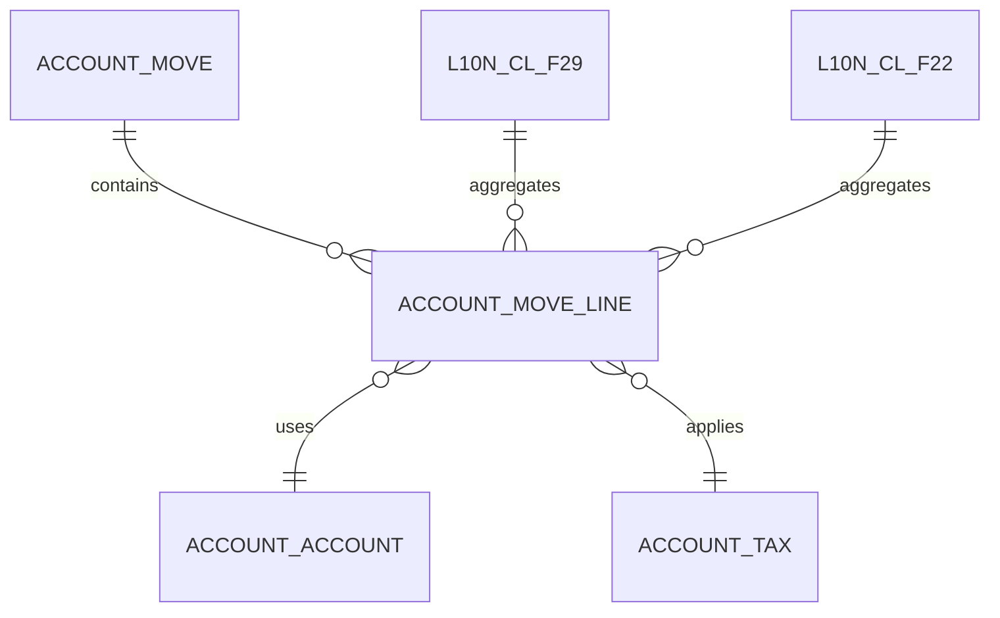

# Auditoría Técnica Exhaustiva – account_financial_report (Odoo 18 CE, Suite Chilena)

Fecha: 2025-08-08
Auditor: GitHub Copilot

## Resumen ejecutivo

Módulo identificado como el núcleo de gestión de reportes financieros de la suite chilena. Presentaba desalineaciones menores de wiring y manifest (ruta de wizard, hooks no declarados, imports frágiles). El resto del armazón es robusto: amplia capa de modelos, vistas, assets OWL, controladores y SQL de performance con hooks de aplicación y rollback. Se aplicaron correcciones puntuales sin romper API ni estructura.

## Alcance y metodología

- Inventario de estructura (models, views, wizards, controllers, report, static, sql, tests)
- Validación de __manifest__.py: depends, data, assets, hooks, rutas
- Revisión de __init__.py y models/__init__.py para registro de subpaquetes
- Inspección de hooks.py y SQL (financial_report_indexes.sql, rollback)
- Verificación de assets referenciados vs. presencia en static/
- Detección de imports frágiles/brittle y referencias a subpaquetes inexistentes

## Hallazgos clave

1) Wiring de paquete incompleto

- __init__.py no registraba explícitamente subpaquetes estándar (models, controllers, report).
- Riesgo: autoload inconsistente bajo ciertos loaders o herramientas estáticas.

1) Manifest: ruta de wizard y hooks

- Referenciaba "wizard/add_widget_wizard_views.xml" inexistente; ruta correcta: "wizards/financial_dashboard_add_widget_wizard_view.xml".
- No declaraba pre_init_hook/uninstall_hook a pesar de implementaciones presentes en hooks.py.

1) models/__init__.py con imports inválidos

- Importaba ..mixins y ..wizard que no existen como subpaquetes Python en este módulo.
- Importaba financial_report_wizards (no presente); los asistentes son vistas XML.

1) Assets y vistas

- Las rutas de assets de widgets/chart/gauge/table y componentes financieros existen. Gridstack presente. No se detectaron assets rotos en manifest tras validación de carpetas.

1) SQL de performance y hooks

- financial_report_indexes.sql bien estructurado por secciones, usa CONCURRENTLY/IF NOT EXISTS y vistas de monitoreo; uninstall_hook contempla rollback_indexes.sql.
- post_init_hook parsea y ejecuta índices individualmente, ignora "already exists", y ejecuta ANALYZE; incluye validación de performance con query de referencia.

## Cambios aplicados

- __init__.py: registro explícito de models/controllers/report y preservación de hooks; se evita importar tests.
- __manifest__.py: corrección de ruta de wizard, se declaran pre_init_hook/post_init_hook/uninstall_hook.
- models/__init__.py: se eliminan imports frágiles (..mixins, ..wizard) y módulo inexistente financial_report_wizards; se documenta que wizards están en XML.

## Diagramas de arquitectura

```mermaid
flowchart LR
  A[__manifest__.py]
  A --> B[models/]
  A --> C[views/]
  A --> D[controllers/]
  A --> E[report/]
  A --> F[static/ (OWL, JS, SCSS, XML)]
  A --> G[sql/ indexes]
  A --> H[hooks.py]

  B --> B1[core reports: balance, P&L, ledger]
  B --> B2[chile: l10n_cl_f22, l10n_cl_f29]
  B --> B3[dashboards: widgets, layout, template]
  B --> B4[services: financial_report_service_model]

  H -.post_init.-> G
  H -.uninstall.-> G
```



## Riesgos y consideraciones

- Seguridad: reglas sobre financial_report_service están comentadas; verificar modelos efectivos antes de activar reglas.
- Dependencias: numpy/scikit-learn/joblib se listan como external_dependencies; confirmar entorno en producción y pin de versiones.
- Migraciones: vistas SQL y extensiones (pg_stat_statements) requieren permisos; en PaaS puede requerir coordinación DBA.

## Recomendaciones

1) CI de preflight para reportes

- Verificar existencia de cada ruta en assets/data y dependencias importables; fallar rápido con reporte JSON.

1) Toggle de características

- Mantener banderas para activar dashboards avanzados y ML según entorno.

1) Hardening de hooks

- Añadir guardas para ediciones sin permisos a extensiones; degradar con log si no aplicable.

1) Tests de humo post-instalación

- Ejecutar test_post_installation y test_performance_indexes con base pequeña para validar índices.

## Cómo verificar

1) Instalación del módulo

- Actualizar lista, instalar account_financial_report; revisar logs de hooks para creación de índices.

1) Validación de assets

- Abrir dashboards en Accounting > Reporting; confirmar carga de componentes OWL.

1) Monitoreo

- Consultar vistas financial_report_index_usage y financial_report_slow_queries para uso/latencias.

## Estado final

- Wiring y manifest corregidos, hooks declarados, imports saneados. No se modificó lógica de negocio. El módulo queda más instalable y mantenible, con documentación de riesgos y próximos pasos.
