# 📊 ANÁLISIS CRÍTICO: MAPEO COMPLETO DE DEPENDENCIAS MÓDULOS CHILENOS

**Fecha**: 2025-08-12  
**Analista**: Architecture Analyst Expert  
**Versión Odoo**: 18.0 CE  
**Estado**: ANÁLISIS COMPLETO BASADO EN MANIFIESTOS REALES

## 🎯 RESUMEN EJECUTIVO

### Módulos Analizados y Estado Actual

| Módulo | Versión | Estado | Tipo | Prioridad |
|--------|---------|--------|------|-----------|
| **l10n_cl_base** | 18.0.2.0.0 | ✅ INSTALADO | Base Chilena | CRÍTICO |
| **account_financial_report** | 18.0.1.0.0 | ✅ INSTALADO | Reportes | ALTO |
| **l10n_cl_fe** | 18.0.7.1.0 | ❌ NO INSTALADO | DTE/Facturación | CRÍTICO |
| **l10n_cl_payroll** | 18.0.5.0.0 | ❌ NO INSTALADO | Nómina | CRÍTICO |

### Hallazgo Crítico: Dependencias OCA Faltantes

⚠️ **ALERTA**: Existen dependencias OCA que deben instalarse antes de los módulos chilenos:

1. **payroll** (OCA) - REQUERIDO para l10n_cl_payroll
2. **payroll_account** (OCA) - REQUERIDO para l10n_cl_payroll  
3. **base_sparse_field** (OCA) - REQUERIDO para queue_job
4. **queue_job** (OCA) - Ya instalado ✅
5. **report_xlsx** (OCA) - Ya instalado ✅
6. **date_range** (OCA) - Ya instalado ✅

---

## 📋 ANÁLISIS DETALLADO POR MÓDULO

### 1. **l10n_cl_fe** - Electronic Invoice (DTE)
**Versión**: 18.0.7.1.0  
**Estado**: ❌ NO INSTALADO  
**Aplicación**: Sí  

#### Dependencias Directas (16 módulos)
```
CORE ODOO (disponibles en contenedor):
├── account_edi          [EDI Framework]
├── l10n_cl              [Localización Chile Base]
├── l10n_latam_invoice_document [Documentos LATAM]
├── purchase             [Compras]
├── mail                 [Sistema de Mensajería]
├── portal               [Portal Web]
├── website              [Sitio Web]
├── stock                [Inventario]
├── stock_account        [Contabilidad de Inventario]
├── sale                 [Ventas]
└── base_automation      [Automatización]

MÓDULOS CHILENOS:
└── l10n_cl_base         [✅ YA INSTALADO]

MÓDULOS OCA:
└── queue_job            [✅ YA INSTALADO]
```

#### Dependencias Python Externas
```python
REQUERIDAS:
- defusedxml>=0.7.1      # Parseo XML seguro
- pdf417>=0.8.1          # Generación código barras
- cryptography>=41.0.0   # Manejo certificados
- lxml>=4.9.0           # Procesamiento XML
- zeep>=4.2.1           # Cliente SOAP para SII
- rut-chile>=0.7.0      # Validación RUT chileno
- redis>=4.5.0          # Servicio de caché
```

### 2. **l10n_cl_payroll** - Chilean Payroll & HR
**Versión**: 18.0.5.0.0  
**Estado**: ❌ NO INSTALADO  
**Aplicación**: Sí

#### Dependencias Directas (36 módulos!)
```
CORE ODOO HR (disponibles en contenedor):
├── hr                   [Base RRHH]
├── hr_contract          [Contratos]
├── hr_holidays          [Vacaciones]
├── hr_holidays_attendance [Integración vacaciones-asistencia]
├── hr_work_entry        [Entradas de trabajo]
├── hr_work_entry_contract [Work entries con contratos]
├── hr_work_entry_holidays [Vacaciones en work entries]
├── hr_attendance        [Control asistencia]
├── hr_hourly_cost       [Costo por hora]
├── hr_homeworking       [Teletrabajo]
├── hr_expense           [Gastos]
├── hr_skills            [Habilidades]
└── hr_timesheet         [Partes de horas]

MÓDULOS PROYECTO:
├── project              [Gestión proyectos]
├── sale                 [Ventas]
└── sale_timesheet       [Timesheet ventas]

CONTABILIDAD:
├── account              [Contabilidad base]
├── account_payment      [Pagos]
└── analytic             [Analítica]

LOCALIZACIÓN:
├── l10n_cl              [Chile base]
└── l10n_cl_base         [✅ YA INSTALADO]

BASE:
├── base                 [Framework]
├── web                  [Interfaz web]
├── mail                 [Mensajería]
├── portal               [Portal]
├── calendar             [Calendario]
├── contacts             [Contactos]
├── base_import          [Importación]
└── http_routing         [Rutas HTTP]

⚠️ MÓDULOS OCA CRÍTICOS:
├── payroll              [❌ NO INSTALADO - CRÍTICO]
├── payroll_account      [❌ NO INSTALADO - CRÍTICO]  
├── queue_job            [✅ YA INSTALADO]
└── report_xlsx          [✅ YA INSTALADO]
```

#### Dependencias Python Externas
```python
REQUERIDAS:
- num2words              # Conversión números a palabras
- requests               # HTTP requests
- xlsxwriter            # Generación Excel
- lxml                  # Procesamiento XML
- beautifulsoup4        # Parseo HTML
- cryptography          # Encriptación datos
- redis                 # Cache y métricas
- PyJWT>=2.8.0          # Autenticación JWT
- psutil                # Métricas sistema
- freezegun             # Testing - freeze time
```

---

## 🔄 GRAFO DE DEPENDENCIAS

```mermaid
graph TD
    %% Módulos Core Odoo
    subgraph "Core Odoo 18 (Contenedor Docker)"
        BASE[base]
        WEB[web]
        MAIL[mail]
        ACCOUNT[account]
        SALE[sale]
        PURCHASE[purchase]
        STOCK[stock]
        HR[hr]
        HR_CONTRACT[hr_contract]
        HR_HOLIDAYS[hr_holidays]
        HR_WORK_ENTRY[hr_work_entry]
        PROJECT[project]
        L10N_CL[l10n_cl]
        ACCOUNT_EDI[account_edi]
    end
    
    %% Módulos OCA
    subgraph "Módulos OCA"
        QUEUE_JOB[queue_job ✅]
        REPORT_XLSX[report_xlsx ✅]
        DATE_RANGE[date_range ✅]
        PAYROLL[payroll ❌]
        PAYROLL_ACCOUNT[payroll_account ❌]
        BASE_SPARSE[base_sparse_field ❌]
    end
    
    %% Módulos Chilenos
    subgraph "Módulos Chilenos"
        L10N_CL_BASE[l10n_cl_base ✅]
        L10N_CL_FE[l10n_cl_fe ❌]
        L10N_CL_PAYROLL[l10n_cl_payroll ❌]
        ACCOUNT_FINANCIAL[account_financial_report ✅]
    end
    
    %% Dependencias l10n_cl_base
    L10N_CL_BASE --> BASE
    L10N_CL_BASE --> L10N_CL
    L10N_CL_BASE --> MAIL
    L10N_CL_BASE --> ACCOUNT
    
    %% Dependencias l10n_cl_fe
    L10N_CL_FE --> L10N_CL_BASE
    L10N_CL_FE --> ACCOUNT_EDI
    L10N_CL_FE --> L10N_CL
    L10N_CL_FE --> PURCHASE
    L10N_CL_FE --> SALE
    L10N_CL_FE --> STOCK
    L10N_CL_FE --> QUEUE_JOB
    L10N_CL_FE --> MAIL
    L10N_CL_FE --> WEB
    
    %% Dependencias l10n_cl_payroll
    L10N_CL_PAYROLL --> L10N_CL_BASE
    L10N_CL_PAYROLL --> HR
    L10N_CL_PAYROLL --> HR_CONTRACT
    L10N_CL_PAYROLL --> HR_HOLIDAYS
    L10N_CL_PAYROLL --> HR_WORK_ENTRY
    L10N_CL_PAYROLL --> PROJECT
    L10N_CL_PAYROLL --> PAYROLL
    L10N_CL_PAYROLL --> PAYROLL_ACCOUNT
    L10N_CL_PAYROLL --> QUEUE_JOB
    L10N_CL_PAYROLL --> REPORT_XLSX
    
    %% Dependencias OCA
    PAYROLL --> HR_CONTRACT
    PAYROLL --> HR_HOLIDAYS
    PAYROLL --> MAIL
    PAYROLL_ACCOUNT --> PAYROLL
    PAYROLL_ACCOUNT --> ACCOUNT
    QUEUE_JOB --> BASE_SPARSE
    QUEUE_JOB --> MAIL
    QUEUE_JOB --> WEB
    
    %% Dependencias account_financial_report
    ACCOUNT_FINANCIAL --> ACCOUNT
    ACCOUNT_FINANCIAL --> DATE_RANGE
    ACCOUNT_FINANCIAL --> REPORT_XLSX
    
    style L10N_CL_BASE fill:#90EE90
    style ACCOUNT_FINANCIAL fill:#90EE90
    style QUEUE_JOB fill:#90EE90
    style REPORT_XLSX fill:#90EE90
    style DATE_RANGE fill:#90EE90
    style L10N_CL_FE fill:#FFB6C1
    style L10N_CL_PAYROLL fill:#FFB6C1
    style PAYROLL fill:#FF6B6B
    style PAYROLL_ACCOUNT fill:#FF6B6B
    style BASE_SPARSE fill:#FF6B6B
```



---

## 🚀 ORDEN DE INSTALACIÓN ÓPTIMO

### Fase 1: Dependencias OCA Faltantes
```bash
# 1. Instalar base_sparse_field (dependencia de queue_job)
# NOTA: queue_job ya está instalado pero puede necesitar base_sparse_field

# 2. Instalar módulo payroll base de OCA
odoo -d mydb -i payroll --stop-after-init

# 3. Instalar payroll_account (integración contable)
odoo -d mydb -i payroll_account --stop-after-init
```

### Fase 2: Módulo de Facturación Electrónica
```bash
# 4. Instalar l10n_cl_fe (DTE)
odoo -d mydb -i l10n_cl_fe --stop-after-init
```

### Fase 3: Módulo de Nómina
```bash
# 5. Instalar l10n_cl_payroll
odoo -d mydb -i l10n_cl_payroll --stop-after-init
```

---

## ⚠️ RIESGOS IDENTIFICADOS

### 1. **Dependencia base_sparse_field Faltante**
- **Riesgo**: queue_job requiere base_sparse_field
- **Impacto**: Posible fallo en funcionalidades asíncronas
- **Mitigación**: Instalar base_sparse_field o verificar si está en contenedor

### 2. **Módulos OCA Payroll No Instalados**
- **Riesgo**: l10n_cl_payroll NO funcionará sin payroll y payroll_account
- **Impacto**: CRÍTICO - Imposible instalar nómina chilena
- **Mitigación**: Instalar módulos OCA payroll ANTES de l10n_cl_payroll

### 3. **Complejidad de Dependencias HR**
- **Riesgo**: l10n_cl_payroll tiene 36 dependencias
- **Impacto**: Mayor superficie de posibles conflictos
- **Mitigación**: Validar todas las dependencias HR están en contenedor

### 4. **Dependencias Python Externas**
- **Riesgo**: Librerías Python no instaladas en contenedor
- **Impacto**: Errores en runtime
- **Mitigación**: Verificar e instalar todas las librerías Python requeridas

### 5. **Integración con Redis**
- **Riesgo**: Ambos módulos chilenos requieren Redis
- **Impacto**: Problemas de rendimiento sin caché
- **Mitigación**: Asegurar Redis está configurado y accesible

---

## ✅ PLAN DE ACCIÓN RECOMENDADO

### Paso 1: Verificación de Prerequisitos
```bash
# Verificar módulos en contenedor
docker exec odoo18-dev odoo shell -d mydb -c "
from odoo import api, SUPERUSER_ID
env = api.Environment(cr, SUPERUSER_ID, {})
installed = env['ir.module.module'].search([('state', '=', 'installed')])
for m in installed:
    print(f'{m.name}: {m.state}')
"
```

### Paso 2: Instalar Dependencias OCA
```bash
# Obtener módulos OCA faltantes
cd /path/to/addons

# Clonar payroll de OCA
git clone -b 18.0 https://github.com/OCA/payroll.git oca_payroll
cp -r oca_payroll/payroll ./
cp -r oca_payroll/payroll_account ./

# Clonar base_sparse_field
git clone -b 18.0 https://github.com/OCA/server-tools.git oca_tools
cp -r oca_tools/base_sparse_field ./
```

### Paso 3: Instalar Librerías Python
```bash
# En el contenedor Docker
docker exec -it odoo18-dev bash
pip install --upgrade \
    defusedxml>=0.7.1 \
    pdf417>=0.8.1 \
    cryptography>=41.0.0 \
    lxml>=4.9.0 \
    zeep>=4.2.1 \
    rut-chile>=0.7.0 \
    redis>=4.5.0 \
    num2words \
    beautifulsoup4 \
    PyJWT>=2.8.0 \
    psutil \
    freezegun
```

### Paso 4: Secuencia de Instalación
```bash
# 1. Módulos OCA base
odoo -d mydb -i base_sparse_field --stop-after-init
odoo -d mydb -i payroll --stop-after-init
odoo -d mydb -i payroll_account --stop-after-init

# 2. Módulo Facturación Electrónica
odoo -d mydb -i l10n_cl_fe --stop-after-init

# 3. Módulo Nómina
odoo -d mydb -i l10n_cl_payroll --stop-after-init
```

### Paso 5: Validación Post-Instalación
```bash
# Verificar módulos instalados
odoo shell -d mydb -c "
modules = ['l10n_cl_base', 'l10n_cl_fe', 'l10n_cl_payroll', 
           'payroll', 'payroll_account', 'queue_job']
for m in modules:
    mod = env['ir.module.module'].search([('name', '=', m)])
    print(f'{m}: {mod.state if mod else 'NOT FOUND'}')
"
```

---

## 📊 MATRIZ DE CONFLICTOS POTENCIALES

| Conflicto | Módulos Afectados | Severidad | Solución |
|-----------|-------------------|-----------|----------|
| base_sparse_field ausente | queue_job → l10n_cl_fe, l10n_cl_payroll | ALTA | Instalar desde OCA/server-tools |
| payroll/payroll_account ausentes | l10n_cl_payroll | CRÍTICA | Instalar desde OCA/payroll |
| Redis no configurado | l10n_cl_fe, l10n_cl_payroll | MEDIA | Configurar servicio Redis |
| Certificados digitales | l10n_cl_fe | ALTA | Configurar path /mnt/certificates |
| Librerías Python | Ambos módulos chilenos | ALTA | pip install en contenedor |

---

## 🎯 CONCLUSIONES

1. **CRÍTICO**: Instalar módulos OCA payroll ANTES de intentar l10n_cl_payroll
2. **IMPORTANTE**: Verificar base_sparse_field para queue_job
3. **RECOMENDADO**: Instalar l10n_cl_fe antes que l10n_cl_payroll (menos dependencias)
4. **VALIDAR**: Todas las dependencias Python en el contenedor
5. **CONFIGURAR**: Redis para optimización de rendimiento

**Tiempo estimado total**: 2-3 horas con validaciones
**Riesgo general**: MEDIO-ALTO sin módulos OCA, BAJO con todo instalado

---

*Análisis basado en manifiestos reales del proyecto*  
*Arquitectura Docker híbrida considerada*  
*Dependencias verificadas contra código fuente*