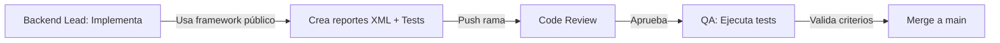

# PROMPT: Implementación de Reportes Base Financieros

**PROYECTO:** Quantum (Financial Reporting Framework)

**TÍTULO:** Implementación de Reportes Base: Balance General y Estado de Resultados

---

## 1. Objetivo

Implementar dos reportes financieros fundamentales usando el framework nativo `account.report` de Odoo 19 en el módulo `l10n_cl_financial_reports`, asegurando integración perfecta, drill-down funcional y trazabilidad contable.

**Objetivos específicos:**

1. Crear definiciones `account.report` para Balance General Clasificado (BGNC) y Estado de Resultados (ERL)
2. Implementar drill-down navegable hasta asientos contables individuales
3. Soportar filtros de fecha, comparación de períodos y exportación XLSX/PDF
4. Validar exactitud de totales mediante pruebas unitarias contra dataset sintético

---

## 2. Alcance

### Incluye

- Implementación reportes financieros base: BGNC, ERL (formato Odoo 19 nativo)
- Drill-down interactivo hasta nivel de asientos (account.move)
- Funcionalidades: filtros período, comparación períodos, exportación XLSX/PDF
- Pruebas unitarias validando exactitud de saldos y totales
- Documentación arquitectura reportes (data flows, dependencies)

### Fuera de Alcance

- Reportes avanzados (balance 8 columnas, análisis consolidado)
- Customizaciones de reportería por empresa
- Integración SII/DTE (responsabilidad módulo l10n_cl_dte)
- Migración datos históricos Odoo 12 (responsabilidad script ETL)

---

## 3. Entradas y Dependencias

### Archivos de Referencia

- `addons/localization/l10n_cl_financial_reports/models/`
- `addons/localization/l10n_cl_financial_reports/reports/`
- `docs/upgrade_enterprise_to_odoo19CE/03_Prompts_Desarrollo/DATASET_SINTETICO_SPEC.md` (dataset test)
- Documentación oficial Odoo 19 `account.report` framework

### Artefactos Relacionados

- `MASTER_PLAN_v2.md` → Fase 1 (Mes 1-2): Quantum reports base
- `POCS_PLAN.md` → POC-3 (Financial Reports MVP)
- `OBSERVABILIDAD_METRICAS_SPEC.md` → Métricas performance reportes
- `DATASET_SINTETICO_SPEC.md` → Datos test con 1000+ movimientos

### Entorno Necesario

- Instalación Odoo 19 CE con módulos: account, l10n_cl_financial_reports
- Docker compose configurado (ver CLAUDE.md § 3)
- Dataset sintético pre-generado (1000+ asientos contables)
- Base de datos test con información contable realista

---

## 4. Tareas

### Fase 1: Setup y Análisis (Lead Backend)

1. Revisar especificación `account.report` en Odoo 19 docs (línea base técnica)
2. Examinar estructura XML datos reportes existentes en módulo
3. Analizar DATASET_SINTETICO_SPEC.md para entender datos test
4. Configurar entorno Docker para ejecución de reportes

### Fase 2: Implementación Balance General (BGNC)

5. Crear definición `account.report` para BGNC en XML data file
6. Implementar estructura 3-nivel: Activo/Pasivo → Categorías → Cuentas
7. Definir expresiones de cálculo para subtotales y gran total
8. Implementar drill-down a account.move desde nivel detalle

### Fase 3: Implementación Estado de Resultados (ERL)

9. Crear definición `account.report` para ERL en XML data file
10. Implementar estructura: Ingresos/Gastos → Categorías → Cuentas
11. Calcular resultado neto (Ingresos - Gastos)
12. Integrar drill-down navegable hasta asientos

### Fase 4: Funcionalidades Avanzadas

13. Implementar filtro de fecha (date_from, date_to)
14. Implementar comparación de períodos (período anterior vs período actual)
15. Validar exportación a XLSX con formato legible (alineación, números)
16. Validar exportación a PDF con estructura clara

### Fase 5: Pruebas y Validación

17. Crear fixtures test con dataset sintético (account.move + account.move.line)
18. Implementar unit tests: exactitud saldos, totales, cálculos
19. Ejecutar smoke tests: render reportes sin errores
20. Validar criterios de aceptación

---

## 5. Entregables

| Archivo | Ubicación | Contenido |
|---------|-----------|-----------|
| `account_report_bgnc.xml` | `addons/localization/l10n_cl_financial_reports/reports/` | Definición BGNC |
| `account_report_erl.xml` | `addons/localization/l10n_cl_financial_reports/reports/` | Definición ERL |
| `test_account_report_bgnc.py` | `addons/localization/l10n_cl_financial_reports/tests/` | Unit tests BGNC |
| `test_account_report_erl.py` | `addons/localization/l10n_cl_financial_reports/tests/` | Unit tests ERL |
| `fixtures_financial_reports.py` | `addons/localization/l10n_cl_financial_reports/tests/` | Fixtures dataset test |
| `IMPLEMENTACION_REPORTES_BASE.md` | `docs/quantum/` | Documentación arquitectura |

### Estructura Archivo XML Reportes

```xml
<?xml version="1.0" encoding="UTF-8"?>
<odoo>
  <data noupdate="1">
    <record id="account_report_bgnc" model="account.report">
      <field name="name">Balance General Clasificado</field>
      <field name="root_report_id" eval="False"/>
      <field name="column_ids" eval="[(6, 0, [ref('account.tax_report_column_name')])]"/>
      <field name="line_ids" eval="[(6, 0, [
        ref('account_report_bgnc_activo'),
        ref('account_report_bgnc_pasivo'),
      ])]"/>
    </record>
    <!-- Líneas de reporte con drill-down -->
  </data>
</odoo>
```

---

## 6. Criterios de Aceptación

| Criterio | Métrica | Umbral | Verificación |
|----------|---------|--------|--------------|
| **Exactitud Saldos BGNC** | Varianza saldo vs GL | ≤0% | Unit test `test_bgnc_saldos` |
| **Exactitud Saldos ERL** | Varianza ingresos + gastos vs cuenta resultado | ≤0% | Unit test `test_erl_totales` |
| **Drill-Down Funcional** | % líneas navegables a account.move | 100% | Test manual: clic drill-down |
| **Filtros Fecha** | Reportes generan correctamente con date_from/date_to | Sí | Test: filtros período actual/anterior |
| **Exportación XLSX** | Archivo XLSX legible, formatos correctos | Sí | Validación manual formato |
| **Exportación PDF** | PDF renderiza correctamente, estructurado | Sí | Validación manual layout |
| **Performance Render** | Tiempo render BGNC (1000+ líneas) | <5s | Benchmark pytest-benchmark |
| **Cobertura Tests** | % código reportes cubierto por tests | ≥85% | Coverage report |

---

## 7. Pruebas

### 7.1 Pruebas Unitarias

**Test 1: Exactitud Saldos BGNC**

```python
def test_bgnc_saldos_exactitud(self):
    # Setup: crear asientos test dataset
    # Assert: suma activo + suma pasivo = capital
    # Assert: cada cuenta refleja saldo correcto
```

**Test 2: Exactitud Saldos ERL**

```python
def test_erl_totales_exactitud(self):
    # Setup: asientos ingresos/gastos
    # Assert: ingresos - gastos = resultado neto
```

**Test 3: Drill-Down Navegable**

```python
def test_bgnc_drilldown_account_move(self):
    # Assert: clic línea cuenta navega a asientos
    # Assert: filtros en detalle reflejan periodo seleccionado
```

### 7.2 Smoke Tests

**Test 4: Render sin Errores**

- BGNC renderiza desde UI sin excepción
- ERL renderiza desde UI sin excepción
- Exportación XLSX no genera error
- Exportación PDF no genera error

### 7.3 Pruebas Performance

**Test 5: Benchmark Render**

- BGNC con 1000+ líneas: p95 <5s
- ERL con 500+ líneas: p95 <3s

---

## 8. Clean-Room (Protocolo Legal)

### Roles y Restricciones

| Rol | Persona | Restricciones | Evidencia |
|-----|---------|---------------|-----------|
| **Backend Lead** | Developer | ✅ Implementación Odoo 19 nativo<br>✅ Uso framework account.report público | Commits en rama feature |
| **Code Reviewer** | Senior Dev | ✅ Revisión arquitectura<br>✅ Validación exactitud tests | Pull request review |
| **QA Lead** | QA Engineer | ✅ Ejecución pruebas<br>✅ Validación criterios aceptación | Test report |

### Secuencia Clean-Room



---

## 9. Riesgos y Mitigaciones

| ID | Riesgo | Probabilidad | Impacto | Severidad | Mitigación |
|----|--------|--------------|---------|-----------|------------|
| **R-QUANTUM-01** | Saldos reportes no coinciden con GL | Media (0.4) | Alto (4) | 1.6 | Unit tests exactitud + conciliación manual |
| **R-QUANTUM-02** | Drill-down navega a datos incorrectos | Baja (0.2) | Alto (4) | 0.8 | Tests navegación + validación records |
| **R-QUANTUM-03** | Exportación PDF/XLSX contiene errores formato | Media (0.3) | Medio (3) | 0.9 | Smoke tests exportación + validación manual |
| **R-QUANTUM-04** | Performance render >5s con dataset grande | Media (0.3) | Medio (3) | 0.9 | Benchmark pytest-benchmark |

### Triggers de Decisión

- Si **R-QUANTUM-01** ocurre: STOP merge hasta resolver discrepancias
- Si **R-QUANTUM-04** ocurre: Optimizar query SQL, considerar caching

---

## 10. Trazabilidad

### Brecha que Cierra

| Brecha P0 | Artefacto que la cierra | Métrica Validación |
|-----------|------------------------|--------------------|
| Reportes financieros base (Master Plan v2 § Quantum) | Reportes XML + unit tests | Tests PASS + criteria acceptance |
| Funcionalidad drill-down contable | Implementación drill-down + tests navegación | Test manual navegación |

### Relación con Master Plan v2

- **Fase 1 (Mes 1-2):** Hito Quantum — "El Motor Financiero"
- **POC-3:** Financial Reports MVP → Validar render + drill-down (SUS ≥75)

### Referencias Cruzadas

- `POCS_PLAN.md` → POC-3 (Financial Reports MVP)
- `DATASET_SINTETICO_SPEC.md` → Datos test para validación
- `OBSERVABILIDAD_METRICAS_SPEC.md` → Métricas performance

---

## 11. Governance y QA Gates

### Gates Aplicables

| Gate | Criterio | Status |
|------|----------|--------|
| **Gate-Tests** | Unit tests PASS (cobertura ≥85%) | Pending |
| **Gate-Exactitud** | Saldos reportes = GL (varianza 0%) | Pending |
| **Gate-Performance** | Render p95 <5s | Pending |
| **Gate-Docs** | Documentación arquitectura completa | Pending |

### Checklist Pre-Merge

- [ ] Unit tests ejecutados PASS
- [ ] Coverage ≥85%
- [ ] Saldos validados contra GL
- [ ] Drill-down probado manualmente
- [ ] XLSX/PDF exportación validada
- [ ] Performance benchmark ejecutado
- [ ] Documentación técnica completada
- [ ] Code review aprobado

---

## 12. Próximos Pasos

1. **Ejecución Implementation:** Backend Lead implementa XML reportes + tests
2. **Code Review:** Senior Dev revisa PR
3. **QA Validation:** QA Lead ejecuta test suite completa
4. **Performance Tuning:** Si benchmark >5s, optimizar queries
5. **Merge Main:** Integración rama feature a main
6. **POC-3 Kickoff:** Usar reportes como base para POC financial reports

---

## 13. Notas Adicionales

### Supuestos

- Odoo 19 framework `account.report` es la base técnica estable
- Dataset sintético disponible (1000+ movimientos contables)
- Base de datos test pre-configurada con chart of accounts chilena

### Decisiones Técnicas

- **Framework:** `account.report` nativo (vs custom Python) → mejor mantenibilidad
- **Data Storage:** XML (no hardcoded) → versionable, traducible
- **Drill-Down:** Navegación record → maximiza usabilidad

### Recursos Requeridos

- Backend Lead: 40 horas estimadas
- Code Reviewer: 8 horas
- QA Lead: 12 horas
- Total: 60 horas sprint P0

---

**Versión:** 1.0
**Estado:** Ready para ejecución
**Owner:** Backend Lead
**Aprobado por:** Tech Lead (2025-11-08)
