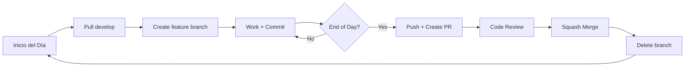

# Git Best Practices - Odoo 19 Localization Chile

**Audiencia**: Todo el equipo de desarrollo
**Nivel**: Principiante a Intermedio
**Última actualización**: 2025-11-15

---

## 🎯 TL;DR (Too Long; Didn't Read)

```bash
# Regla de Oro
"Integrate Early, Integrate Often"

# Lo Esencial:
1. Merge a develop DIARIAMENTE
2. Feature branches MAX 3 días
3. Commits descriptivos (Conventional Commits)
4. Tests antes de PR
5. Squash merge siempre
```

---

## 📚 Tabla de Contenidos

1. [Por Qué Necesitamos Esto](#por-qué-necesitamos-esto)
2. [Workflow Diario](#workflow-diario)
3. [Reglas de Oro](#reglas-de-oro)
4. [Ejemplos Prácticos](#ejemplos-prácticos)
5. [Errores Comunes](#errores-comunes)
6. [Solución de Problemas](#solución-de-problemas)

---

## Por Qué Necesitamos Esto

### Problemas que Teníamos (Antes de Nov 2025)

```
❌ Branches con 175+ commits sin integrar
❌ Merges con 19 conflictos
❌ Código "destruido" por resolución automática
❌ 17 conflictos en 2 meses
❌ Delays de días para integrar cambios
```

### Beneficios de la Nueva Estrategia

```
✅ Sin pérdida de código
✅ Conflictos mínimos (detectados temprano)
✅ Historia Git limpia
✅ Releases predecibles
✅ Colaboración fluida
```

---

## Workflow Diario

### Opción 1: El Workflow Ideal (Recomendado)


```mermaid
graph LR
    A[Inicio del Día] --> B[Pull develop]
    B --> C[Create feature branch]
    C --> D[Work + Commit]
    D --> E{End of Day?}
    E -->|No| D
    E -->|Yes| F[Push + Create PR]
    F --> G[Code Review]
    G --> H[Squash Merge]
    H --> I[Delete branch]
    I --> A
```

### Opción 2: Workflow Detallado (Paso a Paso)

#### Mañana (9:00 AM)

```bash
# 1. Actualizar develop
cd /path/to/odoo19
git checkout develop
git pull origin develop

# 2. Crear feature branch
git checkout -b feature/dte-add-validator
# Naming: feature/<module>-<description>
```

#### Durante el Día (9:00 AM - 5:00 PM)

```bash
# 3. Trabajar normalmente
# Editar archivos...

# 4. Commit frecuente (cada 1-2 horas)
git add addons/localization/l10n_cl_dte/libs/validator.py
git commit -m "feat(l10n_cl_dte): add CAF expiration validator"

# Pre-commit hooks corren automáticamente:
# ✓ Black (formatting)
# ✓ Flake8 (linting)
# ✓ Tests unitarios

# 5. Más trabajo...
git add addons/localization/l10n_cl_dte/tests/test_caf_validator.py
git commit -m "test(l10n_cl_dte): add validator tests (coverage 95%)"

# 6. Push frecuente (backup en cloud)
git push origin feature/dte-add-validator
```

#### Tarde (5:00 PM - 6:00 PM)

```bash
# 7. Preparar para merge
git checkout develop
git pull origin develop
git checkout feature/dte-add-validator

# Opción A: Rebase (historia lineal)
git rebase develop

# Opción B: Merge (preserva historia)
git merge develop

# 8. Resolver conflictos SI HAY (raro si merges diario)
# git add <archivos-resueltos>
# git rebase --continue

# 9. Push final
git push origin feature/dte-add-validator --force-with-lease

# 10. Crear PR
gh pr create \
  --base develop \
  --title "feat(l10n_cl_dte): Add CAF expiration validator" \
  --body "
## Summary
- Adds CAF expiration validation
- Prevents using expired CAF

## Testing
- [x] Unit tests pass
- [x] Coverage 95%
- [x] Manual testing OK

## Breaking Changes
None
"
```

#### Después del Code Review

```bash
# 11. Merge (hecho por reviewer o auto)
# GitHub hace squash merge automático

# 12. Limpiar local
git checkout develop
git pull origin develop
git branch -d feature/dte-add-validator

# 13. Confirmar que se borró remote
git push origin --delete feature/dte-add-validator
```

---

## Reglas de Oro

### 1. Integración Continua

```yaml
✅ DO:
  - Merge a develop DIARIAMENTE
  - Feature branches max 3 días de vida
  - Push frecuente (mínimo 2x al día)

❌ DON'T:
  - Branches >100 commits sin merge
  - Acumular cambios por semanas
  - Esperar "hasta terminar" para integrar
```

**Razón**: Detectar conflictos TEMPRANO cuando son pequeños y fáciles de resolver.

### 2. Commits Atómicos

```yaml
✅ DO:
  - Un commit = un concepto
  - 1-100 líneas idealmente
  - Mensaje descriptivo

❌ DON'T:
  - Commits gigantes (>500 líneas)
  - "WIP", "changes", "fixes"
  - Mezclar features no relacionadas
```

**Razón**: Facilita code review, debugging, y rollback selectivo.

### 3. Conventional Commits

```yaml
Format:
  <type>(<scope>): <description>

Types:
  feat:     Nueva funcionalidad
  fix:      Bug fix
  refactor: Refactoring
  test:     Tests
  docs:     Documentación
  chore:    Mantenimiento

Scopes:
  l10n_cl_dte
  l10n_cl_hr_payroll
  l10n_cl_financial_reports
```

**Razón**: Historia Git legible, CHANGELOGs automáticos, semantic versioning.

### 4. Testing Antes de PR

```yaml
✅ DO:
  - Run pytest antes de PR
  - Verificar coverage >80%
  - Linting OK (pre-commit)

❌ DON'T:
  - "Lo pruebo después"
  - Skip tests
  - Commit código roto
```

**Razón**: No romper develop para otros developers.

### 5. Squash Merge Siempre

```yaml
✅ DO:
  - Squash merge desde PR
  - Historia lineal en develop
  - Un commit por feature

❌ DON'T:
  - Merge commits en develop
  - Preserve all commits
  - Complicated history
```

**Razón**: Historia Git limpia, fácil de navegar, rollback simple.

---

## Ejemplos Prácticos

### Ejemplo 1: Feature Simple (1 día)

```bash
# Lunes 9:00 AM
git checkout develop && git pull
git checkout -b feature/dte-add-email-validation

# Lunes 10:00 AM - 12:00 PM: Trabajar
git add libs/validators.py
git commit -m "feat(l10n_cl_dte): add email validator"

git add tests/test_validators.py
git commit -m "test(l10n_cl_dte): add email validator tests"

# Lunes 2:00 PM - 4:00 PM: Más trabajo
git add models/dte_inbox.py
git commit -m "feat(l10n_cl_dte): integrate email validator in DTE inbox"

# Lunes 5:00 PM: Merge
git push origin feature/dte-add-email-validation
gh pr create --base develop --fill

# Lunes 5:30 PM: Code review aprobado
# Squash merge automático
# Delete branch

# ✅ Feature completado en 1 día
```

### Ejemplo 2: Feature Media (2-3 días)

```bash
# Lunes: Día 1
git checkout -b feature/payroll-previred-api-v2

# Commits del día:
- feat(l10n_cl_hr_payroll): add Previred API v2 client
- test(l10n_cl_hr_payroll): add API client tests

git push origin feature/payroll-previred-api-v2

# Martes: Día 2
git pull origin develop  # Actualizar
git rebase develop       # Integrar cambios de otros

# Commits del día:
- feat(l10n_cl_hr_payroll): integrate API v2 in payslip calculation
- refactor(l10n_cl_hr_payroll): migrate from API v1 to v2

git push origin feature/payroll-previred-api-v2 --force-with-lease

# Miércoles: Día 3 (Último día)
git pull origin develop
git rebase develop

# Commits finales:
- docs(l10n_cl_hr_payroll): add Previred API v2 migration guide
- test(l10n_cl_hr_payroll): integration tests for full workflow

git push origin feature/payroll-previred-api-v2 --force-with-lease

# Create PR
gh pr create --base develop

# Code review + merge
# ✅ Feature completado en 3 días (límite máximo)
```

### Ejemplo 3: Hotfix Urgente (Mismo día)

```bash
# Production bug discovered: 11:00 AM
git checkout develop && git pull
git checkout -b fix/dte-sii-timeout

# 11:15 AM - 12:00 PM: Fix
git add libs/sii_client.py
git commit -m "fix(l10n_cl_dte): increase SII timeout to 60s"

git add tests/test_sii_client.py
git commit -m "test(l10n_cl_dte): add timeout tests"

# 12:30 PM: PR
git push origin fix/dte-sii-timeout
gh pr create --base develop --title "HOTFIX: SII timeout" --label "priority:high"

# 1:00 PM: Fast review + merge
# 1:30 PM: Deploy to staging
# 2:00 PM: Deploy to production

# ✅ Hotfix completado en 3 horas
```

---

## Errores Comunes

### Error #1: Branch de Larga Duración

```bash
❌ MALO:
git checkout -b feature/big-refactor
# ... 2 semanas después ...
# 250 commits, 100 archivos, 50 conflictos

✅ BUENO:
git checkout -b feature/refactor-step1-validators
# Día 1-2: Solo validators
# PR + Merge

git checkout -b feature/refactor-step2-models
# Día 3-4: Solo models
# PR + Merge

# ... Dividir en pasos pequeños
```

### Error #2: Commits Sin Sentido

```bash
❌ MALO:
git commit -m "changes"
git commit -m "WIP"
git commit -m "fix"
git commit -m "update"

✅ BUENO:
git commit -m "feat(l10n_cl_dte): add CAF expiration validator"
git commit -m "test(l10n_cl_dte): add CAF validator unit tests"
git commit -m "fix(l10n_cl_dte): correct timezone in DTE timestamp"
git commit -m "refactor(l10n_cl_dte): extract validation logic to separate class"
```

### Error #3: Resolver Conflictos Sin Revisar

```bash
❌ MALO:
git merge develop -X ours  # Acepta todo de mi branch
# Puede sobrescribir fixes importantes de otros

❌ MALO:
git merge develop -X theirs  # Acepta todo de develop
# Puede perder tu trabajo

✅ BUENO:
git merge develop
# Revisar CADA conflicto manualmente
# Entender QUÉ cambió y POR QUÉ
# Elegir solución correcta (puede ser combinación)
git add <resolved-files>
git commit

# Test después de resolver
pytest addons/localization/<module>/
```

### Error #4: Force Push a Branches Compartidas

```bash
❌ MALO:
git push origin develop --force  # ¡NUNCA!
git push origin main --force     # ¡NUNCA!

✅ BUENO:
git push origin develop           # Normal push
git push origin feature/my-branch --force-with-lease  # OK para tus branches
```

### Error #5: No Actualizar Antes de Merge

```bash
❌ MALO:
git checkout feature/my-feature
# No update from develop in 5 days
gh pr create  # 50 conflictos!

✅ BUENO:
git checkout develop
git pull origin develop
git checkout feature/my-feature
git rebase develop  # Actualizar ANTES de PR
# Resolver conflictos localmente
git push origin feature/my-feature --force-with-lease
gh pr create  # 0 conflictos ✨
```

---

## Solución de Problemas

### Problema: "Tengo Conflictos en el Merge"

```bash
# Paso 1: Entender el conflicto
git diff  # Ver qué está en conflicto

# Paso 2: Ver historia
git log --oneline develop..HEAD -- <archivo-conflicto>
git log --oneline HEAD..develop -- <archivo-conflicto>

# Paso 3: Abrir en editor visual
code <archivo-conflicto>  # VSCode tiene buen merge editor

# Paso 4: Elegir cambios
# <<<<<<< HEAD (tu branch)
# tu código
# =======
# código de develop
# >>>>>>> develop

# Paso 5: Test después de resolver
pytest addons/localization/<module>/

# Paso 6: Commit resolución
git add <archivo-resuelto>
git commit -m "merge: resolve conflicts in <archivo>"
```

### Problema: "Hice un Commit Malo, Cómo lo Borro?"

```bash
# Si NO hiciste push:
git reset --soft HEAD~1  # Deshacer último commit, mantener cambios
git reset --hard HEAD~1  # Deshacer último commit, BORRAR cambios

# Si YA hiciste push:
git revert <commit-hash>  # Crear commit que revierte el malo
git push origin feature/my-branch
```

### Problema: "Mi Branch está Muy Desactualizada"

```bash
# Opción 1: Rebase (preferido - historia lineal)
git checkout feature/my-branch
git fetch origin
git rebase origin/develop

# Resolver conflictos uno por uno
# Para cada conflicto:
# 1. Editar archivos
# 2. git add <archivos-resueltos>
# 3. git rebase --continue

# Push con force
git push origin feature/my-branch --force-with-lease

# Opción 2: Merge (más seguro si hay muchos conflictos)
git checkout feature/my-branch
git merge origin/develop
# Resolver todos los conflictos
git commit
git push origin feature/my-branch
```

### Problema: "Hice Force Push a develop/main por Error"

```bash
# ¡PÁNICO! Pero hay solución:

# Paso 1: Avisar AL EQUIPO INMEDIATAMENTE
# Slack #emergencies

# Paso 2: Encontrar commit bueno
git reflog  # Ver historia completa
# Buscar: HEAD@{10 minutes ago}: ...

# Paso 3: Restore (si tienes acceso)
git checkout develop
git reset --hard <commit-bueno>
git push origin develop --force  # Sí, force ahora es necesario

# Paso 4: Verificar con equipo que se restauró correcto

# Paso 5: Post-mortem
# Documentar qué pasó y cómo prevenir
```

### Problema: "No Sé Qué Cambió en Mi Branch"

```bash
# Ver todos los cambios vs develop
git diff develop...feature/my-branch --stat

# Ver commits únicos
git log develop..feature/my-branch --oneline

# Ver archivos modificados
git diff develop...feature/my-branch --name-only

# Ver diff específico de un archivo
git diff develop...feature/my-branch -- path/to/file.py
```

---

## 🎓 Recursos Adicionales

### Documentación Interna

- [.claude/GIT_STRATEGY.md](.claude/GIT_STRATEGY.md) - Estrategia completa
- [.claude/GIT_WORKFLOW_QUICK.md](.claude/GIT_WORKFLOW_QUICK.md) - Quick reference
- [CONTRIBUTING.md](CONTRIBUTING.md) - Guía de contribución

### Tutoriales Externos

- [Conventional Commits](https://www.conventionalcommits.org/)
- [Atlassian Git Tutorials](https://www.atlassian.com/git/tutorials)
- [GitHub Git Guides](https://github.com/git-guides)

### Herramientas

```bash
# Git aliases útiles
git config --global alias.st "status -sb"
git config --global alias.lg "log --graph --oneline --decorate"
git config --global alias.unstage "reset HEAD --"
git config --global alias.last "log -1 HEAD"
git config --global alias.visual "log --graph --oneline --all"

# Git GUI tools
# - GitKraken (visual, fácil)
# - SourceTree (Atlassian, gratis)
# - VSCode Git extension (integrado)
```

---

## ✅ Checklist Diario

Imprimir y pegar en tu monitor:

```
📋 CHECKLIST DESARROLLO DIARIO

MAÑANA (Start of Day):
[ ] git checkout develop
[ ] git pull origin develop
[ ] git checkout -b feature/<module>-<desc>

DURANTE EL DÍA (Working):
[ ] Commits frecuentes (cada 1-2h)
[ ] Conventional Commits format
[ ] Push frecuente (backup)
[ ] Tests pasan localmente

TARDE (End of Day):
[ ] git pull origin develop
[ ] git rebase develop
[ ] git push origin feature/...
[ ] gh pr create --base develop
[ ] PR tiene descripción clara
[ ] CI/CD pasa (green checks)

DESPUÉS DE MERGE:
[ ] git checkout develop
[ ] git pull origin develop
[ ] git branch -d feature/...
[ ] Celebrar ✨
```

---

**¿Dudas?** Pregunta en Slack #dev-odoo o contacta a @pedro

**Last Updated**: 2025-11-15
