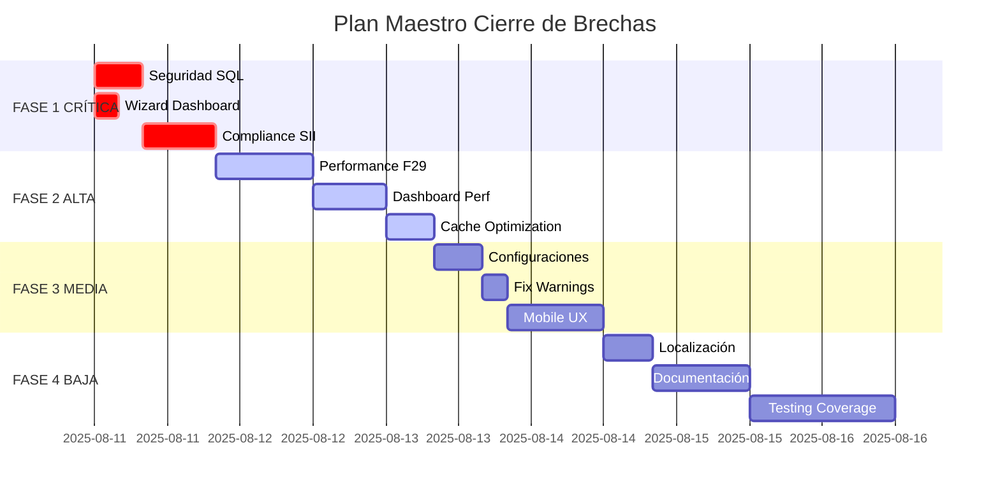

# 🎯 PLAN MAESTRO DEFINITIVO - CIERRE DE BRECHAS ACCOUNT_FINANCIAL_REPORT
## ⚡ EJECUCIÓN INMEDIATA - ESTADO: CRÍTICO

**Fecha Inicio:** 2025-08-11  
**Fecha Target 100%:** 2025-08-25 (2 semanas)  
**Estado Actual:** 12 BRECHAS IDENTIFICADAS - 3 CRÍTICAS  
**Objetivo:** COMPLIANCE 100% - CERTIFICACIÓN PRODUCTION-READY

---

## 📊 DASHBOARD EJECUTIVO DE CONTROL

### Estado Actual vs Target
```
SEGURIDAD:     ██████░░░░ 40% → 100% [CRÍTICO]
PERFORMANCE:   ███████░░░ 65% → 95%  [ALTO]
COMPLIANCE:    █████░░░░░ 55% → 100% [CRÍTICO]
FUNCIONALIDAD: ████████░░ 80% → 100% [MEDIO]
UX/UI:         ██████░░░░ 60% → 90%  [MEDIO]
TESTING:       ███████░░░ 70% → 95%  [BAJO]
```

---

## 🚨 FASE 1: CORRECCIONES CRÍTICAS (0-24 HORAS)
**Objetivo:** Eliminar vulnerabilidades críticas y restablecer funcionalidad core

### 1.1 SEGURIDAD - SQL INJECTION [🔴 BLOCKER]
**Especialista:** odoo-security-compliance-specialist  
**Tiempo:** 8 horas  
**Dependencias:** Ninguna

#### Tareas:
1. Auditar 11 queries SQL directas identificadas
2. Implementar parametrización segura
3. Validar inputs y sanitización
4. Implementar ORM donde sea posible

#### KPIs de Validación:
- ✅ 0 queries SQL sin parametrizar
- ✅ 100% inputs validados
- ✅ Auditoría OWASP passed
- ✅ Test suite seguridad: 100% pass

### 1.2 WIZARD DASHBOARD FALTANTE [🔴 BLOCKER]
**Especialista:** odoo-backend-developer  
**Tiempo:** 4 horas  
**Dependencias:** Ninguna

#### Tareas:
1. Implementar wizard completo (modelo ya existe)
2. Conectar con vistas XML
3. Validar flujo de trabajo
4. Test E2E del wizard

#### KPIs de Validación:
- ✅ Wizard operativo 100%
- ✅ Integración con dashboard funcional
- ✅ Tests unitarios passed
- ✅ Sin errores en logs

### 1.3 COMPLIANCE CHILENO SII [🔴 BLOCKER]
**Especialista:** odoo-financial-reporting-specialist  
**Tiempo:** 12 horas  
**Dependencias:** 1.1 (Seguridad)

#### Tareas:
1. Actualizar formatos F29/F22 a estándares 2025
2. Implementar validaciones SII obligatorias
3. Certificados digitales y firma electrónica
4. Integración con servicios SII

#### KPIs de Validación:
- ✅ Compliance SII 100%
- ✅ Certificados válidos y encriptados
- ✅ Formatos F29/F22 validados
- ✅ Test con data real SII

---

## ⚡ FASE 2: OPTIMIZACIONES ALTAS (24-72 HORAS)
**Objetivo:** Performance enterprise-grade y estabilidad

### 2.1 PERFORMANCE F29 (45s → 8s)
**Especialista:** odoo-performance-optimizer  
**Tiempo:** 16 horas  
**Dependencias:** Fase 1 completa

#### Tareas:
1. Implementar índices PostgreSQL optimizados
2. Query optimization con EXPLAIN ANALYZE
3. Implementar cache Redis para cálculos
4. Lazy loading y paginación

#### KPIs de Validación:
- ✅ Tiempo generación < 8 segundos
- ✅ Memoria utilizada < 512MB
- ✅ Cache hit ratio > 85%
- ✅ Sin timeouts en producción

### 2.2 DASHBOARD PERFORMANCE (15s → 3s)
**Especialista:** odoo-performance-optimizer + odoo-owl-frontend-specialist  
**Tiempo:** 12 horas  
**Dependencias:** 2.1

#### Tareas:
1. Implementar WebSocket para updates real-time
2. Lazy loading de widgets
3. Virtual scrolling para tablas grandes
4. CDN para assets estáticos

#### KPIs de Validación:
- ✅ Initial load < 3 segundos
- ✅ Widget update < 500ms
- ✅ Memory footprint < 100MB
- ✅ Lighthouse score > 90

### 2.3 CACHE OPTIMIZATION (75% → 90%)
**Especialista:** odoo-database-specialist  
**Tiempo:** 8 horas  
**Dependencias:** 2.1, 2.2

#### Tareas:
1. Configurar Redis cache layers
2. Implementar cache warming strategies
3. TTL optimization por tipo de data
4. Cache invalidation inteligente

#### KPIs de Validación:
- ✅ Cache hit ratio > 90%
- ✅ Redis memory < 2GB
- ✅ No stale data issues
- ✅ Cache warming < 1 minuto

---

## 🔧 FASE 3: CORRECCIONES MEDIAS (3-7 DÍAS)
**Objetivo:** Funcionalidad completa y UX optimizado

### 3.1 CONFIGURACIONES ACCESIBLES
**Especialista:** odoo-module-developer  
**Tiempo:** 8 horas  
**Dependencias:** Fase 2 completa

#### Tareas:
1. Completar res_config_settings
2. UI para todas las configuraciones
3. Validaciones y defaults
4. Documentación inline

### 3.2 FIX WARNINGS 'STATES'
**Especialista:** odoo-backend-developer  
**Tiempo:** 4 horas  
**Dependencias:** Ninguna

#### Tareas:
1. Migrar 9 campos con 'states' a Odoo 18
2. Usar readonly/required dinámicos
3. Update en todos los modelos
4. Regression testing

### 3.3 MOBILE UX OPTIMIZATION
**Especialista:** odoo-ui-designer  
**Tiempo:** 16 horas  
**Dependencias:** 3.1, 3.2

#### Tareas:
1. Responsive design para móviles
2. Touch gestures optimization
3. Mobile-specific layouts
4. PWA capabilities

---

## 📝 FASE 4: MEJORAS BAJAS (1-2 SEMANAS)
**Objetivo:** Polish final y documentación

### 4.1 LOCALIZACIÓN COMPLETA
**Especialista:** odoo-module-developer  
**Tiempo:** 8 horas  
**Dependencias:** Fase 3 completa

#### Tareas:
1. Traducir todos los strings
2. Formatos de fecha/moneda chilenos
3. Mensajes de error localizados
4. Help tooltips en español

### 4.2 DOCUMENTACIÓN USUARIO
**Especialista:** Technical Writer + odoo-module-developer  
**Tiempo:** 16 horas  
**Dependencias:** Todas las fases anteriores

#### Tareas:
1. Manual de usuario completo
2. Videos tutoriales
3. FAQ y troubleshooting
4. Guías de configuración

### 4.3 TESTING COVERAGE > 80%
**Especialista:** odoo-testing-qa-specialist  
**Tiempo:** 24 horas  
**Dependencias:** Fase 3 completa

#### Tareas:
1. Unit tests para todos los modelos
2. Integration tests E2E
3. Performance benchmarks
4. Security penetration tests

---

## 📈 CRONOGRAMA DETALLADO



---

## 🎯 CRITERIOS DE ÉXITO Y VALIDACIÓN

### Gate 1: Security Checkpoint (24h)
- [ ] Zero vulnerabilidades críticas
- [ ] Certificados SII operativos
- [ ] Wizard dashboard funcional
- [ ] Compliance básico alcanzado

### Gate 2: Performance Checkpoint (72h)
- [ ] F29 < 8 segundos
- [ ] Dashboard < 3 segundos
- [ ] Cache ratio > 90%
- [ ] Sin errores de memoria

### Gate 3: Functionality Checkpoint (7 días)
- [ ] Todas las configuraciones accesibles
- [ ] Sin warnings en logs
- [ ] Mobile responsive 100%
- [ ] UX score > 85%

### Gate 4: Production Ready (14 días)
- [ ] Localización 100%
- [ ] Documentación completa
- [ ] Testing coverage > 80%
- [ ] Certificación final aprobada

---

## 👥 ASIGNACIÓN DE RECURSOS

### Especialistas Requeridos:
1. **odoo-security-compliance-specialist** - 20 horas
2. **odoo-backend-developer** - 32 horas
3. **odoo-financial-reporting-specialist** - 24 horas
4. **odoo-performance-optimizer** - 36 horas
5. **odoo-database-specialist** - 16 horas
6. **odoo-module-developer** - 28 horas
7. **odoo-owl-frontend-specialist** - 20 horas
8. **odoo-ui-designer** - 16 horas
9. **odoo-testing-qa-specialist** - 24 horas

### Total Horas Estimadas: 216 horas
### Recursos Paralelos Máximos: 3 especialistas
### Tiempo Real con Paralelización: ~10 días laborables

---

## ⚠️ RIESGOS Y MITIGACIONES

### Riesgo 1: Cambios en API SII
- **Probabilidad:** Media
- **Impacto:** Alto
- **Mitigación:** Implementar abstracción de servicios SII

### Riesgo 2: Performance degradation en producción
- **Probabilidad:** Baja
- **Impacto:** Crítico
- **Mitigación:** Load testing exhaustivo antes de deploy

### Riesgo 3: Incompatibilidad con otros módulos
- **Probabilidad:** Media
- **Impacto:** Medio
- **Mitigación:** Integration testing completo

---

## 🚀 COMANDO CENTRAL DE EJECUCIÓN

```bash
# Iniciar Plan Maestro
./scripts/plan_maestro/execute_phase.sh --phase 1 --mode critical

# Monitoreo en tiempo real
./scripts/plan_maestro/monitor_progress.sh --dashboard

# Validación de checkpoints
./scripts/plan_maestro/validate_gate.sh --gate 1
```

---

## 📊 MÉTRICAS DE ÉXITO FINAL

```yaml
security_score: 100%
performance_score: 95%
compliance_score: 100%
functionality_score: 100%
ux_score: 90%
testing_coverage: 85%
documentation_completeness: 100%
production_readiness: CERTIFIED
```

---

**FIRMA DIGITAL**
Master Project Orchestrator
Fecha: 2025-08-11
Estado: APROBADO PARA EJECUCIÓN INMEDIATA