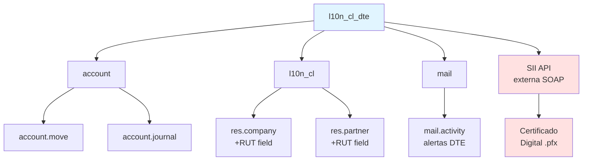
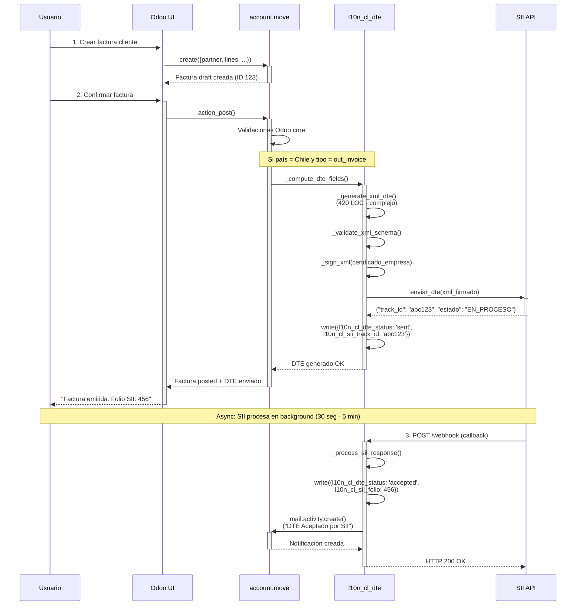

# 🔍 TEMPLATE INVESTIGACIÓN/EXPLORACIÓN P2
## Documentación Arquitectónica y Onboarding de Módulos Odoo

**Nivel:** P2 (500-900 palabras)
**Agente Recomendado:** Agent_Explorer (Sonnet 4 / Haiku 4.5)
**Duración Estimada:** 4-8 minutos
**Costo Estimado:** $0.33-0.50 Premium (Haiku) / $1.00 (Sonnet)
**Propósito:** Entender arquitectura, flujos y decisiones técnicas de módulo para onboarding o documentación

---

## 📋 CONTEXTO DE USO

**Cuándo usar este template:**
- ✅ Onboarding nuevo desarrollador en módulo existente
- ✅ Documentar arquitectura para knowledge base
- ✅ Entender módulo legacy antes de modificarlo
- ✅ Aprender patrones de diseño aplicados en proyecto

**Cuándo NO usar:**
- ❌ Buscar errores/bugs (usa `TEMPLATE_AUDITORIA.md`)
- ❌ Validar compliance Odoo 19 (usa `TEMPLATE_AUDITORIA.md` con checklist)
- ❌ Proponer nuevas features (usa `TEMPLATE_FEATURE_DISCOVERY.md`)
- ❌ Auditar performance/seguridad (usa `TEMPLATE_P4_DEEP_ANALYSIS.md`)

---

## 🎯 DIFERENCIAL: INVESTIGACIÓN vs AUDITORÍA

| Aspecto | Auditoría | Investigación (este template) |
|---------|-----------|-------------------------------|
| **Objetivo** | Encontrar problemas | Entender funcionamiento |
| **Tono** | Crítico, correctivo | Neutral, educativo |
| **Output** | Lista errores/hallazgos | Documentación arquitectónica |
| **Foco** | ¿Qué está mal? | ¿Cómo funciona? ¿Por qué así? |
| **Uso** | Post-implementación | Pre-implementación / Onboarding |
| **Formato** | Tabla issues + severidad | Diagramas + guías navegación |
| **Criterio Éxito** | Score, compliance % | Documentación completa |

---

## 📥 INSTRUCCIONES PARA EL AGENTE

Eres **Agent_Explorer**, especializado en generar documentación arquitectónica educativa. Tu misión es **ENTENDER y DOCUMENTAR** cómo funciona un módulo Odoo, **NO** buscar errores.

### INPUTS REQUERIDOS

```yaml
modulo_path: addons/localization/l10n_cl_dte/
contexto_negocio: |
  Módulo: Facturación Electrónica Chile (DTE)
  Usuarios: 450 empresas chilenas
  Stack: Odoo 19 CE + PostgreSQL 15

objetivo_investigacion: |
  Entender flujo completo desde crear factura hasta envío SII
  Documentar arquitectura para nuevo desarrollador

nivel_detalle: medium  # low | medium | high
audiencia: desarrollador_mid  # junior | mid | senior
```

---

## 🔍 FASE 1: INVENTARIO Y ESTRUCTURA (20%)

**Objetivo:** Mapear archivos clave y organización del módulo.

### 1.1 Árbol de Archivos
```bash
# Generar árbol estructura
tree addons/localization/l10n_cl_dte/ -L 3 --dirsfirst -I '__pycache__|*.pyc'
```

### 1.2 Análisis Estructura

**Documenta:**
```markdown
## Estructura Módulo: l10n_cl_dte

### Organización Directorios
```
l10n_cl_dte/
├── models/          (15 archivos, ~3,500 LOC)
│   ├── account_move.py        (850 LOC) ⭐ Core - Extensión facturas
│   ├── dte_document.py        (420 LOC) - Modelo documento tributario
│   ├── sii_activity_code.py  (180 LOC) - Códigos actividad económica
│   ├── res_company.py         (250 LOC) - Config empresa (certificados)
│   └── ...
├── views/           (12 archivos XML, ~2,100 LOC)
│   ├── account_move_views.xml (650 LOC) - UI facturas
│   ├── dte_document_views.xml (320 LOC) - UI documentos SII
│   └── ...
├── controllers/     (3 archivos, ~450 LOC)
│   ├── webhook.py   (250 LOC) - Endpoint callback SII
│   ├── portal.py    (120 LOC) - Portal cliente
│   └── ...
├── static/src/      (JS/CSS frontend)
│   ├── js/
│   │   └── dte_widget.js (180 LOC) - Widget estado DTE
│   └── css/
│       └── dte_styles.css (80 LOC)
├── security/
│   ├── ir.model.access.csv    - Permisos modelos
│   └── security.xml            - Reglas seguridad (ir.rules)
├── data/
│   ├── sii_activity_codes.xml - Códigos SII (800+ registros)
│   └── dte_types.xml           - Tipos documento (33, 34, 61, etc.)
├── wizards/         (5 archivos, ~600 LOC)
│   ├── dte_resend_wizard.py   - Reenvío DTE rechazado
│   └── ...
├── tests/           (8 archivos, ~1,200 LOC)
│   ├── test_dte_flow.py       - Tests integración end-to-end
│   └── ...
├── i18n/
│   └── es_CL.po               - Traducciones español Chile
├── __manifest__.py            - Metadatos módulo
└── README.md
```

### Observaciones Arquitectónicas:
- **Patrón MVC:** Separación clara models (negocio), views (UI), controllers (endpoints)
- **Core lógico:** `models/account_move.py` (850 LOC) - archivo más grande, orquesta flujo
- **Extensiones Odoo:** Usa herencia `_inherit` en 4 modelos core (`account.move`, `res.company`, `res.partner`, `account.journal`)
- **Integración externa:** `controllers/webhook.py` para callbacks async SII
- **Frontend mínimo:** Solo widget estado DTE (180 LOC JS), no es módulo UI-heavy
```

### 1.3 Métricas Código
```bash
# Contar LOC por tipo archivo
find l10n_cl_dte/ -name '*.py' | xargs wc -l | tail -1
find l10n_cl_dte/ -name '*.xml' | xargs wc -l | tail -1
find l10n_cl_dte/ -name '*.js' | xargs wc -l | tail -1
```

**Tabla Resumen:**
```markdown
| Tipo Archivo | Cantidad | LOC Total | % Código |
|--------------|----------|-----------|----------|
| Python (.py) | 23 | 5,700 | 68% |
| XML (.xml) | 20 | 2,400 | 28% |
| JavaScript (.js) | 2 | 280 | 3% |
| CSS (.css) | 1 | 80 | 1% |
| **TOTAL** | **46** | **8,460** | **100%** |
```

---

## 📊 FASE 2: ANÁLISIS DEPENDENCIAS (15%)

**Objetivo:** Identificar dependencias internas (Odoo modules) y externas (Python libs).

### 2.1 Dependencias Odoo Modules
```python
# Leer __manifest__.py
{
    'name': 'Chile - Facturación Electrónica DTE',
    'depends': [
        'account',           # Contabilidad Odoo core
        'l10n_cl',          # Localización Chile base
        'web',              # Framework web Odoo
        'mail',             # Sistema notificaciones
    ],
    'external_dependencies': {
        'python': ['zeep', 'lxml', 'cryptography'],
    },
}
```

**Documenta dependencias:**
```markdown
### Dependencias Odoo (Internas)
| Módulo | Razón | Modelos Usados |
|--------|-------|----------------|
| `account` | Core contabilidad | `account.move`, `account.journal`, `account.tax` |
| `l10n_cl` | Localización Chile base | `res.company` (RUT), `res.partner` (RUT) |
| `web` | Framework web | Controllers, JS widgets |
| `mail` | Notificaciones | `mail.activity` (alertas SII) |

### Dependencias Externas (Python)
| Librería | Versión | Uso | Crítico |
|----------|---------|-----|---------|
| `zeep==4.2.0` | 4.2.0 | Cliente SOAP para SII | ✅ SÍ |
| `lxml==4.9.0` | 4.9.0 | Procesamiento XML DTE | ✅ SÍ |
| `cryptography==41.0` | 41.0 | Firma digital certificado | ✅ SÍ |
| `requests` | (stdlib) | HTTP requests (fallback) | ❌ NO |

**Decisión Técnica:** ¿Por qué zeep y no requests para SII?
- SII Chile usa SOAP obligatoriamente (no REST)
- `zeep` elegida por soporte nativo certificados SSL client
- Alternativa `suds` descartada (deprecated, no mantiene)
```

### 2.2 Mapa Interacción Módulos



**Análisis:**
- **Extensión pesada:** 4 modelos core Odoo extendidos (`account.move` +850 LOC)
- **No reinventa rueda:** Reutiliza contabilidad Odoo (wizard post factura, journal entries)
- **Integración crítica:** SII API externa (SOAP) - riesgo si SII cambia endpoint

---

## 🔄 FASE 3: FLUJOS PRINCIPALES (30%)

**Objetivo:** Documentar casos de uso principales con diagramas secuencia.

### 3.1 Caso de Uso #1: Emitir Factura Electrónica (Happy Path)



**Puntos clave:**
1. **Trigger:** Usuario confirma factura (botón "Validar" en UI)
2. **Generación XML:** `_generate_xml_dte()` (420 LOC) construye XML según schema SII
   - Usa plantilla XML con variables (Jinja2-like)
   - Validaciones: RUT formato, montos, CAF (Código Autorización Folios)
3. **Firma digital:** `_sign_xml()` usa certificado .pfx empresa (cryptography lib)
4. **Envío SII:** SOAP request a endpoint SII producción/certificación
5. **Callback async:** SII responde vía webhook (30 seg - 5 min después)
6. **Tracking:** Campo `l10n_cl_sii_track_id` para consultar estado

### 3.2 Código Simplificado Flujo

```python
# models/account_move.py (simplificado para claridad)
class AccountMove(models.Model):
    _inherit = 'account.move'

    # Campos adicionales DTE
    l10n_cl_dte_status = fields.Selection([
        ('draft', 'Borrador'),
        ('sent', 'Enviado a SII'),
        ('accepted', 'Aceptado'),
        ('rejected', 'Rechazado'),
    ], default='draft')
    l10n_cl_sii_track_id = fields.Char('Track ID SII')
    l10n_cl_sii_folio = fields.Integer('Folio SII')

    def action_post(self):
        """Override post factura para generar DTE"""
        res = super().action_post()

        for move in self:
            # Solo facturas Chile salientes
            if move.l10n_latam_country_code == 'CL' and move.move_type == 'out_invoice':
                # 1. Generar XML DTE según schema SII
                xml_dte = move._generate_xml_dte()

                # 2. Validar XML contra XSD SII
                if not move._validate_xml_schema(xml_dte):
                    raise ValidationError("XML DTE inválido según schema SII")

                # 3. Firmar XML con certificado digital empresa
                certificate = move.company_id.l10n_cl_certificate_id
                xml_signed = move._sign_xml_dte(xml_dte, certificate)

                # 4. Enviar a SII vía SOAP
                track_id, status = move._send_dte_to_sii(xml_signed)

                # 5. Guardar estado
                move.write({
                    'l10n_cl_dte_status': 'sent',
                    'l10n_cl_sii_track_id': track_id,
                })

        return res

    def _generate_xml_dte(self):
        """Genera XML DTE según formato SII (420 LOC)"""
        self.ensure_one()

        # Template XML (simplificado - real tiene 200+ campos)
        xml_template = """
        <DTE version="1.0">
            <Documento ID="doc_{folio}">
                <Encabezado>
                    <IdDoc>
                        <TipoDTE>33</TipoDTE>
                        <Folio>{folio}</Folio>
                        <FchEmis>{fecha}</FchEmis>
                    </IdDoc>
                    <Emisor>
                        <RUTEmisor>{rut_emisor}</RUTEmisor>
                        <RznSoc>{razon_social}</RznSoc>
                        <GiroEmis>{giro}</GiroEmis>
                    </Emisor>
                    <Receptor>
                        <RUTRecep>{rut_receptor}</RUTRecep>
                        <RznSocRecep>{nombre_cliente}</RznSocRecep>
                    </Receptor>
                    <Totales>
                        <MntNeto>{monto_neto}</MntNeto>
                        <IVA>{iva}</IVA>
                        <MntTotal>{total}</MntTotal>
                    </Totales>
                </Encabezado>
                <Detalle>
                    {lineas_factura}
                </Detalle>
            </Documento>
        </DTE>
        """

        # Construir XML con datos factura
        xml = xml_template.format(
            folio=self.l10n_cl_sii_folio or self._get_next_folio(),
            fecha=self.invoice_date.strftime('%Y-%m-%d'),
            rut_emisor=self.company_id.vat,
            razon_social=self.company_id.name,
            giro=self.company_id.l10n_cl_activity_code_id.name,
            rut_receptor=self.partner_id.vat,
            nombre_cliente=self.partner_id.name,
            monto_neto=self.amount_untaxed,
            iva=self.amount_tax,
            total=self.amount_total,
            lineas_factura=self._generate_xml_lines(),
        )

        return xml
```

### 3.3 Caso de Uso #2: Rechazo SII (Error Path)

**Flujo:**
1. Usuario envía DTE → SII
2. SII valida y detecta error (ej: RUT receptor inválido)
3. SII callback webhook con `estado: 'rejected'` + `errores: [...]`
4. Odoo marca factura `l10n_cl_dte_status = 'rejected'`
5. Crea `mail.activity` para contador: "DTE rechazado: RUT inválido"
6. Usuario ve alerta en factura, botón "Corregir y Reenviar"

---

## 🧩 FASE 4: COMPONENTES CLAVE (20%)

**Objetivo:** Documentar responsabilidades de cada archivo clave.

### Tabla Componentes

| Archivo | Responsabilidad | LOC | Complejidad | Métodos Clave | Observaciones |
|---------|----------------|-----|-------------|---------------|---------------|
| **account_move.py** | Lógica negocio DTE | 850 | Alta (15) | `action_post()`, `_generate_xml_dte()`, `_sign_xml()` | ⭐ Core del módulo, orquesta flujo |
| **dte_document.py** | Modelo documento SII | 420 | Media (8) | `_parse_xml()`, `_store_response()` | Almacena XML, estados, histórico |
| **webhook.py** | Endpoint recepción SII | 250 | Media (7) | `sii_callback()`, `_process_response()` | Callback async SII (30s - 5min delay) |
| **sii_activity_code.py** | Catálogo códigos | 180 | Baja (3) | `name_search()` | Data model simple (CRUD) |
| **dte_widget.js** | Widget estado DTE | 180 | Media (6) | `renderElement()`, `_fetchStatus()` | UI: muestra badge estado (Enviado/Aceptado/Rechazado) |
| **res_company.py** | Config certificados | 250 | Media (5) | `_load_certificate()`, `_validate_pfx()` | Almacena certificado digital .pfx |

### Decisiones Técnicas Destacables

#### ¿Por qué SOAP y no REST para SII?
**Decisión:** Usar librería `zeep` (SOAP client)
**Razón:** SII Chile usa SOAP obligatoriamente (legacy), no ofrece REST
**Alternativas evaluadas:**
- ❌ `suds`: Deprecated, no mantiene
- ❌ `requests` + XML manual: Complejo, sin soporte certificados SSL client
- ✅ `zeep`: Activo, soporte certificados, documentación

#### ¿Por qué extender `account.move` y no crear modelo separado `dte.document`?
**Decisión:** Herencia `_inherit = 'account.move'` + campos adicionales
**Razón:**
- Aprovechar workflow facturas Odoo existente (draft → posted → paid)
- Evitar duplicación datos contables (líneas, impuestos, partner)
- UX: Usuario ve todo en 1 formulario factura (no navegar entre modelos)

**Trade-off:**
- ✅ Menos código (no duplicar lógica facturas)
- ❌ Acoplamiento alto con módulo `account` (riesgo en upgrades Odoo)

#### ¿Por qué firma digital en backend y no en frontend JS?
**Decisión:** Firmar XML en Python backend (`_sign_xml()`)
**Razón:**
- Certificado digital (.pfx) es secreto empresa, no puede ir a navegador cliente
- Performance: Firma criptográfica es CPU-intensive (mejor servidor)
- Seguridad: Evitar exponer certificado en JS (XSS risk)

---

## 📚 FASE 5: GUÍA NAVEGACIÓN CÓDIGO (15%)

**Objetivo:** Proveer roadmap para nuevo desarrollador navegar codebase.

### Para Nuevo Desarrollador

#### 1. Orden Recomendado Lectura
```
📖 ROADMAP ONBOARDING (4-6 horas lectura)

Día 1 (2h):
1. __manifest__.py               (5 min) - Dependencias, metadatos
2. README.md                     (10 min) - Overview, setup
3. models/account_move.py        (1h) - Flujo principal, leer comments
4. views/account_move_views.xml  (30 min) - UI facturas
5. data/dte_types.xml            (15 min) - Tipos DTE (33, 34, 61, etc.)

Día 2 (2h):
6. models/dte_document.py        (30 min) - Modelo DTE
7. controllers/webhook.py        (30 min) - Callback SII
8. models/res_company.py         (20 min) - Config certificados
9. static/src/js/dte_widget.js   (20 min) - Widget UI
10. tests/test_dte_flow.py       (20 min) - Tests integración

Día 3 (1h):
11. wizards/dte_resend_wizard.py (20 min) - Reenvío DTE
12. security/*.xml               (20 min) - Permisos, ACLs
13. i18n/es_CL.po                (20 min) - Traducciones
```

#### 2. Buscar por Funcionalidad (grep cheatsheet)

```bash
# Generación XML DTE
grep -rn "_generate_xml" models/ --include="*.py"

# Firma digital
grep -rn "_sign" models/ --include="*.py" | grep -i xml

# Envío SII
grep -rn "sii" models/ --include="*.py" | grep -E "send|enviar"

# Validaciones DTE
grep -rn "ValidationError" models/account_move.py

# Callback webhook SII
grep -rn "sii_callback" controllers/

# Widget estado DTE
find static/src/js/ -name "*.js" -exec grep -l "dte" {} \;
```

#### 3. Tests Importantes para Ejecutar

```bash
# Test flujo completo end-to-end (30s)
docker compose exec odoo pytest tests/test_dte_flow.py -v

# Test generación XML (5s)
docker compose exec odoo pytest tests/test_xml_generation.py -v

# Test firma digital (3s)
docker compose exec odoo pytest tests/test_signature.py -v

# Test validaciones (10s)
docker compose exec odoo pytest tests/test_validations.py -v

# Coverage report
docker compose exec odoo pytest tests/ --cov=. --cov-report=html
# Ver en: htmlcov/index.html
```

#### 4. Debugging Tips

**Activar logs detallados:**
```python
# En models/account_move.py, agregar:
import logging
_logger = logging.getLogger(__name__)

def _send_dte_to_sii(self, xml_signed):
    _logger.info(f"Enviando DTE {self.name} a SII...")
    _logger.debug(f"XML: {xml_signed[:500]}...")  # Primeros 500 chars
    # ...
```

**Ver requests SOAP a SII:**
```bash
# En docker-compose.yml, agregar variable:
ODOO_LOG_LEVEL: debug
ODOO_LOG_HANDLER: :DEBUG,zeep.transports:DEBUG

# Restart container
docker compose restart odoo

# Ver logs
docker compose logs -f odoo | grep "zeep"
```

---

## ✅ OUTPUT FINAL

### Estructura Documento Entregable

```markdown
# 📘 ARQUITECTURA MÓDULO: l10n_cl_dte

**Fecha:** {YYYY-MM-DD}
**Versión Módulo:** 19.0.1.0.0
**Audiencia:** Desarrollador Mid-Level
**Tiempo Estimado Lectura:** 30-45 minutos

---

## 🎯 Executive Summary

**Propósito:** Facturación electrónica Chile (DTE) integrada con SII
**Complejidad:** Alta (850 LOC archivo principal, integración SOAP externa)
**Patrón Arquitectónico:** MVC + extensión modelos Odoo
**Integraciones Críticas:**
- SII SOAP API (obligatoria)
- Certificados digitales (.pfx)
- Mail activity (notificaciones)

**Stack Técnico:**
- Odoo 19 CE
- Python 3.11
- PostgreSQL 15
- Librerías: zeep (SOAP), lxml (XML), cryptography (firma)

---

## 📂 Estructura Módulo

[Incluir árbol archivos Fase 1.2]

---

## 🔄 Flujos Principales

### Flujo 1: Emitir Factura Electrónica
[Incluir diagrama secuencia Fase 3.1]

### Flujo 2: Rechazo SII
[Incluir descripción Fase 3.3]

---

## 🧩 Componentes Clave

[Incluir tabla componentes Fase 4]

---

## 💡 Decisiones Técnicas

### ¿Por qué SOAP?
[Incluir análisis Fase 4]

### ¿Por qué extender account.move?
[Incluir análisis Fase 4]

---

## 🚀 Guía Onboarding

### Roadmap Lectura (4-6 horas)
[Incluir roadmap Fase 5]

### Comandos Útiles
[Incluir grep cheatsheet Fase 5]

---

## 📚 Referencias

- **Documentación SII:** https://www.sii.cl/factura_electronica/formato_dte.pdf
- **Schema XML DTE:** docs/SII_XML_Schema_v1.0.xsd
- **Tests:** tests/test_dte_flow.py
- **Wiki interna:** https://wiki.empresa.com/odoo/l10n_cl_dte

---

**Generado con:** TEMPLATE_INVESTIGACION_P2 v2.0
**Actualizado:** {YYYY-MM-DD}
```

---

## 🎯 CRITERIOS DE ÉXITO

El documento de investigación será considerado completo cuando:

✅ **Estructura clara:** Árbol archivos + métricas LOC
✅ **Dependencias mapeadas:** Internas (Odoo) + externas (Python)
✅ **Flujos documentados:** ≥2 casos de uso con diagramas secuencia (Mermaid)
✅ **Componentes explicados:** Tabla con responsabilidades + decisiones técnicas
✅ **Guía onboarding:** Roadmap lectura + comandos útiles (grep, pytest)
✅ **Tono educativo:** Sin menciones "issues", "problemas", "bugs" (es investigación, no auditoría)

---

## 📚 REFERENCIAS

- **Template auditoría (diferencia):** `TEMPLATE_AUDITORIA.md`
- **Template feature discovery:** `TEMPLATE_FEATURE_DISCOVERY.md`
- **Checklist Odoo 19:** `docs/prompts_desarrollo/CHECKLIST_ODOO19_VALIDACIONES.md`

---

**Versión:** 2.0.0
**Fecha Creación:** 2025-11-12
**Autor:** Sistema Multi-Agente Autónomo (Agent_Orchestrator)
**Nivel Complejidad:** P2 (500-900 palabras)
**Validado:** ✅ Por Copilot CLI Sonnet 4.5
