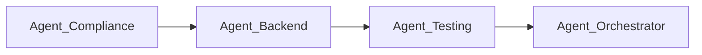
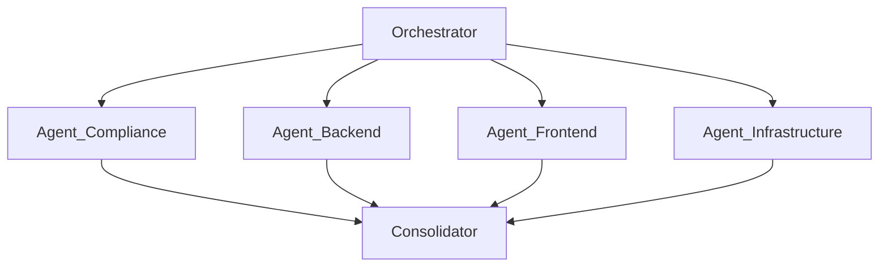
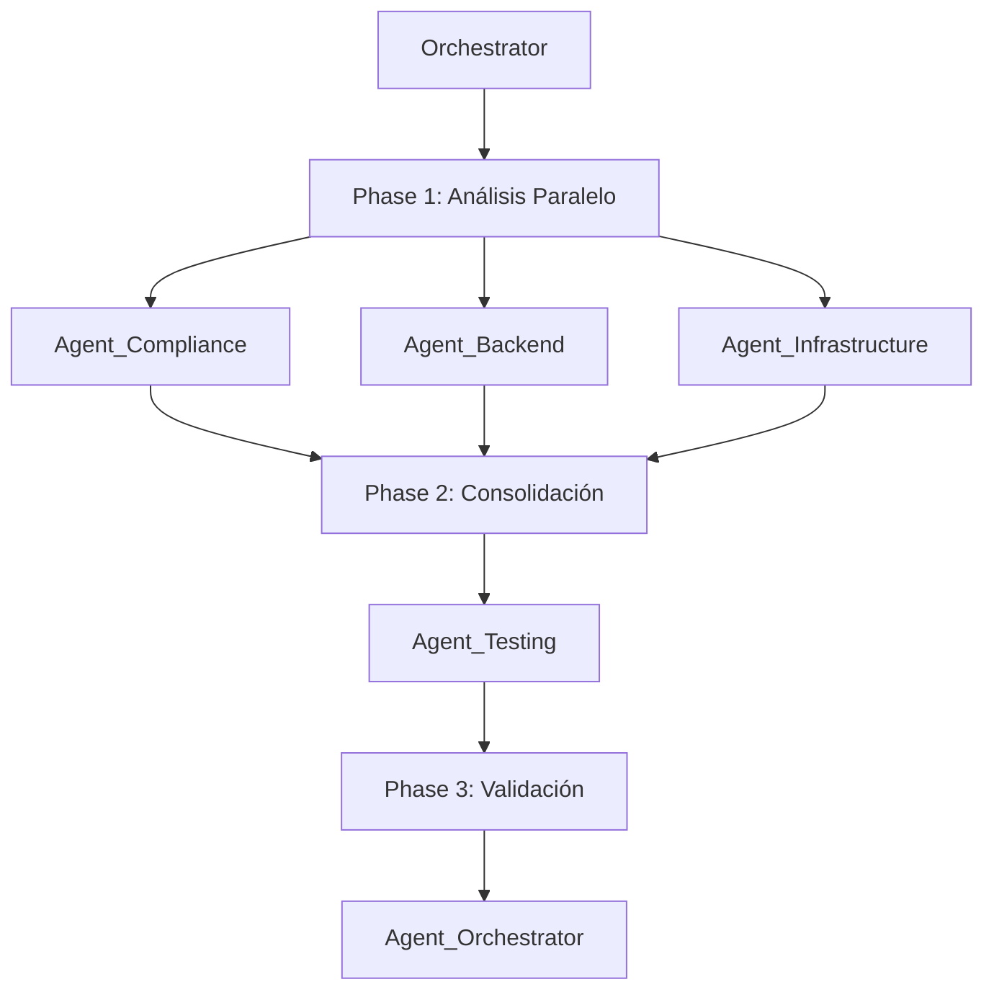

# 🤝 TEMPLATE MULTI-AGENT ORCHESTRATION - Orquestación Agentes Colaborativos

**Versión:** 1.0.0
**Nivel:** P4 (Alta Complejidad)
**Tipo:** Coordinación Multi-Agente para Tareas Complejas
**Tiempo Estimado:** Variable (4-12 horas según complejidad)
**Tokens Estimados:** 100K-300K (distribuidos entre agentes)

---

## 📋 Metadata Prompt

```yaml
prompt_id: TPL-P4-MULTI-001
version: 1.0.0
created: 2025-11-12
use_case: [complex_migration, full_stack_audit, compliance_closure, integration_testing]
agents_required: 2-5
coordination_mode: sequential | parallel | hybrid
outputs: [consolidated_report, agent_logs, metrics, action_plan]
```

---

## 🎯 Cuándo Usar Este Template

**Usar Multi-Agent Orchestration cuando:**
1. Tarea requiere expertise en >2 dominios (backend, frontend, infra, compliance)
2. Subtareas pueden ejecutarse en paralelo para acelerar delivery
3. Necesitas validación cruzada entre componentes
4. Proyecto requiere auditoría 360° (código + infra + seguridad + compliance)
5. Cierre de brechas afecta múltiples módulos/capas

**Ejemplos:**
- Auditoría completa proyecto (DTE + Payroll + Financial + Infra)
- Migración Odoo 16→19 (compliance + refactor + testing + deploy)
- Integración multi-sistema (Odoo ↔ AI ↔ SII ↔ Previred)
- Cierre brechas P0/P1 en 8 módulos simultáneamente

---

## 🏗️ Arquitectura Multi-Agente

### Roles de Agentes

```yaml
Agentes Disponibles:

  - Agent_Compliance:
      expertise: [odoo19_deprecations, sii_regulations, legal_compliance]
      tools: [grep, regex_validation, checklist_audit]
      outputs: [deprecations_report, compliance_score]

  - Agent_Backend:
      expertise: [python_models, orm, business_logic, api_design]
      tools: [code_analysis, complexity_metrics, test_execution]
      outputs: [code_quality_report, test_coverage]

  - Agent_Frontend:
      expertise: [qweb, javascript, xml_views, ui_ux]
      tools: [template_validation, accessibility_check]
      outputs: [ui_audit_report, accessibility_score]

  - Agent_Infrastructure:
      expertise: [docker, postgresql, redis, networking, security]
      tools: [container_scan, db_performance, security_audit]
      outputs: [infrastructure_report, security_assessment]

  - Agent_Testing:
      expertise: [pytest, odoo_tests, integration_tests, e2e]
      tools: [test_runner, coverage_analysis, regression_detection]
      outputs: [test_report, coverage_metrics]

  - Agent_Orchestrator:
      role: coordinator
      responsibilities:
        - Asignar tareas a agentes especializados
        - Consolidar reportes
        - Resolver conflictos
        - Validar completitud
      outputs: [consolidated_report, final_recommendations]
```

---

## 📐 Patrones de Coordinación

### Patrón 1: Secuencial (Pipeline)

**Uso:** Cuando output de Agent_A es input de Agent_B



**Ejemplo:** Cierre Brechas
1. Agent_Compliance: Identificar deprecaciones
2. Agent_Backend: Implementar fixes
3. Agent_Testing: Validar fixes
4. Agent_Orchestrator: Consolidar y aprobar

---

### Patrón 2: Paralelo (Fan-Out/Fan-In)

**Uso:** Cuando subtareas independientes, acelerar ejecución



**Ejemplo:** Auditoría 360°
1. Orchestrator: Dividir trabajo por dominio
2. Agentes ejecutan en paralelo (2-4h cada uno)
3. Consolidator: Merge reportes, detectar duplicados
4. Orchestrator: Priorizar hallazgos globales

---

### Patrón 3: Híbrido (Pipeline + Paralelo)

**Uso:** Máxima eficiencia, combinar secuencial y paralelo



**Ejemplo:** Migración Completa Odoo 16→19
1. **Fase 1 (Paralelo):** Compliance audit, Code review, Infra upgrade
2. **Fase 2 (Secuencial):** Consolidar hallazgos, priorizar
3. **Fase 3 (Secuencial):** Implementar fixes, Testing, Deploy

---

## 🎬 Template de Ejecución

### Fase 0: Planning (Orchestrator)

```markdown
## Definición Misión

**Objetivo:** {DESCRIPCIÓN_CLARA_OBJETIVO}

**Alcance:**
- Módulos afectados: {LISTA_MODULOS}
- Capas involucradas: [backend, frontend, infra, compliance]
- Deadline: {FECHA}
- Restricciones: {RESTRICCIONES}

**Criterios Éxito:**
- [ ] Compliance Odoo 19: 100% P0/P1 cerrados
- [ ] Test coverage: >80%
- [ ] Security: 0 CVEs críticas
- [ ] Performance: <2s carga página
- [ ] Documentación: Runbook completo

## Asignación Agentes

| Agente | Tarea | Duración | Dependencies | Output |
|--------|-------|----------|--------------|--------|
| Agent_Compliance | Audit deprecaciones Odoo 19 | 2h | None | compliance_report.md |
| Agent_Backend | Review código Python | 3h | None | backend_report.md |
| Agent_Frontend | Audit QWeb/JS | 2h | None | frontend_report.md |
| Agent_Infrastructure | Audit Docker/DB/Redis | 2h | None | infra_report.md |
| Agent_Testing | Run tests + coverage | 1h | [Agent_Backend] | test_report.md |
| Agent_Orchestrator | Consolidate + prioritize | 1h | [ALL] | final_report.md |

**Total Estimado:** 11h (6h si paralelo fases 1-2)
```

---

### Fase 1: Ejecución Agentes

#### Agent_Compliance

```markdown
## Prompt para Agent_Compliance

**Rol:** Auditor Compliance Odoo 19 CE

**Tarea:**
Ejecutar auditoría compliance completa según:
- `docs/prompts/02_compliance/CHECKLIST_ODOO19_VALIDACIONES.md`
- Validar 8 patrones deprecación (P0/P1/P2)
- Módulos: {LISTA_MODULOS}

**Comandos:**
```bash
# P0-1: t-esc → t-out
docker compose exec odoo grep -r "t-esc" /mnt/extra-addons/{MODULO}/

# P0-2: type='json' → type='jsonrpc'
docker compose exec odoo grep -r "type='json'" /mnt/extra-addons/{MODULO}/

# (... 8 patrones completos)
```

**Output Esperado:**
- Tabla hallazgos por patrón (línea exacta + contexto)
- Severidad (P0/P1/P2)
- Esfuerzo estimado cierre (horas)
- Prioridad recomendada

**Guardar:** `outputs/compliance_report_{MODULE}_{DATE}.md`
```

---

#### Agent_Backend

```markdown
## Prompt para Agent_Backend

**Rol:** Revisor Código Python (Odoo Models/Controllers)

**Tarea:**
Auditar código backend:
- Complejidad ciclomática (target <10)
- Anti-patterns (N+1 queries, hardcoded values)
- Security (SQL injection, validations)
- Testing (unit tests coverage)

**Archivos:**
```bash
find addons/{MODULO}/models/ -name "*.py"
find addons/{MODULO}/controllers/ -name "*.py"
```

**Métricas:**
- Complexity: radon cc -a -nb {files}
- Coverage: pytest --cov={MODULE} --cov-report=term
- Security: bandit -r {MODULE}/

**Output Esperado:**
- Lista funciones complejidad >15
- N+1 queries detectadas
- Vulnerabilidades seguridad
- Coverage % por archivo

**Guardar:** `outputs/backend_report_{MODULE}_{DATE}.md`
```

---

#### Agent_Frontend

```markdown
## Prompt para Agent_Frontend

**Rol:** Auditor Frontend (QWeb Templates, JS, XML Views)

**Tarea:**
Auditar capa presentación:
- QWeb: Sin t-esc (usar t-out)
- XML Views: Sin attrs={} (usar invisible=)
- JS: Linting (ESLint), accessibility
- UX: Validar flujos usuario, errores claros

**Archivos:**
```bash
find addons/{MODULO}/views/ -name "*.xml"
find addons/{MODULO}/static/src/ -name "*.js"
```

**Validaciones:**
- t-esc deprecado
- attrs={} en views
- Botones sin confirmación (delete, approve)
- Mensajes usuario (traducidos, claros)

**Output Esperado:**
- Hallazgos deprecaciones QWeb
- Issues UX (confusos, sin validación)
- Recomendaciones accessibility

**Guardar:** `outputs/frontend_report_{MODULE}_{DATE}.md`
```

---

#### Agent_Infrastructure

```markdown
## Prompt para Agent_Infrastructure

**Rol:** Auditor Infraestructura (Docker, DB, Redis, Seguridad)

**Tarea:**
Auditar stack infraestructura:
- Docker Compose: healthchecks, resource limits, secrets
- PostgreSQL: performance, indexes, backups
- Redis: cache config, persistencia
- Security: CVE scan, permisos, network segmentation

**Usar Template:**
`docs/prompts/04_templates/TEMPLATE_P4_INFRASTRUCTURE_AUDIT.md`

**Output Esperado:**
- Infrastructure score card
- Hallazgos críticos (P0: backups, secrets)
- Recomendaciones tuning DB/Redis
- Runbook operacional

**Guardar:** `outputs/infra_report_{DATE}.md`
```

---

#### Agent_Testing

```markdown
## Prompt para Agent_Testing

**Rol:** Ingeniero QA (Testing & Coverage)

**Tarea:**
Ejecutar suite completa tests:
- Unit tests: pytest {MODULE}/tests/
- Integration tests: odoo-bin --test-enable
- Coverage: >80% líneas, >70% branches
- Regression: Validar bugs conocidos no regresan

**Comandos:**
```bash
# Tests con coverage
docker compose exec odoo pytest /mnt/extra-addons/{MODULE}/tests/ \
    --cov={MODULE} \
    --cov-report=term-missing \
    --cov-report=html

# Tests Odoo framework
docker compose exec odoo odoo-bin --test-enable -i {MODULE} \
    --test-tags /{MODULE} -d odoo19_db --stop-after-init
```

**Output Esperado:**
- Coverage % total + por archivo
- Tests fallando (si hay)
- Gaps coverage (métodos sin tests)
- Recomendación nuevos tests

**Guardar:** `outputs/test_report_{MODULE}_{DATE}.md`
```

---

### Fase 2: Consolidación (Orchestrator)

```markdown
## Prompt para Agent_Orchestrator

**Rol:** Coordinador y Consolidador

**Tarea:**
Consolidar reportes de todos los agentes:

**Inputs:**
- compliance_report_{MODULE}_{DATE}.md (Agent_Compliance)
- backend_report_{MODULE}_{DATE}.md (Agent_Backend)
- frontend_report_{MODULE}_{DATE}.md (Agent_Frontend)
- infra_report_{DATE}.md (Agent_Infrastructure)
- test_report_{MODULE}_{DATE}.md (Agent_Testing)

**Proceso:**
1. **Merge hallazgos:** Detectar duplicados, agrupar similares
2. **Priorizar global:** P0 > P1 > P2, criticidad combinada
3. **Calcular métricas:** Score global, esfuerzo total
4. **Generar plan acción:** Sprints priorizados

**Output:**
### Reporte Consolidado Final

#### Executive Summary
- **Score Global:** {X}/100
- **Hallazgos Totales:** {N} (P0: {n0}, P1: {n1}, P2: {n2})
- **Esfuerzo Total:** {X} horas ({Y} días @ 6h/día)
- **Riesgo:** {ALTO|MEDIO|BAJO}

#### Top 10 Hallazgos Críticos
1. [H-P0-01] Descripción (afecta compliance + security)
2. [H-P0-02] Descripción
...

#### Plan Acción (3 Sprints)
**Sprint 1 (5 días):** P0 bloqueantes
- [ ] [H-P0-01] Migrar t-esc → t-out (8h)
- [ ] [H-P0-03] Fix SQL injection (4h)
...

**Sprint 2 (7 días):** P1 altas
...

**Sprint 3 (10 días):** P2 + mejoras
...

#### Métricas Comparativas

| Dominio | Score | Hallazgos | Esfuerzo |
|---------|-------|-----------|----------|
| Compliance | {X}/100 | {N} | {H}h |
| Backend | {X}/100 | {N} | {H}h |
| Frontend | {X}/100 | {N} | {H}h |
| Infrastructure | {X}/100 | {N} | {H}h |
| Testing | {X}/100 | {N} | {H}h |

**Guardar:** `outputs/CONSOLIDATED_REPORT_{PROJECT}_{DATE}.md`
```

---

## 📊 Métricas y KPIs

### Por Agente

```json
{
  "multi_agent_execution": {
    "date": "2025-11-12",
    "total_duration_hours": 6.5,
    "agents_executed": 5,
    "reports_generated": 6,

    "agent_metrics": [
      {
        "agent": "Agent_Compliance",
        "duration_hours": 2.0,
        "findings": 28,
        "critical": 12,
        "effort_hours": 48
      },
      {
        "agent": "Agent_Backend",
        "duration_hours": 3.0,
        "findings": 15,
        "critical": 5,
        "effort_hours": 32
      },
      {
        "agent": "Agent_Frontend",
        "duration_hours": 1.5,
        "findings": 8,
        "critical": 2,
        "effort_hours": 12
      },
      {
        "agent": "Agent_Infrastructure",
        "duration_hours": 2.0,
        "findings": 10,
        "critical": 3,
        "effort_hours": 24
      },
      {
        "agent": "Agent_Testing",
        "duration_hours": 1.0,
        "coverage_pct": 78.5,
        "tests_failing": 0,
        "effort_hours": 16
      }
    ],

    "consolidated": {
      "total_findings": 61,
      "critical_findings": 22,
      "total_effort_hours": 132,
      "global_score": 72.5,
      "sprints_required": 3
    }
  }
}
```

---

## 🚀 Ejecución Práctica

### Ejemplo: Auditoría 360° Proyecto Completo

```markdown
## Misión: Auditoría 360° Odoo 19 EERGYGROUP

**Objetivo:** Evaluar compliance, calidad, seguridad, performance de todos los módulos localization chilena.

**Módulos:**
- l10n_cl_dte (Facturación Electrónica)
- l10n_cl_hr_payroll (Nómina)
- l10n_cl_financial_reports (Reportes Financieros)
- + Infrastructure (Docker, DB, Redis)

**Patrón:** Paralelo (Fan-Out/Fan-In)

**Coordinación:**

### Step 1: Launch Agents (Paralelo)

**Agent_Compliance:**
```bash
# Ejecutar con template TEMPLATE_AUDITORIA.md
# Target: l10n_cl_dte, l10n_cl_hr_payroll, l10n_cl_financial_reports
# Output: compliance_report_{MODULE}_{DATE}.md
```

**Agent_Backend (paralelo con Compliance):**
```bash
# Ejecutar con template TEMPLATE_P4_DEEP_ANALYSIS.md
# Sección: Arquitectura + Performance + Security
# Output: backend_report_{MODULE}_{DATE}.md
```

**Agent_Infrastructure (paralelo):**
```bash
# Ejecutar con template TEMPLATE_P4_INFRASTRUCTURE_AUDIT.md
# Target: docker-compose.yml, DB, Redis
# Output: infra_report_{DATE}.md
```

**Duración Fase 1:** ~3h (paralelo), 9h (secuencial)

---

### Step 2: Testing (Secuencial, después Backend)

**Agent_Testing:**
```bash
# Esperar a que Agent_Backend complete
# Ejecutar tests con coverage
# Output: test_report_{MODULE}_{DATE}.md
```

**Duración Fase 2:** 1h

---

### Step 3: Consolidation (Orchestrator)

**Agent_Orchestrator:**
```bash
# Consolidar 4-6 reportes
# Detectar duplicados, priorizar, calcular métricas
# Generar plan acción 3 sprints
# Output: CONSOLIDATED_REPORT_EERGYGROUP_{DATE}.md
```

**Duración Fase 3:** 1h

---

**Duración Total:** 5h (vs 11h secuencial) = **55% time saved**
```

---

## ✅ Checklist Multi-Agent Execution

### Pre-Ejecución
- [ ] Objetivo claro definido
- [ ] Criterios éxito cuantificables
- [ ] Agentes necesarios identificados
- [ ] Patrón coordinación elegido (secuencial/paralelo/híbrido)
- [ ] Dependencies mapeadas
- [ ] Duración estimada calculada

### Durante Ejecución
- [ ] Cada agente usa template apropiado
- [ ] Outputs guardados en `outputs/` con nomenclatura consistente
- [ ] Logs de ejecución capturados
- [ ] Errores/blockers documentados
- [ ] Duración real vs estimada tracked

### Post-Ejecución
- [ ] Todos reportes generados
- [ ] Consolidación completada
- [ ] Métricas JSON exportadas
- [ ] Plan acción priorizado
- [ ] Hallazgos duplicados merged
- [ ] Reporte final entregado

---

## 📚 Referencias

**Templates Agentes:**
- Agent_Compliance: `TEMPLATE_AUDITORIA.md`
- Agent_Backend: `TEMPLATE_P4_DEEP_ANALYSIS.md`
- Agent_Infrastructure: `TEMPLATE_P4_INFRASTRUCTURE_AUDIT.md`
- Agent_Testing: (pendiente crear `TEMPLATE_TESTING.md`)

**Documentación Proyecto:**
- `docs/prompts/02_compliance/CHECKLIST_ODOO19_VALIDACIONES.md`
- `docs/prompts/03_maximas/MAXIMAS_DESARROLLO.md`
- `docs/prompts/03_maximas/MAXIMAS_AUDITORIA.md`

---

**Template Version:** 1.0.0
**Creado:** 2025-11-12
**Mantenedor:** Pedro Troncoso (@pwills85)
