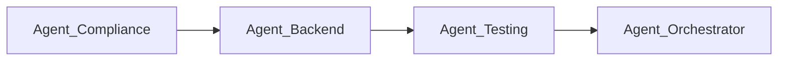
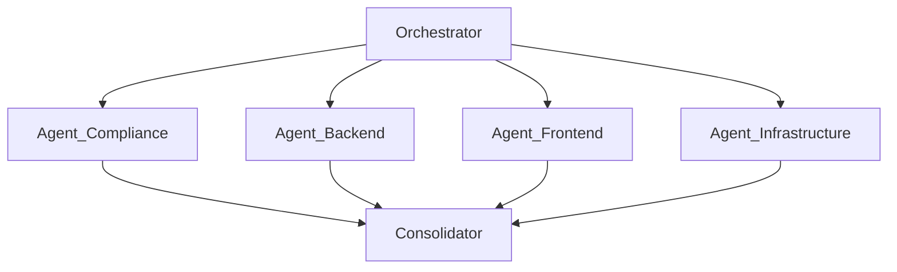
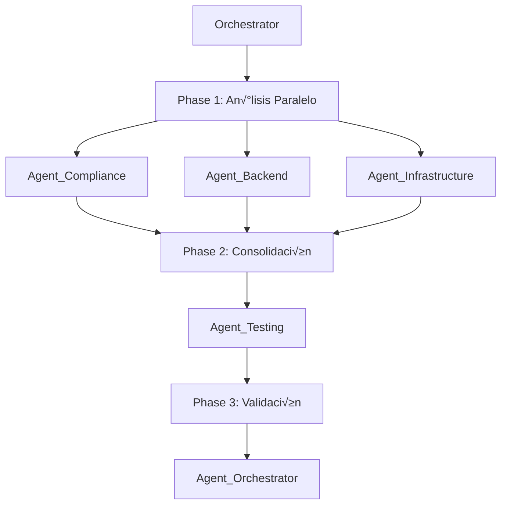

# 🤝 TEMPLATE MULTI-AGENT ORCHESTRATION - Orquestación Agentes Colaborativos

**Versión:** 1.0.0
**Nivel:** P4 (Alta Complejidad)
**Tipo:** Coordinación Multi-Agente para Tareas Complejas
**Tiempo Estimado:** Variable (4-12 horas seg√∫n complejidad)
**Tokens Estimados:** 100K-300K (distribuidos entre agentes)

---

## üìã Metadata Prompt

```yaml
prompt_id: TPL-P4-MULTI-001
version: 1.0.0
created: 2025-11-12
use_case: [complex_migration, full_stack_audit, compliance_closure, integration_testing]
agents_required: 2-5
coordination_mode: sequential | parallel | hybrid
outputs: [consolidated_report, agent_logs, metrics, action_plan]
```

---

## 🎯 Cuándo Usar Este Template

**Usar Multi-Agent Orchestration cuando:**
1. Tarea requiere expertise en >2 dominios (backend, frontend, infra, compliance)
2. Subtareas pueden ejecutarse en paralelo para acelerar delivery
3. Necesitas validación cruzada entre componentes
4. Proyecto requiere auditoría 360° (código + infra + seguridad + compliance)
5. Cierre de brechas afecta múltiples módulos/capas

**Ejemplos:**
- Auditoría completa proyecto (DTE + Payroll + Financial + Infra)
- Migración Odoo 16→19 (compliance + refactor + testing + deploy)
- Integración multi-sistema (Odoo ↔ AI ↔ SII ↔ Previred)
- Cierre brechas P0/P1 en 8 módulos simultáneamente

---

## 🏗️ Arquitectura Multi-Agente

### Roles de Agentes

```yaml
Agentes Disponibles:

  - Agent_Compliance:
      expertise: [odoo19_deprecations, sii_regulations, legal_compliance]
      tools: [grep, regex_validation, checklist_audit]
      outputs: [deprecations_report, compliance_score]

  - Agent_Backend:
      expertise: [python_models, orm, business_logic, api_design]
      tools: [code_analysis, complexity_metrics, test_execution]
      outputs: [code_quality_report, test_coverage]

  - Agent_Frontend:
      expertise: [qweb, javascript, xml_views, ui_ux]
      tools: [template_validation, accessibility_check]
      outputs: [ui_audit_report, accessibility_score]

  - Agent_Infrastructure:
      expertise: [docker, postgresql, redis, networking, security]
      tools: [container_scan, db_performance, security_audit]
      outputs: [infrastructure_report, security_assessment]

  - Agent_Testing:
      expertise: [pytest, odoo_tests, integration_tests, e2e]
      tools: [test_runner, coverage_analysis, regression_detection]
      outputs: [test_report, coverage_metrics]

  - Agent_Orchestrator:
      role: coordinator
      responsibilities:
        - Asignar tareas a agentes especializados
        - Consolidar reportes
        - Resolver conflictos
        - Validar completitud
      outputs: [consolidated_report, final_recommendations]
```

---

## 📐 Patrones de Coordinación

### Patrón 1: Secuencial (Pipeline)

**Uso:** Cuando output de Agent_A es input de Agent_B


```mermaid
graph LR
    A[Agent_Compliance] --> B[Agent_Backend]
    B --> C[Agent_Testing]
    C --> D[Agent_Orchestrator]
```

**Ejemplo:** Cierre Brechas
1. Agent_Compliance: Identificar deprecaciones
2. Agent_Backend: Implementar fixes
3. Agent_Testing: Validar fixes
4. Agent_Orchestrator: Consolidar y aprobar

---

### Patrón 2: Paralelo (Fan-Out/Fan-In)

**Uso:** Cuando subtareas independientes, acelerar ejecución


```mermaid
graph TD
    O[Orchestrator] --> A[Agent_Compliance]
    O --> B[Agent_Backend]
    O --> C[Agent_Frontend]
    O --> D[Agent_Infrastructure]
    A --> F[Consolidator]
    B --> F
    C --> F
    D --> F
```

**Ejemplo:** Auditoría 360°
1. Orchestrator: Dividir trabajo por dominio
2. Agentes ejecutan en paralelo (2-4h cada uno)
3. Consolidator: Merge reportes, detectar duplicados
4. Orchestrator: Priorizar hallazgos globales

---

### Patrón 3: Híbrido (Pipeline + Paralelo)

**Uso:** M√°xima eficiencia, combinar secuencial y paralelo


```mermaid
graph TD
    O[Orchestrator] --> P1[Phase 1: An√°lisis Paralelo]
    P1 --> A[Agent_Compliance]
    P1 --> B[Agent_Backend]
    P1 --> C[Agent_Infrastructure]
    A --> P2[Phase 2: Consolidación]
    B --> P2
    C --> P2
    P2 --> D[Agent_Testing]
    D --> P3[Phase 3: Validación]
    P3 --> F[Agent_Orchestrator]
```

**Ejemplo:** Migración Completa Odoo 16→19
1. **Fase 1 (Paralelo):** Compliance audit, Code review, Infra upgrade
2. **Fase 2 (Secuencial):** Consolidar hallazgos, priorizar
3. **Fase 3 (Secuencial):** Implementar fixes, Testing, Deploy

---

## 🎬 Template de Ejecución

### Fase 0: Planning (Orchestrator)

```markdown
## Definición Misión

**Objetivo:** {DESCRIPCIÓN_CLARA_OBJETIVO}

**Alcance:**
- Módulos afectados: {LISTA_MODULOS}
- Capas involucradas: [backend, frontend, infra, compliance]
- Deadline: {FECHA}
- Restricciones: {RESTRICCIONES}

**Criterios Éxito:**
- [ ] Compliance Odoo 19: 100% P0/P1 cerrados
- [ ] Test coverage: >80%
- [ ] Security: 0 CVEs críticas
- [ ] Performance: <2s carga p√°gina
- [ ] Documentación: Runbook completo

## Asignación Agentes

| Agente | Tarea | Duración | Dependencies | Output |
|--------|-------|----------|--------------|--------|
| Agent_Compliance | Audit deprecaciones Odoo 19 | 2h | None | compliance_report.md |
| Agent_Backend | Review código Python | 3h | None | backend_report.md |
| Agent_Frontend | Audit QWeb/JS | 2h | None | frontend_report.md |
| Agent_Infrastructure | Audit Docker/DB/Redis | 2h | None | infra_report.md |
| Agent_Testing | Run tests + coverage | 1h | [Agent_Backend] | test_report.md |
| Agent_Orchestrator | Consolidate + prioritize | 1h | [ALL] | final_report.md |

**Total Estimado:** 11h (6h si paralelo fases 1-2)
```

---

### Fase 1: Ejecución Agentes

#### Agent_Compliance

```markdown
## Prompt para Agent_Compliance

**Rol:** Auditor Compliance Odoo 19 CE

**Tarea:**
Ejecutar auditoría compliance completa según:
- `docs/prompts/02_compliance/CHECKLIST_ODOO19_VALIDACIONES.md`
- Validar 8 patrones deprecación (P0/P1/P2)
- Módulos: {LISTA_MODULOS}

**Comandos:**
```bash
# P0-1: t-esc ‚Üí t-out
docker compose exec odoo grep -r "t-esc" /mnt/extra-addons/{MODULO}/

# P0-2: type='json' ‚Üí type='jsonrpc'
docker compose exec odoo grep -r "type='json'" /mnt/extra-addons/{MODULO}/

# (... 8 patrones completos)
```

**Output Esperado:**
- Tabla hallazgos por patrón (línea exacta + contexto)
- Severidad (P0/P1/P2)
- Esfuerzo estimado cierre (horas)
- Prioridad recomendada

**Guardar:** `outputs/compliance_report_{MODULE}_{DATE}.md`
```

---

#### Agent_Backend

```markdown
## Prompt para Agent_Backend

**Rol:** Revisor Código Python (Odoo Models/Controllers)

**Tarea:**
Auditar código backend:
- Complejidad ciclom√°tica (target <10)
- Anti-patterns (N+1 queries, hardcoded values)
- Security (SQL injection, validations)
- Testing (unit tests coverage)

**Archivos:**
```bash
find addons/{MODULO}/models/ -name "*.py"
find addons/{MODULO}/controllers/ -name "*.py"
```

**Métricas:**
- Complexity: radon cc -a -nb {files}
- Coverage: pytest --cov={MODULE} --cov-report=term
- Security: bandit -r {MODULE}/

**Output Esperado:**
- Lista funciones complejidad >15
- N+1 queries detectadas
- Vulnerabilidades seguridad
- Coverage % por archivo

**Guardar:** `outputs/backend_report_{MODULE}_{DATE}.md`
```

---

#### Agent_Frontend

```markdown
## Prompt para Agent_Frontend

**Rol:** Auditor Frontend (QWeb Templates, JS, XML Views)

**Tarea:**
Auditar capa presentación:
- QWeb: Sin t-esc (usar t-out)
- XML Views: Sin attrs={} (usar invisible=)
- JS: Linting (ESLint), accessibility
- UX: Validar flujos usuario, errores claros

**Archivos:**
```bash
find addons/{MODULO}/views/ -name "*.xml"
find addons/{MODULO}/static/src/ -name "*.js"
```

**Validaciones:**
- t-esc deprecado
- attrs={} en views
- Botones sin confirmación (delete, approve)
- Mensajes usuario (traducidos, claros)

**Output Esperado:**
- Hallazgos deprecaciones QWeb
- Issues UX (confusos, sin validación)
- Recomendaciones accessibility

**Guardar:** `outputs/frontend_report_{MODULE}_{DATE}.md`
```

---

#### Agent_Infrastructure

```markdown
## Prompt para Agent_Infrastructure

**Rol:** Auditor Infraestructura (Docker, DB, Redis, Seguridad)

**Tarea:**
Auditar stack infraestructura:
- Docker Compose: healthchecks, resource limits, secrets
- PostgreSQL: performance, indexes, backups
- Redis: cache config, persistencia
- Security: CVE scan, permisos, network segmentation

**Usar Template:**
`docs/prompts/04_templates/TEMPLATE_P4_INFRASTRUCTURE_AUDIT.md`

**Output Esperado:**
- Infrastructure score card
- Hallazgos críticos (P0: backups, secrets)
- Recomendaciones tuning DB/Redis
- Runbook operacional

**Guardar:** `outputs/infra_report_{DATE}.md`
```

---

#### Agent_Testing

```markdown
## Prompt para Agent_Testing

**Rol:** Ingeniero QA (Testing & Coverage)

**Tarea:**
Ejecutar suite completa tests:
- Unit tests: pytest {MODULE}/tests/
- Integration tests: odoo-bin --test-enable
- Coverage: >80% líneas, >70% branches
- Regression: Validar bugs conocidos no regresan

**Comandos:**
```bash
# Tests con coverage
docker compose exec odoo pytest /mnt/extra-addons/{MODULE}/tests/ \
    --cov={MODULE} \
    --cov-report=term-missing \
    --cov-report=html

# Tests Odoo framework
docker compose exec odoo odoo-bin --test-enable -i {MODULE} \
    --test-tags /{MODULE} -d odoo19_db --stop-after-init
```

**Output Esperado:**
- Coverage % total + por archivo
- Tests fallando (si hay)
- Gaps coverage (métodos sin tests)
- Recomendación nuevos tests

**Guardar:** `outputs/test_report_{MODULE}_{DATE}.md`
```

---

### Fase 2: Consolidación (Orchestrator)

```markdown
## Prompt para Agent_Orchestrator

**Rol:** Coordinador y Consolidador

**Tarea:**
Consolidar reportes de todos los agentes:

**MEJORA v2.2:** Validación Cruzada GPT-5 (Opcional)
Después de consolidación Sonnet 4.5, ejecutar validación independiente con GPT-5 para detectar:
- Duplicados no detectados
- Priorizaciones incorrectas
- Estimaciones fuera de rango
- Gaps en an√°lisis

Ver: Fase 2.5 Validación GPT-5 más abajo.

**Inputs:**
- compliance_report_{MODULE}_{DATE}.md (Agent_Compliance)
- backend_report_{MODULE}_{DATE}.md (Agent_Backend)
- frontend_report_{MODULE}_{DATE}.md (Agent_Frontend)
- infra_report_{DATE}.md (Agent_Infrastructure)
- test_report_{MODULE}_{DATE}.md (Agent_Testing)

**Proceso:**
1. **Merge hallazgos:** Detectar duplicados, agrupar similares
2. **Priorizar global:** P0 > P1 > P2, criticidad combinada
3. **Calcular métricas:** Score global, esfuerzo total
4. **Generar plan acción:** Sprints priorizados

**Output:**
### Reporte Consolidado Final

#### Executive Summary
- **Score Global:** {X}/100
- **Hallazgos Totales:** {N} (P0: {n0}, P1: {n1}, P2: {n2})
- **Esfuerzo Total:** {X} horas ({Y} días @ 6h/día)
- **Riesgo:** {ALTO|MEDIO|BAJO}

#### Top 10 Hallazgos Críticos
1. [H-P0-01] Descripción (afecta compliance + security)
2. [H-P0-02] Descripción
...

#### Plan Acción (3 Sprints)
**Sprint 1 (5 días):** P0 bloqueantes
- [ ] [H-P0-01] Migrar t-esc ‚Üí t-out (8h)
- [ ] [H-P0-03] Fix SQL injection (4h)
...

**Sprint 2 (7 días):** P1 altas
...

**Sprint 3 (10 días):** P2 + mejoras
...

#### Métricas Comparativas

| Dominio | Score | Hallazgos | Esfuerzo |
|---------|-------|-----------|----------|
| Compliance | {X}/100 | {N} | {H}h |
| Backend | {X}/100 | {N} | {H}h |
| Frontend | {X}/100 | {N} | {H}h |
| Infrastructure | {X}/100 | {N} | {H}h |
| Testing | {X}/100 | {N} | {H}h |

**Guardar:** `outputs/CONSOLIDATED_REPORT_{PROJECT}_{DATE}.md`
```

---

## 📊 Métricas y KPIs

### Por Agente

```json
{
  "multi_agent_execution": {
    "date": "2025-11-12",
    "total_duration_hours": 6.5,
    "agents_executed": 5,
    "reports_generated": 6,

    "agent_metrics": [
      {
        "agent": "Agent_Compliance",
        "duration_hours": 2.0,
        "findings": 28,
        "critical": 12,
        "effort_hours": 48
      },
      {
        "agent": "Agent_Backend",
        "duration_hours": 3.0,
        "findings": 15,
        "critical": 5,
        "effort_hours": 32
      },
      {
        "agent": "Agent_Frontend",
        "duration_hours": 1.5,
        "findings": 8,
        "critical": 2,
        "effort_hours": 12
      },
      {
        "agent": "Agent_Infrastructure",
        "duration_hours": 2.0,
        "findings": 10,
        "critical": 3,
        "effort_hours": 24
      },
      {
        "agent": "Agent_Testing",
        "duration_hours": 1.0,
        "coverage_pct": 78.5,
        "tests_failing": 0,
        "effort_hours": 16
      }
    ],

    "consolidated": {
      "total_findings": 61,
      "critical_findings": 22,
      "total_effort_hours": 132,
      "global_score": 72.5,
      "sprints_required": 3
    }
  }
}
```

---

## 🚀 Ejecución Práctica

### Ejemplo: Auditoría 360° Proyecto Completo

```markdown
## Misión: Auditoría 360° Odoo 19 EERGYGROUP

**Objetivo:** Evaluar compliance, calidad, seguridad, performance de todos los módulos localization chilena.

**Módulos:**
- l10n_cl_dte (Facturación Electrónica)
- l10n_cl_hr_payroll (Nómina)
- l10n_cl_financial_reports (Reportes Financieros)
- + Infrastructure (Docker, DB, Redis)

**Patrón:** Paralelo (Fan-Out/Fan-In)

**Coordinación:**

### Step 1: Launch Agents (Paralelo)

**Agent_Compliance:**
```bash
# Ejecutar con template TEMPLATE_AUDITORIA.md
# Target: l10n_cl_dte, l10n_cl_hr_payroll, l10n_cl_financial_reports
# Output: compliance_report_{MODULE}_{DATE}.md
```

**Agent_Backend (paralelo con Compliance):**
```bash
# Ejecutar con template TEMPLATE_P4_DEEP_ANALYSIS.md
# Sección: Arquitectura + Performance + Security
# Output: backend_report_{MODULE}_{DATE}.md
```

**Agent_Infrastructure (paralelo):**
```bash
# Ejecutar con template TEMPLATE_P4_INFRASTRUCTURE_AUDIT.md
# Target: docker-compose.yml, DB, Redis
# Output: infra_report_{DATE}.md
```

**Duración Fase 1:** ~3h (paralelo), 9h (secuencial)

---

### Step 2: Testing (Secuencial, después Backend)

**Agent_Testing:**
```bash
# Esperar a que Agent_Backend complete
# Ejecutar tests con coverage
# Output: test_report_{MODULE}_{DATE}.md
```

**Duración Fase 2:** 1h

---

### Step 3: Consolidation (Orchestrator)

**Agent_Orchestrator:**
```bash
# Consolidar 4-6 reportes
# Detectar duplicados, priorizar, calcular métricas
# Generar plan acción 3 sprints
# Output: CONSOLIDATED_REPORT_EERGYGROUP_{DATE}.md
```

**Duración Fase 3:** 1h

---

**Duración Total:** 5h (vs 11h secuencial) = **55% time saved**
```

---

## ‚úÖ Checklist Multi-Agent Execution

### Pre-Ejecución
- [ ] Objetivo claro definido
- [ ] Criterios éxito cuantificables
- [ ] Agentes necesarios identificados
- [ ] Patrón coordinación elegido (secuencial/paralelo/híbrido)
- [ ] Dependencies mapeadas
- [ ] Duración estimada calculada

### Durante Ejecución
- [ ] Cada agente usa template apropiado
- [ ] Outputs guardados en `outputs/` con nomenclatura consistente
- [ ] Logs de ejecución capturados
- [ ] Errores/blockers documentados
- [ ] Duración real vs estimada tracked

### Post-Ejecución
- [ ] Todos reportes generados
- [ ] Consolidación completada
- [ ] Métricas JSON exportadas
- [ ] Plan acción priorizado
- [ ] Hallazgos duplicados merged
- [ ] Reporte final entregado

---

## üìö Referencias

**Templates Agentes:**
- Agent_Compliance: `TEMPLATE_AUDITORIA.md`
- Agent_Backend: `TEMPLATE_P4_DEEP_ANALYSIS.md`
- Agent_Infrastructure: `TEMPLATE_P4_INFRASTRUCTURE_AUDIT.md`
- Agent_Testing: (pendiente crear `TEMPLATE_TESTING.md`)

**Documentación Proyecto:**
- `docs/prompts/02_compliance/CHECKLIST_ODOO19_VALIDACIONES.md`
- `docs/prompts/03_maximas/MAXIMAS_DESARROLLO.md`
- `docs/prompts/03_maximas/MAXIMAS_AUDITORIA.md`

---

### Fase 2.5: Validación Cruzada GPT-5 (Opcional v2.2)

**MEJORA v2.2:** Validación independiente post-consolidación para aumentar confiabilidad.

```markdown
## Prompt para Agent_Validator_GPT5

**Rol:** Validador Independiente (Cross-Model Validation)

**Tarea:**
Analizar CONSOLIDATED_REPORT_360_{DATE}.md como auditor externo para detectar:

### CHECKLIST VALIDACIÓN:

**1. Duplicados Ocultos:**
- ¬øHay issues reportados por m√∫ltiples agentes que no se consolidaron correctamente?
- ¬øDiferentes nombres pero mismo problema? (ej: 'attrs deprecado' vs 'Python expressions')
- ¿Hallazgos solapados en diferentes módulos?

**2. Priorización Correcta:**
- ¿P0 realmente críticos? (breaking changes Odoo 19, deadlines SII)
- ¬øP1 bien priorizados seg√∫n impacto vs esfuerzo?
- ¿Algún P2 debería ser P1 por impacto negocio?
- ¬øPrioridad alineada con compliance P0 deadline (2025-03-01)?

**3. Estimaciones Realistas:**
- ¬øHoras realistas comparado benchmarks industria?
- ¿Se consideró testing, documentación, deployment?
- ¬øEstimaciones incluyen refactoring indirecto (code adjacent)?
- Ejemplo: attrs= 33 ocurrencias ‚Üí 6.5h (¬øsuficiente para todos?)

**4. Gaps en An√°lisis:**
- ¿Falta algún dominio crítico? (seguridad, performance, UX, DevOps)
- ¬øAn√°lisis demasiado superficial en alguna √°rea?
- ¬øSe revisaron archivos clave? (models/, views/, controllers/)
- ¿Se validó compliance con TODOS los patrones Odoo 19?

**5. Coherencia Cross-Domain:**
- ¿Hallazgo backend impacta frontend pero no se detectó?
- ¬øFix frontend requiere cambio backend pero no se menciona?
- ¿Migración P0 rompe tests pero no se planificó re-testeo?

### OUTPUT TABLA VALIDACIÓN:

| Issue ID | Problema Detectado | Severidad | Recomendación Correctiva |
|----------|-------------------|-----------|--------------------------|
| H-P0-01 (attrs=) | OK, consolidado correctamente (33 ‚Üí 1 issue) | ‚úÖ | Ninguna |
| H-P0-02 (complejidad) | Estimación 8h parece baja (método 24 complejidad) | ⚠️ | Aumentar a 10-12h |
| Duplicado oculto | self._cr reportado Compliance + Backend sin merge | 🔴 | Consolidar en 1 issue |
| Gap seguridad | No se auditó SQL injection en controllers/ | 🟡 | Agregar revisión seguridad |
| ... | ... | ... | ... |

**SCORE VALIDACIÓN:** {X}/100

**Criterios score:**
- 90-100: EXCELENTE (mínimos ajustes)
- 80-89: BUENO (ajustes menores recomendados)
- 70-79: ACEPTABLE (requiere revisión)
- <70: RECHAZAR (re-consolidar con hallazgos GPT-5)

**RECOMENDACIÓN FINAL:** [APROBAR | REVISAR | RECHAZAR]

**Justificación:** {explicación 2-3 líneas}

**Acciones correctivas (si aplica):**
1. Merge duplicados: H-P1-05 + H-P1-12 (mismo issue)
2. Re-priorizar: H-P2-03 ‚Üí H-P1 (impacto subestimado)
3. Ajustar estimaciones: Sprint 1 15h ‚Üí 18h
4. Agregar hallazgo: SQL injection controllers/webhook.py
```

### Integración Workflow Validación GPT-5

```bash
# En ciclo_completo_auditoria.sh - FASE 4

log "🔍 FASE 4: Validación cruzada GPT-5..."

copilot -p "$(cat << 'EOF'
Valida CONSOLIDATED_REPORT_360_${DATE}.md siguiendo TEMPLATE_MULTI_AGENT_ORCHESTRATION.md Fase 2.5:

CHECKLIST:
1. Duplicados ocultos
2. Priorización correcta
3. Estimaciones realistas
4. Gaps an√°lisis
5. Coherencia cross-domain

OUTPUT: validation_gpt5_${DATE}.md en docs/prompts/06_outputs/
EOF
)" --model gpt-5 --allow-all-paths

success "‚úÖ Fase 4 completada"

# Leer score validación
VALIDATION_SCORE=$(grep "SCORE VALIDACIÓN:" "${OUTPUT_DIR}/validation_gpt5_${DATE}.md" | awk '{print $3}' | cut -d/ -f1)

if [ "$VALIDATION_SCORE" -lt 80 ]; then
    warn "⚠️ Score validación GPT-5: ${VALIDATION_SCORE}/100 (< 80)"
    warn "Revisar hallazgos validación antes de aprobar consolidación"
fi
```

### Ejemplo Output Validación GPT-5

```markdown
# 🔍 VALIDACIÓN GPT-5 - CONSOLIDATED_REPORT_360_2025-11-12

**Fecha validación:** 2025-11-12 16:45:00
**Modelo:** GPT-5 (temperature 0.1)
**Reporte validado:** CONSOLIDATED_REPORT_360_2025-11-12.md

---

## ✅ RESULTADO VALIDACIÓN

**Score:** 87/100 (BUENO - ajustes menores recomendados)
**Recomendación:** APROBAR con correcciones sugeridas

---

## 📊 HALLAZGOS VALIDACIÓN

| Issue ID | Problema Detectado | Severidad | Acción Correctiva |
|----------|-------------------|-----------|-------------------|
| H-P0-01 (attrs=) | ‚úÖ OK - Bien consolidado (Compliance + Frontend ‚Üí 1 issue) | ‚úÖ | Ninguna |
| H-P0-03 (_sql_constraints) | ‚úÖ OK - Detectado correctamente (3 occurrences) | ‚úÖ | Ninguna |
| H-P1-04 (self._cr) | ⚠️ DUPLICADO NO CONSOLIDADO - Backend + Compliance reportan separado | 🔴 CRÍTICO | Merge en 1 issue (13 total occurrences) |
| Estimación Sprint 1 | ⚠️ 15h parece bajo (incluye refactor complejidad 24) | ⚠️ | Aumentar a 18-20h |
| Gap seguridad | ⚠️ No se auditó SQL injection en controllers/webhook.py | 🟡 | Agregar revisión endpoint seguridad |
| H-P2-07 (performance) | ⚠️ Debería ser P1 (N+1 queries impacta UX directamente) | 🟠 | Re-priorizar P2 → P1 |

**Total hallazgos validación:** 6 (1 crítico, 2 warnings, 3 menores)

---

## 🎯 ANÁLISIS DETALLADO

### 1. Duplicados (Score: 7/10)

**Encontrado 1 duplicado crítico:**
- `self._cr` reportado por:
  - Agent_Compliance: 13 occurrences (P1)
  - Agent_Backend: "self._cr deprecated" (P1)

**Acción:** Consolidar en **H-P1-UNIFIED-01** con 13 occurrences totales

### 2. Priorización (Score: 9/10)

**Bien priorizado:**
- ‚úÖ P0 attrs= deadline 2025-03-01 (correcto)
- ‚úÖ P0 complejidad 24 (correcto, impide mantenimiento)

**Re-priorizar:**
- ⚠️ H-P2-07 (N+1 queries) → **P1**
  - Justificación: Impacta UX directamente (120s load time)
  - Esfuerzo bajo (4h) vs impacto alto

### 3. Estimaciones (Score: 8/10)

**Ajustes recomendados:**

| Sprint/Issue | Estimado | Recomendado | Razón |
|-------------|----------|-------------|-------|
| Sprint 1 total | 15h | 18-20h | Refactoring complejidad 24 subestimado |
| H-P0-02 (refactor) | 8h | 10h | Incluir tests + docs |
| H-P1-04 (self._cr) | - | 2h | Merge duplicado, agregar esfuerzo |

### 4. Gaps An√°lisis (Score: 8/10)

**Detectado:**
- ⚠️ **Seguridad controllers/**: No se auditó SQL injection en webhook.py
- ⚠️ **Performance queries:** Solo se detectó N+1, no se analizó query complexity
- ℹ️ **DevOps:** No se auditó Docker healthchecks, resource limits

**Recomendación:** Agregar Agent_Security en próximo ciclo

### 5. Coherencia Cross-Domain (Score: 10/10)

‚úÖ Excelente coherencia:
- attrs= impacta Compliance + Frontend ‚Üí bien consolidado
- Complejidad backend requiere m√°s tests ‚Üí detectado
- _sql_constraints backend impacta compliance ‚Üí OK

---

## ✅ ACCIÓN RECOMENDADA

**APROBAR consolidación** con las siguientes correcciones:

1. **CRÍTICO:** Merge duplicado self._cr (H-P1-04)
2. **IMPORTANTE:** Aumentar estimación Sprint 1 a 18-20h
3. **DESEABLE:** Re-priorizar N+1 queries P2 ‚Üí P1
4. **NICE-TO-HAVE:** Agregar auditoría seguridad controllers/

**Timeline:** 30 minutos correcciones → Re-generar consolidación v2

---

**Validado por:** GPT-5 (temperature 0.1)
**Duración validación:** 2m 34s
**Costo:** $0.15 Premium
```

---

**Template Version:** 1.0.1 (v2.2 - Validación GPT-5 integrada)
**Creado:** 2025-11-12
**Actualizado:** 2025-11-12 (MEJORA 5)
**Mantenedor:** Pedro Troncoso (@pwills85)
