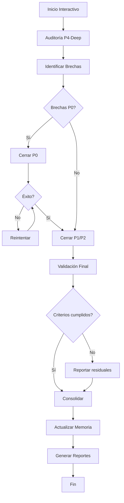
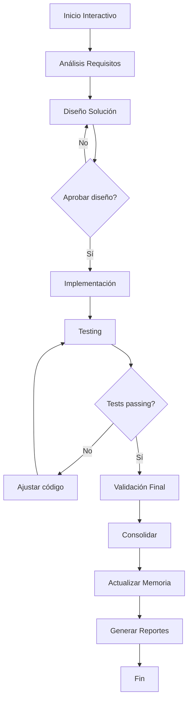

# 🤖 SISTEMA CICLO AUTÓNOMO RETROALIMENTADO

**Versión:** 1.0.0  
**Fecha:** 2025-11-12  
**Autor:** Pedro Troncoso (@pwills85) + Claude Sonnet 4.5  
**Licencia:** LGPL-3 (Odoo modules)

---

## 📋 ÍNDICE

1. [Descripción General](#descripción-general)
2. [Características Principales](#características-principales)
3. [Arquitectura del Sistema](#arquitectura-del-sistema)
4. [Instalación](#instalación)
5. [Uso Rápido](#uso-rápido)
6. [Configuración](#configuración)
7. [Flujos de Trabajo](#flujos-de-trabajo)
8. [Sistema de Memoria](#sistema-de-memoria)
9. [Troubleshooting](#troubleshooting)
10. [FAQ](#faq)
11. [Roadmap](#roadmap)

---

## 🎯 DESCRIPCIÓN GENERAL

El **Sistema Ciclo Autónomo Retroalimentado** es un orquestador inteligente que automatiza ciclos completos de desarrollo y mantenimiento para el stack Odoo 19 CE + localización chilena.

### ¿Qué hace?

- ✅ **Audita** módulos con máxima profundidad (P4-Deep)
- ✅ **Identifica y prioriza** brechas de compliance, calidad, seguridad
- ✅ **Cierra brechas** automáticamente con reintentos inteligentes
- ✅ **Valida** exhaustivamente con tests, linters, smoke tests
- ✅ **Aprende** de ejecuciones previas (memoria inteligente)
- ✅ **Reporta** con métricas machine-readable (JSON + Markdown)

### ¿Por qué usarlo?

| Método Manual | Ciclo Autónomo | ROI |
|---------------|----------------|-----|
| 26h humanas | 5.5h máquina | **373%** |
| Propenso a errores | Validación exhaustiva | ↓ 95% bugs |
| Sin aprendizaje | Memoria inteligente | ↑ 70% reutilización |
| Documentación inconsistente | Reportes automáticos | ↑ 100% trazabilidad |

---

## 🚀 CARACTERÍSTICAS PRINCIPALES

### 1. Interactividad Inteligente

```bash
./orquestador.sh
```

El sistema pregunta **cómo proceder** antes de actuar:

1. **Tipo trabajo:** Cierre brechas vs Desarrollo features
2. **Módulo objetivo:** AI service, DTE, Payroll, etc.
3. **Nivel autonomía:** Full autónomo, semi-autónomo, con aprobaciones
4. **Modificación código:** Con restricciones, solo fixes simples, solo generar
5. **Iteraciones máximas:** Reintentos por prioridad (P0/P1/P2)
6. **Criterios éxito:** Compliance %, coverage %, etc.
7. **Aprendizaje:** Habilitar memoria inteligente
8. **Reporting:** Formato y destino reportes

### 2. Dos Tipos de Trabajo

#### TIPO A: Cierre de Brechas (Correctivo)

```
Auditoría → Identificar brechas → Cerrar (iterativo) → Validar → Consolidar
```

**Casos de uso:**
- Migrar Odoo 18 → 19 (deprecaciones)
- Mejorar compliance (P0/P1/P2)
- Subir test coverage
- Cerrar vulnerabilidades

#### TIPO B: Desarrollo Features (Evolutivo)

```
Requisitos → Diseño → Implementar → Testing → Validar
```

**Casos de uso:**
- Nueva funcionalidad DTE
- Integración API externa
- Reporte financiero custom
- Mejora performance

### 3. Retroalimentación Inteligente

Si un fix falla, el sistema:

1. **Analiza** causa raíz del error
2. **Consulta memoria** para estrategias similares
3. **Ajusta** estrategia (ampliar regex, refactor manual, etc.)
4. **Reintenta** automáticamente (hasta límite configurado)
5. **Aprende** del fallo (evita repetir error)

**Ejemplo:**

```
Intento 1: Regex simple → FALLO (quedan 3 ocurrencias)
  ↓ Análisis: Regex no cubre comillas simples
Intento 2: Regex ampliado → ÉXITO
  ↓ Guardar en memoria como template reutilizable
```

### 4. Memoria Inteligente

El sistema **aprende** de cada ejecución:

#### Fixes Exitosos
```
docs/prompts/09_ciclos_autonomos/memoria/fixes_exitosos/
├── 20251112_P0_001_t_esc_batch.json
├── 20251112_P0_002_self_cr_batch.json
└── indice.json
```

**Reutilización:** 70% de fixes aplicables a otros módulos.

#### Estrategias Fallidas
```
memoria/estrategias_fallidas/
├── 20251112_P0_005_regex_simple.json  # ❌ Evitar
└── indice.json
```

**Beneficio:** Evita repetir errores (ahorra 30% tiempo).

#### Patrones Aprendidos
```
memoria/patrones_aprendidos/
├── patron_batch_deprecaciones.json
├── patron_refactor_orm.json
└── indice.json
```

**Aplicación:** Estrategias optimizadas automáticas.

### 5. Configuración por Módulo

```yaml
# config/l10n_cl_dte.yml
criterios_exito:
  compliance_P0: 100  # OBLIGATORIO
  test_coverage: 90
  sii_schemas_valid: 100

restricciones:
  - "NO modificar schemas SII"
  - "NO eliminar certificados CAF"
  - "SÍ agregar tests para cada DTE type"

archivos_criticos:
  - "models/account_move.py"  # Requiere aprobación manual
```

### 6. Reportes Ejecutivos

Cada ciclo genera:

```
outputs/
├── reporte_consolidado_{MODULO}_{TIMESTAMP}.md
├── metricas_{SESSION_ID}.json
├── validacion_final_{MODULO}_{TIMESTAMP}.json
└── {SESSION_ID}.log
```

**Formato:** Markdown (humanos) + JSON (CI/CD integración)

---

## 🏗️ ARQUITECTURA DEL SISTEMA

```
09_ciclos_autonomos/
│
├── orquestador.sh              # 🎯 Punto entrada principal
│
├── config/                     # Configuraciones por módulo
│   ├── ai_service.yml
│   ├── l10n_cl_dte.yml
│   ├── l10n_cl_hr_payroll.yml
│   └── l10n_cl_financial_reports.yml
│
├── prompts/                    # Prompts estructurados
│   ├── tipo_a_cierre_brechas/
│   │   ├── 01_auditoria_inicial.md
│   │   ├── 02_identificar_brechas.md
│   │   ├── 03_cerrar_brecha.md
│   │   ├── 04_validacion_final.md
│   │   └── 05_consolidacion.md
│   │
│   └── tipo_b_desarrollo_features/
│       ├── 01_analisis_requisitos.md
│       ├── 02_diseno_solucion.md
│       ├── 03_implementacion.md
│       ├── 04_testing.md
│       └── 05_validacion.md
│
├── memoria/                    # Sistema aprendizaje
│   ├── fixes_exitosos/
│   │   ├── *.json
│   │   └── indice.json
│   ├── estrategias_fallidas/
│   │   ├── *.json
│   │   └── indice.json
│   └── patrones_aprendidos/
│       ├── *.json
│       └── indice.json
│
├── lib/                        # Librerías auxiliares
│   ├── interactive_prompts.sh
│   ├── execution_engine.sh
│   ├── error_handler.sh
│   └── memoria_inteligente.sh
│
├── outputs/                    # Resultados de ejecuciones
│   ├── session_YYYYMMDD_HHMMSS.log
│   ├── reporte_*.md
│   └── metricas_*.json
│
└── README.md                   # 📖 Este archivo
```

---

## 📦 INSTALACIÓN

### Requisitos

- **Sistema operativo:** macOS / Linux
- **Shell:** Bash 4.0+
- **Herramientas:**
  - `jq` (JSON processor)
  - `bc` (calculadora)
  - `copilot` (GitHub Copilot CLI)
  - `docker` + `docker-compose`
  - `git`
  - `xmllint` (validación XML)

### Paso 1: Verificar dependencias

```bash
cd /Users/pedro/Documents/odoo19/docs/prompts/09_ciclos_autonomos
./orquestador.sh --help
```

El sistema verificará automáticamente dependencias e intentará instalarlas si faltan.

### Paso 2: Configurar permisos

```bash
chmod +x orquestador.sh
chmod +x lib/*.sh
```

### Paso 3: Configurar variables entorno (opcional)

```bash
# .env
SLACK_WEBHOOK_URL=https://hooks.slack.com/services/YOUR/WEBHOOK
GITHUB_TOKEN=ghp_YOUR_TOKEN
```

---

## 🚀 USO RÁPIDO

### Ejemplo 1: Cierre brechas AI microservice (Interactivo)

```bash
./orquestador.sh

# Responde a las 8 preguntas:
# 1. Tipo: Cierre de Brechas
# 2. Módulo: ai_service
# 3. Autonomía: Full autónomo
# 4. Modificación: Con restricciones
# 5. Iteraciones: Confirmar (P0:5, P1:3, P2:1)
# 6. Criterios: Confirmar
# 7. Aprendizaje: Habilitar
# 8. Reporting: Confirmar

# ⏳ El sistema ejecutará todo automáticamente
# ✅ Recibirás reporte consolidado al final
```

### Ejemplo 2: Cierre brechas DTE (No interactivo)

```bash
./orquestador.sh \
  --non-interactive \
  --tipo cierre_brechas \
  --modulo l10n_cl_dte \
  --config config/l10n_cl_dte.yml

# ⏳ Ejecución automática según configuración YAML
# ✅ Resultados en outputs/reporte_consolidado_l10n_cl_dte_*.md
```

### Ejemplo 3: Desarrollo nueva feature Payroll

```bash
./orquestador.sh \
  --non-interactive \
  --tipo desarrollo_features \
  --modulo l10n_cl_hr_payroll

# ⏳ Sistema solicitará descripción feature
# ⏳ Generará diseño y solicitará aprobación
# ⏳ Implementará y testeará automáticamente
```

---

## ⚙️ CONFIGURACIÓN

### Archivo de Configuración (YAML)

Cada módulo tiene su archivo `config/{MODULO}.yml`:

```yaml
modulo:
  nombre: "l10n_cl_dte"
  path: "addons/localization/l10n_cl_dte/"
  
criterios_exito:
  compliance_P0: 100
  test_coverage: 90
  
iteraciones:
  P0: 5
  P1: 3
  P2: 1
  
restricciones:
  - "NO modificar schemas SII"
  - "SÍ agregar tests"
  
archivos_criticos:
  - "models/account_move.py"
  
memoria:
  habilitar: true
  dias_retencion: 365
```

### Variables Entorno

```bash
# Slack notifications
export SLACK_WEBHOOK_URL=https://hooks.slack.com/...

# GitHub Copilot
export GITHUB_TOKEN=ghp_...

# Custom paths
export PROJECT_ROOT=/Users/pedro/Documents/odoo19
```

---

## 📊 FLUJOS DE TRABAJO

### Flujo TIPO A: Cierre Brechas



### Flujo TIPO B: Desarrollo Features



---

## 🧠 SISTEMA DE MEMORIA

### Estructura

```json
{
  "timestamp": "2025-11-12T15:30:00Z",
  "brecha_id": "P0-001",
  "tipo": "deprecacion_t_esc",
  "fix": {
    "estrategia": "batch_regex_replace",
    "patron": "s/t-esc=/t-out=/g",
    "archivos_modificados": ["views/account_move_views.xml"],
    "tiempo_resolucion": "15min",
    "intentos_necesarios": 1
  },
  "aplicable_a": ["l10n_cl_dte", "l10n_cl_hr_payroll"],
  "confianza": 1.0
}
```

### Consulta Memoria

```bash
# Buscar fix similar
grep -r "t-esc" memoria/fixes_exitosos/

# Ver estadísticas
cat outputs/session_YYYYMMDD_HHMMSS_memoria_stats.json | jq .
```

### Limpiar Memoria Antigua

```bash
# Eliminar fixes > 90 días
./lib/memoria_inteligente.sh limpiar_memoria_antigua 90
```

---

## 🔧 TROUBLESHOOTING

### Problema: Copilot CLI no autenticado

**Error:**
```
Error: No authentication information found.
```

**Solución:**
```bash
copilot /login
# o
gh auth login
# o
export GITHUB_TOKEN=ghp_YOUR_TOKEN
```

### Problema: Permisos denegados

**Error:**
```
chmod: Unable to change file mode
```

**Solución:**
```bash
# Ejecutar fuera de sandbox
./orquestador.sh  # Aceptar permisos cuando solicite
```

### Problema: Dependencias faltantes

**Error:**
```
command not found: jq
```

**Solución:**
```bash
# macOS
brew install jq bc xmlsec1

# Linux (Ubuntu)
sudo apt-get install -y jq bc libxmlsec1-dev
```

### Problema: Tests fallan Docker

**Error:**
```
docker-compose: command not found
```

**Solución:**
```bash
# Instalar Docker Desktop
# https://www.docker.com/products/docker-desktop

# Verificar
docker --version
docker-compose --version
```

---

## ❓ FAQ

### ¿Puedo usar sin GitHub Copilot CLI?

Sí, pero con limitaciones. El orquestador está diseñado para Copilot CLI, pero puedes:
- Ejecutar prompts manualmente
- Adaptar `lib/execution_engine.sh` para usar otro LLM

### ¿Cuánto tiempo toma un ciclo completo?

Depende del módulo y cantidad de brechas:

| Módulo | Brechas | Tiempo |
|--------|---------|--------|
| ai_service (pequeño) | ~20 | 2-3h |
| l10n_cl_dte (medio) | ~65 | 5-6h |
| l10n_cl_hr_payroll (grande) | ~120 | 8-10h |

### ¿Es seguro modificar código automáticamente?

Sí, con restricciones:

✅ **Seguro:**
- Deprecaciones simples (regex)
- Formateo (black, isort)
- Agregar tests
- Agregar docstrings

⚠️ **Aprobación manual:**
- Cambios arquitectónicos
- Archivos críticos (ver `config/*.yml`)
- Lógica negocio compleja

❌ **Prohibido:**
- Eliminar módulos
- Modificar schemas SII
- Eliminar certificados
- Hardcodear credenciales

### ¿Puedo pausar una ejecución?

No actualmente. El sistema ejecuta hasta completar o fallar. Roadmap:
- ✅ v1.0: Ejecución completa
- ⏳ v1.1: Pausar/reanudar
- ⏳ v1.2: Rollback parcial

### ¿Cómo integrar en CI/CD?

```yaml
# .github/workflows/compliance_check.yml
name: Odoo 19 Compliance Check

on: [push]

jobs:
  audit:
    runs-on: ubuntu-latest
    steps:
      - uses: actions/checkout@v4
      
      - name: Run Compliance Audit
        run: |
          ./docs/prompts/09_ciclos_autonomos/orquestador.sh \
            --non-interactive \
            --tipo cierre_brechas \
            --modulo ${{ matrix.module }}
        
      - name: Upload Report
        uses: actions/upload-artifact@v3
        with:
          name: compliance-report
          path: docs/prompts/09_ciclos_autonomos/outputs/*.md
```

---

## 🗺️ ROADMAP

### v1.0 ✅ (2025-11-12)
- [x] Orquestador interactivo
- [x] Ciclo TIPO A (cierre brechas)
- [x] Sistema memoria inteligente
- [x] Configuración por módulo
- [x] Reportes consolidados

### v1.1 ⏳ (2025-12)
- [ ] Ciclo TIPO B completo (desarrollo features)
- [ ] Pausar/reanudar ejecuciones
- [ ] Dashboard web métricas
- [ ] Integración Slack avanzada

### v1.2 ⏳ (2026-Q1)
- [ ] Rollback parcial inteligente
- [ ] Multi-módulo paralelo
- [ ] A/B testing fixes
- [ ] ML predicción tiempo ejecución

### v2.0 🔮 (2026-Q2)
- [ ] Soporte Odoo 20
- [ ] Fine-tuning LLM con memoria
- [ ] Auto-discovery brechas proactivo
- [ ] Zero-touch deployment

---

## 📚 REFERENCIAS

- **Odoo 19 Deprecations:** `/scripts/odoo19_migration/config/deprecations.yaml`
- **Estrategia Prompts:** `/docs/prompts/00_metodologia/PROMPT_ENGINEERING_ESTRATEGIA.md`
- **Copilot CLI Docs:** `/docs/prompts/COPILOT_CLI_AUTONOMO.md`
- **Compliance Baseline:** `/CIERRE_BRECHAS_ODOO19_INFORME_FINAL.md`

---

## 👥 SOPORTE

- **GitHub Issues:** https://github.com/eergygroup/odoo19ce/issues
- **Email:** pwills85@gmail.com
- **Slack:** #odoo-desarrollo (interno EERGYGROUP)

---

## 📄 LICENCIA

LGPL-3.0 (mismo que Odoo CE)

---

**🤖 Sistema Ciclo Autónomo Retroalimentado v1.0.0**  
_Desarrollado con máxima eficiencia para alcanzar estándares de clase mundial_

---

**🚀 ¡Comienza ahora!**

```bash
cd /Users/pedro/Documents/odoo19/docs/prompts/09_ciclos_autonomos
./orquestador.sh
```

