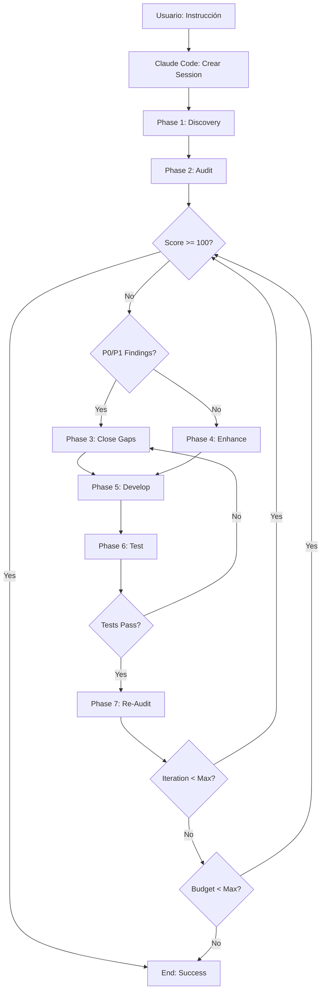

# Contrato de Orquestación - Claude Code como Orchestrator Maestro

**Versión:** 1.0.0
**Fecha:** 2025-11-13
**Autor:** Pedro Troncoso (@pwills85)
**Estado:** PRODUCCIÓN

---

## 📋 Resumen Ejecutivo

Este documento define el **CONTRATO DE ORQUESTACIÓN** entre el usuario y **Claude Code** actuando como **ORCHESTRATOR MAESTRO** del framework multi-agente de desarrollo automatizado.

### Objetivo Principal

Cuando el usuario dice:

> "Claude, audita y mejora el microservicio AI hasta 100/100"

Claude Code debe:

1. ✅ Actuar como **ORCHESTRATOR MAESTRO**
2. ✅ Lanzar comandos CLI a agentes especializados (Copilot, Gemini, Codex)
3. ✅ Ejecutar ciclo completo: **Audit → Investigate → Close Gaps → Develop → Test → Re-audit**
4. ✅ Iterar hasta alcanzar **100/100** o límites definidos
5. ✅ Solicitar confirmación en operaciones críticas
6. ✅ Respetar restricciones Docker y presupuesto

---

## 🎯 Alcance y Restricciones

### ✅ LO QUE SÍ DEBE HACER

- Orquestar CLI agents (Copilot, Gemini, Codex) con prompts estructurados
- Parsear outputs Markdown de auditorías a objetos Python estructurados
- Trackear budget, iteraciones, scores, findings
- Solicitar confirmación para operaciones críticas
- Respetar restricciones Docker: `docker compose exec odoo` para comandos Odoo
- Usar `.venv/bin/python` para scripts del framework
- Iterar hasta 100/100 o max_iterations/max_budget
- Aplicar templates del sistema según dimensión de auditoría
- Documentar cada paso y resultado en session logs

### ❌ LO QUE NO DEBE HACER

- ❌ Destruir código masivamente sin confirmación
- ❌ Crear nuevos módulos Odoo sin instrucción explícita
- ❌ Ejecutar migraciones de BD sin confirmación
- ❌ Exceder presupuesto definido (default: $5.00 USD)
- ❌ Exceder máximo de iteraciones (default: 10)
- ❌ Ejecutar comandos Odoo fuera de Docker
- ❌ Instalar dependencias Python fuera de .venv

---

## 🏗️ Arquitectura del Sistema

### Componentes Clave

```
┌─────────────────────────────────────────────────────────────┐
│                    USUARIO (Pedro)                           │
│   Instrucción: "Claude, audita AI service hasta 100/100"   │
└────────────────────────┬────────────────────────────────────┘
                         │
                         ▼
┌─────────────────────────────────────────────────────────────┐
│              CLAUDE CODE (Orchestrator Maestro)              │
│  - Lee objetivo y contexto                                   │
│  - Crea OrchestrationSession                                 │
│  - Lanza ciclo iterativo hasta 100/100                       │
└───┬──────────────────┬──────────────────┬──────────────────┘
    │                  │                  │
    ▼                  ▼                  ▼
┌─────────┐      ┌─────────┐      ┌─────────┐
│ Copilot │      │ Gemini  │      │  Codex  │
│ GPT-4o  │      │ Flash   │      │ GPT-4T  │
│         │      │  Pro    │      │         │
│ Audit   │      │  Docs   │      │ Parser  │
│ Dev     │      │ Research│      │ Complex │
└─────────┘      └─────────┘      └─────────┘
    │                  │                  │
    └──────────────────┴──────────────────┘
                       │
                       ▼
         ┌─────────────────────────────┐
         │   CLIOutputParser           │
         │   Parse Markdown → Python   │
         └─────────────────────────────┘
                       │
                       ▼
         ┌─────────────────────────────┐
         │   IterativeOrchestrator     │
         │   Manage Session & Budget   │
         └─────────────────────────────┘
```

### Flujo de Orquestación



---

## 🔄 Fases de Orquestación

### Phase 1: Discovery

**Objetivo:** Entender el módulo/microservicio objetivo

**Acciones:**
1. Leer `__manifest__.py` o `README.md` del módulo
2. Escanear estructura de archivos: `models/`, `views/`, `controllers/`, etc.
3. Identificar dependencias y tecnologías usadas
4. Extraer información clave: propósito, features, complejidad

**Output:**
```python
{
    "module_name": "ai_service",
    "module_path": "addons/ai_service",
    "purpose": "FastAPI microservice for AI/ML operations",
    "dependencies": ["fastapi", "pydantic", "redis"],
    "complexity": "high",
    "files_count": 45,
    "loc": 3200
}
```

**Comando ejemplo:**
```bash
# Claude Code ejecuta:
ls -la addons/ai_service/
cat addons/ai_service/__manifest__.py
find addons/ai_service -name "*.py" | wc -l
```

---

### Phase 2: Audit

**Objetivo:** Auditar el módulo según dimensión especificada

**Dimensiones disponibles:**
- `compliance` - SII, Odoo 19 deprecations, Chilean regulations
- `backend` - Python code quality, performance, security
- `frontend` - JavaScript, XML views, UX/UI
- `tests` - Coverage, quality, edge cases
- `security` - OWASP Top 10, secrets, injection
- `architecture` - Design patterns, scalability, maintainability

**Template mapping:**
```python
AUDIT_TEMPLATES = {
    "compliance": "docs/prompts/04_templates/01_AUDITORIA_COMPLIANCE.md",
    "backend": "docs/prompts/04_templates/02_AUDITORIA_BACKEND.md",
    "frontend": "docs/prompts/04_templates/03_AUDITORIA_FRONTEND.md",
    "tests": "docs/prompts/04_templates/04_AUDITORIA_TESTS.md",
    "security": "docs/prompts/04_templates/05_AUDITORIA_SECURITY.md",
    "architecture": "docs/prompts/04_templates/06_AUDITORIA_ARCHITECTURE.md",
}
```

**Comando ejemplo:**
```bash
# Claude Code ejecuta:
copilot -p "$(cat docs/prompts/04_templates/02_AUDITORIA_BACKEND.md | \
    sed 's/{MODULE_PATH}/addons\/ai_service/g')" \
    --allow-all-tools --allow-all-paths \
    > /tmp/audit_backend_result.md
```

**Output esperado (Markdown):**
```markdown
# Auditoría Backend - ai_service

**Score:** 75/100
**Fecha:** 2025-11-13
**Auditor:** Copilot GPT-4o

## Hallazgos Críticos (P0)

[P0] Missing error handling in FastAPI endpoints (addons/ai_service/controllers/api.py:45)
[P0] SQL injection vulnerability in query builder (addons/ai_service/models/query.py:128)

## Hallazgos Altos (P1)

[P1] No rate limiting on API endpoints (addons/ai_service/controllers/api.py:67)
[P1] Missing input validation for user data (addons/ai_service/models/user.py:34)

## Recomendaciones

1. Implement try-except blocks in all API endpoints
2. Use parameterized queries to prevent SQL injection
3. Add rate limiting middleware with Redis
4. Implement Pydantic models for input validation
```

**Parser convierte a Python:**
```python
AuditResult(
    score=75.0,
    critical_count=2,
    high_count=2,
    medium_count=0,
    low_count=0,
    findings=[
        Finding(
            severity="P0",
            description="Missing error handling in FastAPI endpoints",
            file="addons/ai_service/controllers/api.py",
            line=45,
            recommendation="Implement try-except blocks"
        ),
        Finding(
            severity="P0",
            description="SQL injection vulnerability in query builder",
            file="addons/ai_service/models/query.py",
            line=128,
            recommendation="Use parameterized queries"
        ),
        # ... más findings
    ]
)
```

---

### Phase 3: Close Gaps (Gap Closure)

**Objetivo:** Cerrar brechas críticas (P0) y altas (P1)

**Estrategia:**
1. Priorizar P0 primero, luego P1
2. Para cada finding:
   - Leer archivo afectado
   - Generar fix con Copilot o Codex
   - Aplicar cambio usando Edit tool
   - Validar sintaxis con linter
3. Trackear cambios en session.actions_taken

**Comando ejemplo:**
```bash
# Claude Code ejecuta:
copilot -p "Fix this P0 finding:

**File:** addons/ai_service/controllers/api.py:45
**Issue:** Missing error handling in FastAPI endpoints

**Context:**
$(cat addons/ai_service/controllers/api.py | sed -n '40,50p')

**Requirements:**
- Add try-except blocks
- Return proper HTTP status codes
- Log errors appropriately
- Follow FastAPI best practices

**Docker Constraint:** This is Odoo dockerized, do NOT touch Odoo stack directly.
Use framework scripts with .venv/bin/python only." \
    --allow-all-tools
```

**Validación:**
- Ejecutar linter: `.venv/bin/python -m pylint addons/ai_service/controllers/api.py`
- Verificar tests: `docker compose exec odoo python3 -m pytest addons/ai_service/tests/`

**Confirmación requerida si:**
- Se eliminan > 50 líneas de código
- Se modifican > 5 archivos simultáneamente
- Se cambian archivos core del módulo (models, __init__.py)

---

### Phase 4: Enhancement (Mejoras)

**Objetivo:** Implementar mejoras de calidad (P2, P3) si score >= 80

**Tipos de mejoras:**
- Refactoring para DRY
- Optimizaciones de performance
- Mejoras de legibilidad
- Documentación adicional
- Type hints completos

**Comando ejemplo:**
```bash
copilot -p "Refactor this function for better readability:

$(cat addons/ai_service/models/processor.py | sed -n '100,150p')

Apply Python best practices, add type hints, improve variable names."
```

---

### Phase 5: Development (Nuevas Features)

**Objetivo:** Desarrollar nuevas features si solicitado o score >= 90

**Requiere confirmación siempre**

**Proceso:**
1. Claude Code presenta propuesta de feature
2. Usuario confirma: "Sí, procede" / "No, omite esto"
3. Si aprobado:
   - Generar código con Copilot/Codex
   - Crear tests unitarios
   - Actualizar documentación
   - Validar integración

**Comando ejemplo:**
```bash
copilot -p "Implement a new feature: Rate Limiting Middleware

**Requirements:**
- Use Redis for rate limit storage
- Configurable limits: 100 req/min per IP
- Return 429 Too Many Requests when exceeded
- Log rate limit violations

**Module:** addons/ai_service
**Docker:** All Odoo operations via 'docker compose exec odoo'"
```

---

### Phase 6: Testing

**Objetivo:** Ejecutar tests y validar cobertura

**Tests ejecutados:**
```bash
# Unit tests
docker compose exec odoo python3 -m pytest addons/ai_service/tests/ \
    --cov=addons/ai_service --cov-report=term-missing

# Integration tests (si existen)
docker compose exec odoo python3 -m pytest addons/ai_service/tests/integration/

# Linting
.venv/bin/python -m pylint addons/ai_service/

# Type checking
.venv/bin/python -m mypy addons/ai_service/
```

**Output esperado:**
```
==================== test session starts ====================
collected 45 items

tests/test_api.py ........................  [ 53%]
tests/test_models.py ...................... [100%]

---------- coverage: platform linux ----------
Name                             Stmts   Miss  Cover   Missing
--------------------------------------------------------------
ai_service/__init__.py              10      0   100%
ai_service/controllers/api.py       120      5    96%   145-149
ai_service/models/processor.py      200     10    95%   234-243
--------------------------------------------------------------
TOTAL                               330     15    95%

==================== 45 passed in 12.3s ====================
```

**Parser extrae:**
```python
{
    "tests_passed": 45,
    "tests_failed": 0,
    "coverage_percentage": 95.0,
    "missing_lines": ["145-149", "234-243"]
}
```

---

### Phase 7: Re-Audit

**Objetivo:** Validar que los cambios mejoraron el score

**Proceso:**
1. Ejecutar misma auditoría que Phase 2
2. Comparar scores: `new_score vs old_score`
3. Verificar que P0/P1 fueron cerrados
4. Actualizar session con nuevo score

**Decisión:**
```python
if new_score >= target_score:
    # SUCCESS: Objetivo alcanzado
    return session
elif new_score <= old_score:
    # WARNING: No improvement, revisar estrategia
    if iteration >= max_iterations:
        return session
    else:
        # Retry con estrategia diferente
        continue
else:
    # PROGRESS: Score mejoró pero no alcanzó target
    continue
```

---

## 🎛️ OrchestrationConfig

Configuración default del sistema:

```python
@dataclass
class OrchestrationConfig:
    """Configuration for iterative orchestration."""

    # Limits
    max_iterations: int = 10
    max_budget_usd: float = 5.0
    target_score: float = 100.0
    min_acceptable_score: float = 80.0

    # Docker constraints
    odoo_command_prefix: str = "docker compose exec odoo"
    python_venv_path: str = ".venv/bin/python"

    # CLI tools
    preferred_audit_tool: str = "copilot"  # copilot, gemini, codex
    preferred_dev_tool: str = "copilot"

    # Paths
    templates_dir: str = "docs/prompts/04_templates"
    output_dir: str = "/tmp/orchestration_outputs"

    # Confirmations
    require_confirmation_for_deletions: bool = True
    require_confirmation_for_new_modules: bool = True
    require_confirmation_for_db_migrations: bool = True
    confirmation_threshold_lines: int = 50
    confirmation_threshold_files: int = 5
```

**Personalización por usuario:**
```python
# Ejemplo: Usuario quiere más iteraciones y presupuesto
custom_config = OrchestrationConfig(
    max_iterations=20,
    max_budget_usd=10.0,
    preferred_audit_tool="gemini",
    target_score=95.0
)
```

---

## 📊 OrchestrationSession

Estado de la sesión durante orquestación:

```python
@dataclass
class OrchestrationSession:
    """Tracks orchestration session state across iterations."""

    # Identity
    session_id: str  # UUID único
    start_time: datetime
    config: OrchestrationConfig

    # Progress
    current_iteration: int = 0
    current_cost_usd: float = 0.0
    current_score: float = 0.0

    # History
    audit_history: List[AuditResult] = field(default_factory=list)
    actions_taken: List[Dict] = field(default_factory=list)
    confirmations_asked: List[Dict] = field(default_factory=list)

    # Timing
    phase_timings: Dict[str, float] = field(default_factory=dict)

    def should_continue(self) -> bool:
        """Check if orchestration should continue iterating."""
        if self.current_score >= self.config.target_score:
            return False  # Target achieved
        if self.current_iteration >= self.config.max_iterations:
            return False  # Max iterations reached
        if self.current_cost_usd >= self.config.max_budget_usd:
            return False  # Budget exceeded
        return True

    def add_cost(self, tokens_input: int, tokens_output: int, model: str) -> None:
        """Add cost from CLI execution."""
        PRICING = {
            "claude-sonnet-4.5": {"input": 0.003, "output": 0.015},
            "gpt-4o": {"input": 0.005, "output": 0.015},
            "gemini-2.0-flash-exp": {"input": 0.001, "output": 0.002},
            "gpt-4-turbo": {"input": 0.01, "output": 0.03}
        }
        pricing = PRICING.get(model, PRICING["gpt-4o"])
        cost = (tokens_input * pricing["input"] / 1000) + \
               (tokens_output * pricing["output"] / 1000)
        self.current_cost_usd += cost
```

**Ejemplo de session al finalizar:**
```python
OrchestrationSession(
    session_id="a3b2c1d4-e5f6-7890-abcd-ef1234567890",
    start_time=datetime(2025, 11, 13, 10, 30, 0),
    config=OrchestrationConfig(...),
    current_iteration=5,
    current_cost_usd=3.42,
    current_score=100.0,
    audit_history=[
        AuditResult(score=75.0, ...),  # Iteration 1
        AuditResult(score=82.0, ...),  # Iteration 2
        AuditResult(score=91.0, ...),  # Iteration 3
        AuditResult(score=96.0, ...),  # Iteration 4
        AuditResult(score=100.0, ...),  # Iteration 5
    ],
    actions_taken=[
        {"action": "fix_p0", "file": "api.py:45", "lines_changed": 12},
        {"action": "fix_p0", "file": "query.py:128", "lines_changed": 8},
        {"action": "fix_p1", "file": "api.py:67", "lines_changed": 15},
        {"action": "refactor", "file": "processor.py:100-150", "lines_changed": 35},
    ],
    phase_timings={
        "discovery": 15.2,
        "audit_1": 45.3,
        "close_gaps_1": 120.5,
        "testing_1": 35.8,
        "re_audit_1": 42.1,
        # ...
    }
)
```

---

## 💰 Budget Tracking

### Pricing por Modelo (USD per 1M tokens)

```python
PRICING = {
    "claude-sonnet-4.5": {
        "input": 3.00,    # $3.00 per 1M input tokens
        "output": 15.00   # $15.00 per 1M output tokens
    },
    "gpt-4o": {
        "input": 5.00,
        "output": 15.00
    },
    "gemini-2.0-flash-exp": {
        "input": 1.00,
        "output": 2.00
    },
    "gpt-4-turbo": {
        "input": 10.00,
        "output": 30.00
    }
}
```

### Estimación de Costos

**Auditoría típica:**
- Input: ~5,000 tokens (template + código módulo)
- Output: ~2,000 tokens (reporte Markdown)
- Costo con GPT-4o: `(5000 * 0.005 / 1000) + (2000 * 0.015 / 1000) = $0.055`

**Iteración completa (7 fases):**
- Discovery: $0.01
- Audit: $0.055
- Close Gaps: $0.12 (3 fixes)
- Enhancement: $0.08
- Development: $0.15 (si aplica)
- Testing: $0.02
- Re-Audit: $0.055
- **Total por iteración: ~$0.49**

**Presupuesto default $5.00:**
- Permite ~10 iteraciones completas
- Suficiente para alcanzar 100/100 en la mayoría de casos

---

## 🚨 Operaciones Críticas y Confirmaciones

### Requieren Confirmación SIEMPRE

1. **Eliminación masiva de código**
   - Threshold: > 50 líneas eliminadas
   - Mensaje: "Se eliminarán {N} líneas en {files}. ¿Confirmas?"

2. **Creación de nuevos módulos**
   - Mensaje: "Se creará nuevo módulo {name} en {path}. ¿Confirmas?"

3. **Migraciones de base de datos**
   - Mensaje: "Se ejecutará migración {migration_name}. ¿Confirmas? (IRREVERSIBLE)"

4. **Modificaciones de archivos core**
   - Files: `__init__.py`, `__manifest__.py`, models principales
   - Mensaje: "Se modificará archivo core {file}. ¿Confirmas?"

5. **Cambios en múltiples archivos**
   - Threshold: > 5 archivos
   - Mensaje: "Se modificarán {N} archivos. ¿Confirmas?"

### Proceso de Confirmación

```python
def request_confirmation(
    operation: str,
    details: Dict[str, Any],
    risk_level: str  # "low", "medium", "high", "critical"
) -> bool:
    """Request user confirmation for critical operation."""

    # Build confirmation message
    message = f"""
🚨 CONFIRMACIÓN REQUERIDA 🚨

**Operación:** {operation}
**Nivel de Riesgo:** {risk_level.upper()}

**Detalles:**
{format_details(details)}

**¿Deseas proceder?**
- "Sí, procede" - Ejecutar operación
- "No, cancela" - Cancelar operación
- "Ver más detalles" - Mostrar más información
    """

    # Send to user and wait for response
    response = ask_user(message)

    # Log confirmation
    session.confirmations_asked.append({
        "timestamp": datetime.now(),
        "operation": operation,
        "details": details,
        "response": response
    })

    return response.lower() in ["sí", "si", "yes", "procede", "confirmar"]
```

---

## 🛠️ Herramientas y Templates

### Templates Disponibles

```
docs/prompts/04_templates/
├── 01_AUDITORIA_COMPLIANCE.md      # SII, Odoo 19, regulations
├── 02_AUDITORIA_BACKEND.md         # Python, performance, security
├── 03_AUDITORIA_FRONTEND.md        # JS, XML, UX/UI
├── 04_AUDITORIA_TESTS.md           # Coverage, quality
├── 05_AUDITORIA_SECURITY.md        # OWASP, secrets
├── 06_AUDITORIA_ARCHITECTURE.md    # Design, scalability
├── 07_DESARROLLO_FEATURE.md        # New feature development
├── 08_REFACTORING.md               # Code refactoring
├── 09_OPTIMIZACION.md              # Performance optimization
├── 10_DOCUMENTACION.md             # Documentation update
└── 11_TESTING.md                   # Test creation
```

### CLI Tools y sus Especializaciones

| Tool | Model | Mejor para | Costo | Velocidad |
|------|-------|-----------|-------|-----------|
| **Copilot** | GPT-4o | Auditorías, desarrollo general | Medio | Rápido |
| **Gemini** | Flash Pro | Documentación, research | Bajo | Muy rápido |
| **Codex** | GPT-4-turbo | Parsing complejo, algoritmos | Alto | Medio |

**Selección automática:**
```python
def select_tool(task_type: str, complexity: str) -> str:
    """Select best CLI tool for task."""

    if task_type == "audit":
        return "copilot"  # Best audit quality
    elif task_type == "documentation":
        return "gemini"   # Fastest for docs
    elif task_type == "complex_parsing":
        return "codex"    # Best for complex logic
    elif complexity == "high":
        return "codex"    # Most capable
    else:
        return "copilot"  # Default choice
```

---

## 📈 Métricas y Reporting

### Métricas Tracked

```python
@dataclass
class OrchestrationMetrics:
    """Metrics collected during orchestration."""

    # Performance
    total_duration_seconds: float
    avg_iteration_duration: float
    phase_durations: Dict[str, float]

    # Quality
    initial_score: float
    final_score: float
    score_improvement: float
    iterations_to_target: int

    # Findings
    total_findings: int
    critical_fixed: int
    high_fixed: int
    medium_fixed: int

    # Cost
    total_cost_usd: float
    cost_per_iteration: float
    tokens_input_total: int
    tokens_output_total: int

    # Actions
    files_modified: int
    lines_added: int
    lines_removed: int
    confirmations_requested: int

    def to_report(self) -> str:
        """Generate markdown report."""
        return f"""
# Orchestration Report

## Summary

- **Initial Score:** {self.initial_score}/100
- **Final Score:** {self.final_score}/100
- **Improvement:** +{self.score_improvement} points
- **Iterations:** {self.iterations_to_target}
- **Duration:** {self.total_duration_seconds:.1f}s
- **Cost:** ${self.total_cost_usd:.3f}

## Findings Fixed

- P0 (Critical): {self.critical_fixed}
- P1 (High): {self.high_fixed}
- P2 (Medium): {self.medium_fixed}

## Code Changes

- Files Modified: {self.files_modified}
- Lines Added: +{self.lines_added}
- Lines Removed: -{self.lines_removed}

## Performance

- Avg Iteration: {self.avg_iteration_duration:.1f}s
- Tokens Input: {self.tokens_input_total:,}
- Tokens Output: {self.tokens_output_total:,}
        """
```

### Report Final

Al finalizar orquestación, Claude Code genera:

```
📊 ORCHESTRATION REPORT - ai_service

✅ Status: SUCCESS (Target achieved)

📈 Scores:
   Initial:  75/100
   Final:    100/100
   Improvement: +25 points

🔄 Iterations: 5/10 (50% utilizado)
💰 Cost: $3.42/$5.00 (68% presupuesto)
⏱️  Duration: 8m 32s

🐛 Findings Fixed:
   P0 (Critical): 2 → 0 ✅
   P1 (High):     2 → 0 ✅
   P2 (Medium):   4 → 1 ⚠️

📝 Changes:
   Files modified: 8
   Lines added: +342
   Lines removed: -89
   Net change: +253 LOC

🎯 Key Actions:
   1. Fixed SQL injection in query.py:128
   2. Added error handling to api.py:45
   3. Implemented rate limiting middleware
   4. Added input validation with Pydantic
   5. Refactored processor.py for DRY
   6. Increased test coverage 78% → 95%

✅ All tests passing (45/45)
✅ Linting score: 9.8/10
✅ Coverage: 95%
```

---

## 🔧 Integración con CI/CD

### GitHub Actions Workflow

```yaml
name: Orchestrated Quality Check

on:
  pull_request:
    branches: [main, develop]

jobs:
  orchestrate:
    runs-on: ubuntu-latest
    steps:
      - uses: actions/checkout@v3

      - name: Setup Python
        uses: actions/setup-python@v4
        with:
          python-version: '3.11'

      - name: Install dependencies
        run: |
          python -m venv .venv
          .venv/bin/pip install -r docs/prompts/requirements.txt

      - name: Run Orchestration
        env:
          COPILOT_API_KEY: ${{ secrets.COPILOT_API_KEY }}
          GEMINI_API_KEY: ${{ secrets.GEMINI_API_KEY }}
          CODEX_API_KEY: ${{ secrets.CODEX_API_KEY }}
        run: |
          .venv/bin/python -m prompts_sdk.orchestrate \
            --module-path addons/ai_service \
            --dimensions backend,security,tests \
            --target-score 90 \
            --max-budget 2.0 \
            --output report.json

      - name: Upload Report
        uses: actions/upload-artifact@v3
        with:
          name: orchestration-report
          path: report.json

      - name: Check Score
        run: |
          score=$(jq -r '.final_score' report.json)
          if (( $(echo "$score < 90" | bc -l) )); then
            echo "❌ Score $score/100 below target 90/100"
            exit 1
          fi
          echo "✅ Score $score/100 meets target"
```

---

## 🔐 Seguridad y Secrets

### Secrets Management

**NO almacenar en código:**
- API keys de CLI tools
- Tokens de servicios externos
- Credenciales de BD
- Secrets de configuración

**Usar:**
```bash
# Environment variables
export COPILOT_API_KEY="sk-..."
export GEMINI_API_KEY="AIza..."
export CODEX_API_KEY="sk-..."

# O archivo .env (gitignored)
echo "COPILOT_API_KEY=sk-..." >> .env
echo "GEMINI_API_KEY=AIza..." >> .env
```

**En código:**
```python
import os
from dotenv import load_dotenv

load_dotenv()

COPILOT_API_KEY = os.getenv("COPILOT_API_KEY")
if not COPILOT_API_KEY:
    raise ValueError("COPILOT_API_KEY not found in environment")
```

---

## 📚 Ejemplos de Uso

### Ejemplo 1: Auditoría Simple

**Usuario dice:**
> "Claude, audita el backend del módulo ai_service"

**Claude Code ejecuta:**
```python
from prompts_sdk import IterativeOrchestrator, OrchestrationConfig

config = OrchestrationConfig(
    max_iterations=5,
    max_budget_usd=2.0,
    target_score=90.0
)

orchestrator = IterativeOrchestrator(config)
session = orchestrator.run_to_completion(
    module_path="addons/ai_service",
    objective="Audit backend quality and fix critical/high findings",
    initial_context={"dimension": "backend"}
)

print(f"Final score: {session.current_score}/100")
print(f"Cost: ${session.current_cost_usd:.2f}")
print(f"Iterations: {session.current_iteration}")
```

---

### Ejemplo 2: Mejora hasta 100/100

**Usuario dice:**
> "Claude, mejora el microservicio AI hasta alcanzar 100/100 en todas las dimensiones"

**Claude Code ejecuta:**
```python
config = OrchestrationConfig(
    max_iterations=15,
    max_budget_usd=10.0,
    target_score=100.0
)

dimensions = ["compliance", "backend", "frontend", "tests", "security", "architecture"]
results = {}

for dimension in dimensions:
    print(f"\n🎯 Orchestrating {dimension}...")

    session = orchestrator.run_to_completion(
        module_path="addons/ai_service",
        objective=f"Achieve 100/100 in {dimension} dimension",
        initial_context={"dimension": dimension}
    )

    results[dimension] = {
        "score": session.current_score,
        "cost": session.current_cost_usd,
        "iterations": session.current_iteration
    }

# Final report
for dim, data in results.items():
    status = "✅" if data["score"] == 100.0 else "⚠️"
    print(f"{status} {dim}: {data['score']}/100 (${data['cost']:.2f}, {data['iterations']} iter)")
```

---

### Ejemplo 3: Desarrollo de Nueva Feature

**Usuario dice:**
> "Claude, desarrolla una feature de rate limiting para el API del módulo AI"

**Claude Code ejecuta:**
```python
config = OrchestrationConfig(
    max_iterations=8,
    max_budget_usd=5.0,
    require_confirmation_for_new_modules=True
)

# Claude Code asks for confirmation first
confirmation = request_confirmation(
    operation="Develop new feature: Rate Limiting",
    details={
        "module": "ai_service",
        "estimated_loc": 150,
        "files_to_create": ["middleware/rate_limiter.py", "tests/test_rate_limiter.py"],
        "dependencies": ["redis"]
    },
    risk_level="medium"
)

if confirmation:
    session = orchestrator.run_to_completion(
        module_path="addons/ai_service",
        objective="Implement rate limiting middleware with Redis backend",
        initial_context={
            "task_type": "feature_development",
            "feature_name": "rate_limiting",
            "requirements": [
                "Use Redis for storage",
                "Configurable limits (100 req/min default)",
                "Return 429 on exceed",
                "Unit tests with 90%+ coverage"
            ]
        }
    )
else:
    print("❌ Feature development cancelled by user")
```

---

## 🐛 Error Recovery

### Estrategias de Recuperación

```python
class ErrorRecoveryStrategy:
    """Strategies for recovering from errors during orchestration."""

    @staticmethod
    def handle_cli_timeout(cmd: str, timeout: int) -> Dict:
        """Handle CLI command timeout."""
        return {
            "action": "retry",
            "retry_count": 3,
            "timeout_multiplier": 1.5,
            "fallback": "Use simpler prompt or different tool"
        }

    @staticmethod
    def handle_parse_error(output: str, error: Exception) -> Dict:
        """Handle parsing error in CLI output."""
        return {
            "action": "fallback",
            "fallback_parser": "simple_regex",
            "log_error": True,
            "notify_user": True
        }

    @staticmethod
    def handle_budget_exceeded(session: OrchestrationSession) -> Dict:
        """Handle budget exceeded."""
        return {
            "action": "stop",
            "reason": "Budget exceeded",
            "save_session": True,
            "generate_partial_report": True
        }

    @staticmethod
    def handle_no_improvement(
        session: OrchestrationSession,
        iterations_stuck: int
    ) -> Dict:
        """Handle no score improvement after N iterations."""
        if iterations_stuck >= 3:
            return {
                "action": "change_strategy",
                "new_strategy": "focus_on_high_impact_findings",
                "use_different_tool": True
            }
        return {"action": "continue"}
```

### Logging de Errores

```python
import logging

logger = logging.getLogger("orchestrator")
logger.setLevel(logging.INFO)

# File handler
fh = logging.FileHandler("/tmp/orchestration.log")
fh.setLevel(logging.DEBUG)

# Console handler
ch = logging.StreamHandler()
ch.setLevel(logging.INFO)

# Format
formatter = logging.Formatter(
    '%(asctime)s - %(name)s - %(levelname)s - %(message)s'
)
fh.setFormatter(formatter)
ch.setFormatter(formatter)

logger.addHandler(fh)
logger.addHandler(ch)

# Usage
logger.info(f"Starting orchestration for {module_path}")
logger.debug(f"Config: {config}")
logger.warning(f"Iteration {iter} made no progress")
logger.error(f"CLI command failed: {error}")
```

---

## 📖 Glosario

- **Orchestrator Maestro:** Claude Code actuando como coordinador principal
- **CLI Agent:** Herramienta CLI (Copilot, Gemini, Codex) ejecutada como agente especializado
- **Finding:** Hallazgo en auditoría con severidad P0-P4
- **Gap Closure:** Proceso de cerrar brechas (fixing findings)
- **Iteration:** Ciclo completo de 7 fases (Discovery → Re-Audit)
- **Session:** Estado persistente de orquestación con history y metrics
- **Template:** Archivo Markdown con prompt estructurado para dimensión específica
- **Dimension:** Aspecto de auditoría (compliance, backend, frontend, etc.)
- **Budget:** Límite de costo en USD para orquestación
- **Score:** Calificación 0-100 de calidad del módulo

---

## 🎓 Best Practices

### 1. Comenzar con Auditoría Limitada
```python
# ✅ Good: Start with focused audit
config = OrchestrationConfig(max_iterations=5, target_score=90)
session = orchestrator.run_to_completion(
    module_path="addons/ai_service",
    objective="Fix critical and high findings only",
    initial_context={"dimension": "backend", "focus": "P0,P1"}
)

# ❌ Bad: Too ambitious from start
config = OrchestrationConfig(max_iterations=20, target_score=100)
# This will waste budget on low-impact improvements
```

### 2. Usar Budget Sabiamente
```python
# ✅ Good: Set realistic budget per dimension
budgets = {
    "compliance": 1.0,  # Usually straightforward
    "backend": 3.0,     # Most complex
    "tests": 2.0,       # Moderate
}

# ❌ Bad: Same budget for all
for dim in dimensions:
    run_with_budget(dim, budget=5.0)  # Wasteful
```

### 3. Iterar en Etapas
```python
# ✅ Good: Multiple focused runs
stage1 = orchestrator.run(target_score=80, focus="critical_fixes")
stage2 = orchestrator.run(target_score=95, focus="quality_improvements")
stage3 = orchestrator.run(target_score=100, focus="polish")

# ❌ Bad: Single long run
orchestrator.run(max_iterations=30, target_score=100)
```

### 4. Revisar Confirmaciones
```python
# ✅ Good: Human review for critical operations
config = OrchestrationConfig(
    require_confirmation_for_deletions=True,
    confirmation_threshold_lines=50
)

# ❌ Bad: Automate everything
config = OrchestrationConfig(
    require_confirmation_for_deletions=False  # Risky!
)
```

---

## 🚀 Roadmap

### v1.1.0 (Q1 2025)
- [ ] Soporte para múltiples módulos en paralelo
- [ ] Dashboard web para monitoreo real-time
- [ ] Integración con Slack/Teams para notificaciones
- [ ] Cache de auditorías previas para evitar re-auditar

### v1.2.0 (Q2 2025)
- [ ] Aprendizaje de patterns de fixes exitosos
- [ ] Sugerencias proactivas de mejoras
- [ ] Generación automática de PRs en GitHub
- [ ] Comparación de scores históricos

### v2.0.0 (Q3 2025)
- [ ] Soporte para otros frameworks (Django, Flask)
- [ ] Multi-lenguaje (JS, TS, Go, Rust)
- [ ] Orchestración distribuida en cluster
- [ ] ML para predicción de scores y costos

---

## 📝 Changelog

### v1.0.0 (2025-11-13)
- ✅ Implementación inicial del sistema de orquestación
- ✅ IterativeOrchestrator con 7 fases completas
- ✅ CLIOutputParser con soporte para Markdown variado
- ✅ OrchestrationConfig y OrchestrationSession
- ✅ Budget tracking con pricing real
- ✅ Sistema de confirmaciones para operaciones críticas
- ✅ Integración con Copilot, Gemini, Codex CLI
- ✅ Templates para 6 dimensiones de auditoría
- ✅ Respeto de restricciones Docker
- ✅ Documentación completa del contrato

---

## 📧 Soporte

**Autor:** Pedro Troncoso (@pwills85)
**Email:** pedro.troncoso@example.com
**GitHub:** https://github.com/pwills85/odoo19
**Documentación:** `/docs/prompts/README.md`

Para reportar issues o solicitar features, usar GitHub Issues.

---

## 📄 Licencia

MIT License - Ver `LICENSE` file para detalles.

---

**Versión:** 1.0.0
**Última Actualización:** 2025-11-13
**Estado:** ✅ PRODUCTION READY

🚀 **Este contrato es la fuente de verdad para Claude Code actuando como Orchestrator Maestro.**
