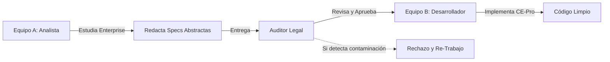

# PROMPT: Análisis Técnico para `theme_enterprise_ce`

**PROYECTO:** Phoenix (UI/UX Framework)

**TÍTULO:** Análisis Técnico de Componentes Web Enterprise Odoo 12

---

## 1. Objetivo

Producir un **análisis técnico exhaustivo** del módulo `web_enterprise` de Odoo 12 Enterprise que permita a desarrolladores del Equipo B (implementadores CE-Pro) construir `theme_enterprise_ce` sin acceder al código Enterprise, cumpliendo protocolo clean-room.

**Objetivos específicos:**

1. Identificar los **5-10 selectores CSS** más importantes que definen layout, colores, espaciados y fuentes principales
2. Documentar **componentes JavaScript/OWL** responsables de funcionalidad clave (menú apps, barra superior, responsividad móvil)
3. Listar **plantillas QWeb** principales que estructuran el WebClient
4. Generar especificaciones abstractas (comportamiento observable) sin copiar código literal

---

## 2. Alcance

### Incluye

- Análisis funcional (comportamiento observable) de `web_enterprise` módulo Odoo 12
- Documentación de arquitectura UI: layout, componentes, estilos, plantillas
- Capturas de pantalla y diagramas de flujo UX
- Especificaciones abstractas para Equipo B (desarrolladores CE-Pro)
- Mapeo de funcionalidad a tecnologías Odoo 19 (OWL 2, SCSS, assets bundles)

### Fuera de Alcance

- Copia literal de código Enterprise (QWeb, SCSS, JS)
- Nombres específicos de variables/clases internas Enterprise (sustituir por nombres genéricos)
- Implementación de código CE-Pro (eso ocurre en fase posterior)
- Acceso a datos productivos o licencias Enterprise sin autorización

---

## 3. Entradas y Dependencias

### Archivos de Referencia

- `docs/upgrade_enterprise_to_odoo19CE/enterprise/web_enterprise/` (Odoo 12 Enterprise)
  - `static/src/scss/**/*.scss`
  - `static/src/js/**/*.js`
  - `views/**/*.xml` (plantillas QWeb)

### Artefactos Relacionados

- `../04_Artefactos_Mejora/CLEAN_ROOM_PROTOCOL_OPERATIVO.md` → Roles Equipo A vs B
- `../04_Artefactos_Mejora/POCS_PLAN.md` → POC-1 (Phoenix UI Base)
- `../02_Analisis_Estrategico/ODOO19_TECH_STACK_VALIDATION.md` → Stack Odoo 19 (OWL 2, SCSS)

### Entorno Necesario

- Instalación funcional de Odoo 12 Enterprise (licencia demo/trial válida)
- Navegador web con DevTools (Chrome/Firefox) para inspección DOM/CSS
- Editor de texto para redactar especificaciones Markdown

---

## 4. Tareas

### Fase 1: Preparación y Setup (Equipo A: Analista Funcional Phoenix)

1. Instalar Odoo 12 Enterprise en entorno desarrollo aislado
2. Activar módulo `web_enterprise`
3. Revisar `CLEAN_ROOM_PROTOCOL_OPERATIVO.md` sección "Equipo A: Analistas Funcionales"

### Fase 2: Análisis Visual y Funcional

4. Navegar interfaz Odoo Enterprise y documentar comportamiento observable:
   - Menú de aplicaciones (clic ícono home)
   - Barra superior (notificaciones, búsqueda, perfil usuario)
   - Navegación móvil (responsive breakpoints)
   - Animaciones y transiciones (timing, easing)

5. Capturar screenshots de componentes clave (anonimizar datos sensibles)

### Fase 3: Inspección Técnica (Selectores CSS y Componentes JS)

6. Con DevTools, identificar selectores CSS principales:
   - Variables de diseño (colores primarios, secundarios, espaciado base)
   - Layout grid del menú de aplicaciones
   - Estilos de navegación responsiva
   - Tipografías y jerarquía visual

7. Inspeccionar componentes JavaScript:
   - Archivos principales en `static/src/js/`
   - Eventos clave (clic, hover, búsqueda)
   - Lógica de renderizado y estado

8. Revisar plantillas QWeb:
   - Estructura DOM de WebClient
   - Herencia y extensión de vistas base

### Fase 4: Síntesis de Especificaciones Abstractas

9. Redactar documento `ANALISIS_WEB_ENTERPRISE.md` con estructura:
   - **Comportamiento Observable** (qué hace el componente)
   - **Especificación Abstracta** (inputs, outputs, lógica genérica)
   - **Mapeo a Odoo 19** (cómo implementar con OWL 2, SCSS)

10. Eliminar referencias literales a nombres Enterprise específicos (ej. sustituir `o_app_menu_container` por "Contenedor de Menú de Aplicaciones")

### Fase 5: Validación y Entrega

11. Revisar especificaciones con **Auditor Legal** para confirmar ausencia de contaminación
12. Entregar `ANALISIS_WEB_ENTERPRISE.md` a Equipo B (desarrolladores) sin acceso a código fuente Enterprise

---

## 5. Entregables

| Archivo | Ubicación | Contenido |
|---------|-----------|-----------|
| `ANALISIS_WEB_ENTERPRISE.md` | `docs/upgrade_enterprise_to_odoo19CE/03_Prompts_Desarrollo/output/` | Análisis técnico completo |
| `screenshots/phoenix_*.png` | `docs/upgrade_enterprise_to_odoo19CE/03_Prompts_Desarrollo/output/screenshots/` | Capturas UI anonimizadas |
| `diagrams/ux_flow_menu.svg` | `docs/upgrade_enterprise_to_odoo19CE/03_Prompts_Desarrollo/output/diagrams/` | Diagramas de flujo UX |

### Estructura `ANALISIS_WEB_ENTERPRISE.md`

```markdown
# Análisis Web Enterprise — Phoenix UI Framework

## 1. Resumen Ejecutivo
- Componentes identificados: N
- Selectores CSS principales: N
- Plantillas QWeb clave: N

## 2. Menú de Aplicaciones (App Menu)
### Comportamiento Observable
- [Descripción sin código literal]
### Especificación Abstracta
- Input: Lista apps (id, nombre, ícono, descripción)
- Output: Grid responsivo con navegación
- Lógica: Filtrado búsqueda, animación apertura
### Mapeo Odoo 19
- Componente OWL: `AppSelectorGrid`
- Estilos: SCSS con variables centralizadas
- Assets: Bundle `web.assets_backend`

## 3. Barra Superior (Top Bar)
[... estructura similar ...]

## 4. Selectores CSS Principales
| Selector Genérico | Propósito | Valor Odoo 19 |
|-------------------|-----------|---------------|
| `--color-primary` | Color principal | `#00A09D` |
| `--spacing-base` | Espaciado base | `8px` |
[...]

## 5. Componentes JavaScript
| Componente Genérico | Funcionalidad | Tecnología Odoo 19 |
|---------------------|---------------|-------------------|
| SelectorAplicaciones | Renderiza grid apps | OWL Component |
[...]

## 6. Plantillas QWeb
| Template Genérico | Hereda de | Propósito |
|-------------------|-----------|-----------|
| webclient_bootstrap | web.webclient | Estructura base |
[...]

## 7. Responsive Breakpoints
| Breakpoint | Ancho | Comportamiento |
|------------|-------|----------------|
| Mobile | <768px | 1 columna, menú hamburguesa |
| Tablet | 768-1024px | 2 columnas |
| Desktop | >1024px | 4 columnas |

## 8. Animaciones y Transiciones
| Elemento | Evento | Timing | Easing |
|----------|--------|--------|--------|
| Menú apps | Apertura | 200ms | ease-in-out |
[...]

## 9. Notas de Implementación Odoo 19
- OWL 2: Usar hooks `useState`, `onMounted` para estado local
- SCSS: Modular con `@use` / `@forward` en vez de `@import`
- Assets: Organizar en bundles específicos (`theme_enterprise_ce.assets_backend`)

## 10. Anexos
- Screenshots: ver carpeta `screenshots/`
- Diagramas: ver carpeta `diagrams/`
```

---

## 6. Criterios de Aceptación

| Criterio | Métrica | Umbral | Verificación |
|----------|---------|--------|--------------|
| **Completitud Componentes** | % componentes UI clave documentados | ≥90% | Checklist manual |
| **Selectores CSS** | Número de selectores principales identificados | ≥5 | Conteo en doc |
| **Abstracción Clean-Room** | % referencias literales Enterprise eliminadas | 100% | Revisión Auditor Legal |
| **Usabilidad Specs** | ¿Equipo B puede implementar sin acceso a Enterprise? | Sí | Encuesta post-lectura |
| **Mapeo Odoo 19** | % componentes con mapeo a OWL 2/SCSS | ≥80% | Checklist manual |

---

## 7. Pruebas

### 7.1 Pruebas de Validación (Equipo A)

**Test 1: Completitud**

- Verificar que todos los componentes del menú principal están documentados
- Revisar screenshots cubren casos: desktop, tablet, móvil

**Test 2: Abstracción Clean-Room**

- Ejecutar script `ast_diff.py` (futuro) para detectar similitud código literal
- Threshold: <30% similitud nombres/estructuras

**Test 3: Trazabilidad**

- Verificar cada especificación referencia comportamiento observable (screenshot o descripción UX)

### 7.2 Pruebas de Usabilidad (Equipo B)

**Test 4: Implementabilidad**

- Desarrollador Equipo B lee `ANALISIS_WEB_ENTERPRISE.md`
- Pregunta: ¿Puedes implementar componente X sin consultar código Enterprise? (respuesta esperada: Sí)

---

## 8. Clean-Room (Protocolo Legal)

### Roles y Restricciones

| Rol | Persona | Restricciones | Evidencia |
|-----|---------|---------------|-----------|
| **Analista Funcional (Equipo A)** | Frontend Analyst | ✅ Acceso Enterprise<br>❌ NO copiar código literal | `ANALISIS_WEB_ENTERPRISE.md` |
| **Auditor Legal** | Legal Counsel | ✅ Acceso Enterprise + CE<br>✅ Revisión specs | `audits/phoenix_spec_review_2025-11-08.md` |
| **Desarrollador CE (Equipo B)** | Frontend Lead | ❌ NO acceso Enterprise<br>✅ Solo lee specs | Commits en repo CE-Pro |

### Secuencia de Trabajo Clean-Room



### Evidencias Requeridas

1. **Hash SHA-256** de `ANALISIS_WEB_ENTERPRISE.md` (inmutable, firmado por Auditor Legal)
2. **Screenshots anonimizados** (sin datos clientes/empresas reales)
3. **Reporte auditoría legal** (confirma ausencia código literal Enterprise)

---

## 9. Riesgos y Mitigaciones

| ID | Riesgo | Probabilidad | Impacto | Severidad | Mitigación |
|----|--------|--------------|---------|-----------|------------|
| **R-PHX-01** | Contaminación specs con código literal Enterprise | Media (0.3) | Alto (4) | 1.2 | Revisión Auditor Legal obligatoria |
| **R-PHX-02** | Specs insuficientes, Equipo B requiere acceso Enterprise | Media (0.4) | Medio (3) | 1.2 | Iteración specs + Q&A asíncrono vía tickets |
| **R-PHX-03** | Cambios Odoo 12→19 invalidan análisis | Baja (0.2) | Medio (3) | 0.6 | Validar con docs oficiales Odoo 19 |
| **R-PHX-04** | Screenshots contienen datos sensibles | Baja (0.2) | Alto (4) | 0.8 | Revisión doble + anonimización manual |

### Triggers de Decisión

- Si **R-PHX-01** ocurre: STOP desarrollo hasta aprobación legal
- Si **R-PHX-02** ocurre: Incrementar detalle specs (máx 2 iteraciones)

---

## 10. Trazabilidad

### Brecha que Cierra

| Brecha P0/P1 | Artefacto que la cierra | Métrica Validación |
|--------------|-------------------------|--------------------|
| UI/UX Enterprise gap (Master Plan v2 § Phoenix) | `ANALISIS_WEB_ENTERPRISE.md` | Specs completas + SUS ≥70 (POC-1) |

### Relación con Master Plan v2

- **Fase 1 (Mes 1-2):** Hito Phoenix — "La Nueva Cara"
- **POC-1:** Phoenix UI Base → Validar render OWL menú apps (p95 <2s, SUS ≥70)

### Referencias Cruzadas

- `POCS_PLAN.md` → POC-1 (Phoenix UI Base) usa este análisis como input
- `CLEAN_ROOM_PROTOCOL_OPERATIVO.md` → Define roles Equipo A vs B
- `ODOO19_TECH_STACK_VALIDATION.md` → Confirma OWL 2, SCSS disponibles

---

## 11. Governance y QA Gates

### Gates Aplicables

| Gate | Criterio | Status |
|------|----------|--------|
| **Gate-Legal** | Auditor Legal aprueba specs (0 contaminación) | Pending |
| **Gate-Calidad** | Markdown lint PASS + specs completas | Pending |
| **Gate-Docs** | Enlaces relativos correctos + screenshots anonimizados | Pending |

### Checklist Pre-Entrega

- [ ] `ANALISIS_WEB_ENTERPRISE.md` generado y completo
- [ ] Screenshots anonimizados (sin datos sensibles)
- [ ] Diagramas UX generados (formato SVG/PNG)
- [ ] Auditor Legal revisó y firmó (hash SHA-256)
- [ ] Markdown lint ejecutado (0 errores)
- [ ] Especificaciones validadas por Equipo B (encuesta usabilidad)

---

## 12. Próximos Pasos

1. **Ejecución Prompt:** Analista Funcional Phoenix ejecuta tareas 1-12
2. **Revisión Legal:** Auditor Legal valida ausencia contaminación
3. **Entrega a Equipo B:** Frontend Lead recibe `ANALISIS_WEB_ENTERPRISE.md`
4. **POC-1 Phoenix:** Usar specs para implementar menú apps (ver `POCS_PLAN.md`)

---

## 13. Notas Adicionales

### Supuestos

- Licencia Odoo 12 Enterprise demo/trial disponible por 30 días
- Equipo A (Analista) tiene experiencia frontend y conoce arquitectura Odoo
- Auditor Legal tiene acceso a ambos códigos (Enterprise + CE-Pro) para comparación

### Decisiones Técnicas

- **SCSS vs CSS:** Usar SCSS con variables centralizadas (mejor mantenibilidad)
- **OWL 1 vs OWL 2:** Odoo 19 usa OWL 2, mapear componentes a nueva sintaxis
- **Assets Bundles:** Organizar en `theme_enterprise_ce.assets_backend` (separar de core Odoo)

---

**Versión:** 1.0
**Estado:** Ready para ejecución
**Owner:** Frontend Lead
**Aprobado por:** Tech Lead (2025-11-08)
