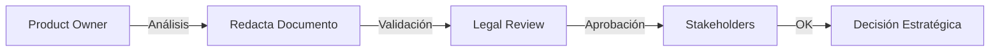

# PROMPT: Evaluación de Alternativas para el Módulo de Suscripciones

**PROYECTO:** Estrategia CE-Pro

**TÍTULO:** Evaluación de Alternativas para el Módulo de Suscripciones

---

## 1. Objetivo

Producir un **análisis estratégico de factibilidad** que permita tomar una decisión informada entre construir o adoptar un módulo de gestión de suscripciones para Odoo 19 CE-Pro, basado en comparativa técnica y de negocio contra `sale_subscription` de Odoo 12 Enterprise como benchmark.

**Objetivos específicos:**

1. Investigar **3-5 soluciones OCA** de gestión de suscripciones disponibles para Odoo 19
2. Documentar **cobertura funcional** de cada alternativa vs. `sale_subscription` Enterprise
3. Generar matriz de evaluación (madurez, calidad código, comunidad, TCO) con **scoring factibilidad**
4. Emitir **recomendación estratégica fundamentada** (Opción A: Adoptar vs. Opción B: Construir)

---

## 2. Alcance

### Incluye

- Análisis comparativo de módulos OCA suscripciones para Odoo 19
- Benchmark funcional contra `sale_subscription` de Odoo 12 Enterprise
- Evaluación madurez código, arquitectura, comunidad, mantenibilidad
- Matriz scoring factibilidad (facilidad integración stack Odoo 19, costos, timeline)
- Análisis TCO (Total Cost of Ownership) por opción
- Recomendación final con justificación técnica y comercial

### Fuera de Alcance

- Implementación de código (ocurre en fase posterior)
- Desarrollos adicionales fuera de módulo suscripciones
- Integración detallada con módulos third-party (solo stack Odoo 19 core)
- Negociación con comunidades OCA

---

## 3. Entradas y Dependencias

### Archivos de Referencia

- `docs/upgrade_enterprise_to_odoo19CE/enterprise/sale_subscription/` (Odoo 12 Enterprise benchmark)
  - `models/sale_subscription.py`
  - `models/sale_subscription_template.py`
  - `views/**/*.xml`

### Artefactos Relacionados

- `../04_Artefactos_Mejora/MASTER_PLAN_ODOO19_CE_PRO_v2.md` → Roadmap general, fase P2
- `../04_Artefactos_Mejora/RUBRICA_SCORING_FACTIBILIDAD.md` → Métricas scoring
- `../02_Analisis_Estrategico/ODOO19_TECH_STACK_VALIDATION.md` → Stack Odoo 19 disponible

### Entorno Necesario

- Acceso a repositorio OCA (GitHub.com/OCA/)
- Instalación Odoo 12 Enterprise (para benchmark `sale_subscription`)
- Instalación Odoo 19 CE con módulos candidatos
- Herramienta análisis código (SonarQube, Pylint)

---

## 4. Tareas

### Fase 1: Preparación (Product Owner)

1. Definir **criterios scoring** (ponderación: funcionalidad 30%, madurez 25%, comunidad 20%, integración 15%, costos 10%)
2. Validar acceso a repositorios OCA y Enterprise reference
3. Revisar `RUBRICA_SCORING_FACTIBILIDAD.md` secciones 2-3

### Fase 2: Investigación OCA (Business Analyst)

4. Identificar **5 módulos candidatos** más relevantes en GitHub.com/OCA/ para suscripciones Odoo 19:
   - Buscar por keywords: "subscription", "sale_subscription", "recurring"
   - Criterios preselección: +200 stars, última actualización <12 meses

5. Para cada módulo, recopilar:
   - README, documentación oficial
   - Número de commits últimos 6 meses
   - Número de issues abiertos/cerrados
   - Licencia
   - Dependencias

### Fase 3: Benchmark Funcional (Product Owner)

6. Instalar y explorar `sale_subscription` Odoo 12 Enterprise:
   - Modelos principales (sale_subscription, sale_subscription_template)
   - Flujos clave (crear suscripción, renovación, cancelación)
   - Integraciones (ventas, facturación, inventario)

7. Documentar **matriz funcional** (checklist):
   - Crear suscripción desde plantilla
   - Período renovación configurable
   - Descuentos/promociones suscripción
   - Facturación recurrente
   - Gestión cierre/cancelación
   - Reportes suscripciones
   - APIs para integraciones externas

### Fase 4: Evaluación Técnica (Tech Lead)

8. Para cada módulo OCA candidato:
   - Ejecutar análisis código (pylint, SonarQube)
   - Revisar arquitectura (modelos, vistas, controladores)
   - Mapeo a stack Odoo 19 (ORM v2, modelos, RBAC)
   - Identificar gaps vs. benchmark Enterprise
   - Estimar esfuerzo integración con stack CE-Pro

9. Evaluar **calidad código** (0-10 escala):
   - Adherencia estándares OCA
   - Cobertura tests
   - Documentación inline
   - Patrón arquitectura modular

### Fase 5: Scoring y Síntesis (Product Owner + Tech Lead)

10. Completar matriz scoring:
    - Funcionalidad: % cobertura vs. benchmark
    - Madurez: commits/año, versiones mantenidas
    - Comunidad: issues/pullreqs, tiempo respuesta
    - Integración Odoo 19: % compatibilidad stack
    - Costos: TCO opción A (adoptar) vs. B (construir)

11. Calcular **puntuación final** (0-100) por opción según ponderación

### Fase 6: Redacción y Aprobación (Product Owner)

12. Redactar documento `ANALISIS_ESTRATEGIA_SUSCRIPCIONES.md` con estructura (ver sección 5)
13. Obtener validación Legal (licencias OCA compatible)
14. Solicitar aprobación stakeholders clave

---

## 5. Entregables

| Archivo | Ubicación | Contenido |
|---------|-----------|----------|
| `ANALISIS_ESTRATEGIA_SUSCRIPCIONES.md` | `docs/upgrade_enterprise_to_odoo19CE/03_Prompts_Desarrollo/output/` | Análisis completo con recomendación |
| `matriz_scoring_suscripciones.csv` | `docs/upgrade_enterprise_to_odoo19CE/03_Prompts_Desarrollo/output/` | Scores numéricos módulos OCA |
| `benchmark_sale_subscription.md` | `docs/upgrade_enterprise_to_odoo19CE/03_Prompts_Desarrollo/output/` | Funcionalidad Enterprise reference |
| `tco_analysis_opcion_a_b.xlsx` | `docs/upgrade_enterprise_to_odoo19CE/03_Prompts_Desarrollo/output/` | Análisis costos y timeline |

### Estructura `ANALISIS_ESTRATEGIA_SUSCRIPCIONES.md`

```markdown
# Análisis Estratégico: Módulo de Suscripciones Odoo 19 CE-Pro

## 1. Resumen Ejecutivo
- Opciones evaluadas: N
- Recomendación: Opción A / B
- Score ganador: X/100
- Justificación 2-3 líneas

## 2. Benchmark Enterprise (sale_subscription Odoo 12)
### Modelo de datos
- Entity sale.subscription (id, name, template_id, partner_id, ...)
- Entity sale.subscription.template (...)
- Relaciones clave

### Funcionalidades críticas
- Checklist 10-15 features core

## 3. Módulos OCA Candidatos
### 3.1 Módulo A: [Nombre]
**Repo:** link
**Stats:** X commits/año, Y issues, Z stars
**Descripción:** [...]

#### Análisis Técnico
- **Arquitectura:** [Descripción]
- **Cobertura Funcional:** % vs. benchmark
- **Calidad Código:** X/10
- **Compatibilidad Odoo 19:** % stack

#### Score
| Criterio | Peso | Calificación | Subtotal |
|----------|------|--------------|----------|
| Funcionalidad | 30% | X | Y |
[...]
| **TOTAL** | 100% | - | **Z/100** |

### 3.2 Módulo B: [...]
[...estructura similar...]

## 4. Opciones Estratégicas
### Opción A: Adoptar OCA (Módulo Ganador)
**Pros:**
- Código validado comunidad
- Mantenimiento distribuido
- Timeline rápido (4-6 weeks)

**Contras:**
- Gaps funcionalidad [lista]
- Dependencia comunidad

**Esfuerzo Integración:** X persona-días
**Timeline:** X semanas
**Costo:** $X

### Opción B: Construir Nativo (ce_pro_subscriptions)
**Pros:**
- 100% cobertura funcional
- Control arquitectura
- Alineado stack Odoo 19

**Contras:**
- Timeline mayor (12-16 weeks)
- Costos superiores
- Mantenimiento propio

**Esfuerzo Construcción:** X persona-días
**Timeline:** X semanas
**Costo:** $X

## 5. Análisis TCO (Total Cost of Ownership)
### Opción A: Y/3 años
### Opción B: Y+X/3 años

## 6. Recomendación Final
**Decisión:** Opción [A/B]
**Justificación:** [párrafo técnico + comercial]

## 7. Plan Implementación Recomendado
- Hito 1: [...]
- Hito 2: [...]
```

---

## 6. Criterios de Aceptación

| Criterio | Métrica | Umbral | Verificación |
|----------|---------|--------|--------------|
| **Completitud Investigación** | Módulos OCA evaluados | ≥5 | Conteo en matriz |
| **Benchmark Documentado** | Funcionalidades Enterprise catalogadas | ≥10 | Checklist |
| **Scoring Matemático** | Replicabilidad scoring | 100% | Verificar fórmula |
| **Recomendación Fundamentada** | % decisión soportada análisis cuantitativo | ≥80% | Trazabilidad doc |
| **Aprobación Legal** | Licencias OCA validadas | ✓ | Documento legal |

---

## 7. Pruebas

### 7.1 Validación Contenido

**Test 1: Completitud Benchmark**

- Verificar `sale_subscription` Odoo 12 documentado completamente
- Revisar checklist funcional cubre: modelos, flujos, integraciones

**Test 2: Scoring Reproducible**

- Ejecutar cálculo scoring independientemente
- Resultado debe coincidir ±2 puntos

**Test 3: Gaps Identificados**

- Para cada módulo OCA, gaps funcionales están listados explícitamente

### 7.2 Validación Recomendación

**Test 4: Consistencia Decisión**

- Lógica recomendación (Opción A/B) es derivada score total
- Si opción X tiene score ≥70%, debe ser recomendación

**Test 5: TCO Realista**

- Costos estimados validados por PM/Financiero
- Tolerancia: ±20% vs. estimaciones históricas

---

## 8. Clean-Room (Protocolo Legal)

### Restricciones Aplicables

| Aspecto | Restricción |
|--------|-------------|
| Código Enterprise | ✅ Lectura permitida (benchmark)<br>❌ Copia literal prohibida |
| Módulos OCA | ✅ Acceso público (GitHub) |
| Documentación Externa | ✅ Acceso permitido |

### Secuencia Aprobación



### Evidencias Requeridas

1. Matriz scoring completa (trazable a criterios objetivos)
2. Documento análisis con referencias a fuentes públicas (OCA, Odoo Docs)
3. Aprobación Legal (validar licencias OCA)

---

## 9. Riesgos y Mitigaciones

| ID | Riesgo | Probabilidad | Impacto | Severidad | Mitigación |
|----|--------|--------------|---------|-----------|------------|
| **R-BUS-01** | Módulos OCA insuficientemente documentados | Media (0.4) | Medio (3) | 1.2 | Contactar maintainers OCA, revisar PRs activos |
| **R-BUS-02** | Score no refleja realidad (subjetividad) | Baja (0.3) | Medio (3) | 0.9 | Usar métricas cuantitativas (commits, issues) |
| **R-BUS-03** | Benchmark Enterprise incompleto | Baja (0.2) | Alto (4) | 0.8 | Validar con doc oficial Odoo 12 |
| **R-BUS-04** | Cambios roadmap Odoo 19 invalidan análisis | Baja (0.2) | Bajo (2) | 0.4 | Revisar contra versión actual Odoo docs |

### Triggers de Decisión

- Si **R-BUS-01** ocurre: Contactar 2-3 maintainers por issue/PR
- Si **R-BUS-02** ocurre: Incrementar % criterios cuantitativos

---

## 10. Trazabilidad

### Brecha que Cierra

| Brecha P2 | Artefacto que la cierra | Métrica Validación |
|-----------|------------------------|--------------------|
| Decisión Suscripciones (Master Plan v2 § Business) | `ANALISIS_ESTRATEGIA_SUSCRIPCIONES.md` | Recomendación ≥70% soportada análisis |

### Relación con Master Plan v2

- **Fase 2 (Mes 3-4):** Hito Business — "Go/No-Go Suscripciones"
- **P2-BUS-001:** Decisión adoptar vs. construir módulo suscripciones

### Referencias Cruzadas

- `RUBRICA_SCORING_FACTIBILIDAD.md` → Criterios scoring
- `MASTER_PLAN_ODOO19_CE_PRO_v2.md` → Roadmap, timeline P2
- `ODOO19_TECH_STACK_VALIDATION.md` → Stack compatible

---

## 11. Governance y QA Gates

### Gates Aplicables

| Gate | Criterio | Status |
|------|----------|--------|
| **Gate-Completitud** | ≥5 módulos OCA evaluados + benchmark documentado | Pending |
| **Gate-Scoring** | Matriz scoring validada (reproducible ±2 pts) | Pending |
| **Gate-Legal** | Licencias OCA validadas | Pending |
| **Gate-Aprobación** | Stakeholders aprueban recomendación | Pending |

### Checklist Pre-Entrega

- [ ] `ANALISIS_ESTRATEGIA_SUSCRIPCIONES.md` completo
- [ ] Matriz scoring (5+ módulos, criterios ponderados)
- [ ] Benchmark `sale_subscription` Enterprise documentado
- [ ] TCO análisis validado por Financiero
- [ ] Legal validó licencias OCA
- [ ] Markdown lint ejecutado (0 errores)

---

## 12. Próximos Pasos

1. **Ejecución Prompt:** Product Owner ejecuta tareas 1-14 (4-6 semanas)
2. **Revisión Técnica:** Tech Lead valida scoring y gaps funcionales
3. **Aprobación Legal:** Valida licencias OCA y compliance
4. **Decisión Ejecutiva:** Stakeholders aprueban recomendación
5. **Inicio Implementación:** Ejecutar plan opción seleccionada (P2 roadmap)

---

## 13. Notas Adicionales

### Supuestos

- Acceso público a repositorios OCA (GitHub) disponible
- Licencia Odoo 12 Enterprise accesible para benchmark
- Equipo tiene experiencia instalación/análisis módulos Odoo
- Decisión esperada en semana 4-5 ejecución

### Decisiones Técnicas

- **Herramientas Scoring:** Usar matriz RACI + ponderación objetiva
- **Benchmark:** `sale_subscription` Odoo 12 Enterprise es única fuente truth
- **Módulos Candidatos:** Seleccionar de GitHub.com/OCA/ únicamente (código público)
- **TCO:** Incluir 3 años proyección + mantenimiento post-go-live

### Contactos Clave

- **Product Owner:** [Nombre] (Owner prompt)
- **Tech Lead:** [Nombre] (Validación técnica)
- **Legal:** [Nombre] (Aprobación licencias)

---

**Versión:** 1.0
**Estado:** Ready para ejecución
**Owner:** Product Owner
**Aprobado por:** [Tech Lead] (2025-11-08)
