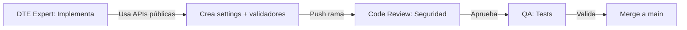

# PROMPT: Exponer Parámetros Críticos de DTE en Configuración

**PROYECTO:** SII DTE (Document Transmission Electronic)

**TÍTULO:** Exponer Parámetros Críticos de DTE en la Configuración de Empresa

---

## 1. Objetivo

Implementar configuración empresarial para parámetros críticos de DTE (redis_url, metrics_enabled, webhook_key) mediante interfaz `res.config.settings`, mejorando mantenibilidad, seguridad y cumplimiento SII.

**Objetivos específicos:**

1. Extender vistas `res.config.settings` con campos DTE configurable desde UI
2. Mapear campos a `ir.config_parameter` para persistencia segura
3. Validar parámetros antes de guardar (URLs válidas, claves seguras)
4. Garantizar accesibilidad desde código sin regresiones funcionales
5. Documentar flujo configuración y validaciones aplicadas

---

## 2. Alcance

### Incluye

- Extensión modelo `res.config.settings` con parámetros DTE
- Vistas XML: formulario Ajustes con sección DTE
- Validaciones: formato URLs, longitud claves, permisos acceso
- Persistencia `ir.config_parameter` segura (encrypted para claves)
- Tests unitarios: guardado/lectura parámetros, validaciones
- Documentación: guía configuración + especificación parámetros

### Fuera de Alcance

- Gestión certificados digitales (responsabilidad módulo separado)
- Validación conectividad real a Redis (solo validar URL)
- Configuración por documento (responsabilidad workflow)
- Encriptación base de datos (usar features Odoo nativas)

---

## 3. Entradas y Dependencias

### Archivos de Referencia

- `addons/localization/l10n_cl_dte/models/` (modelos DTE)
- `addons/localization/l10n_cl_dte/views/` (vistas existentes)
- Documentación Odoo 19 `res.config.settings` (framework oficial)
- `addons/localization/l10n_cl_dte/libs/sii_soap_client.py` (consumidor parámetros)

### Artefactos Relacionados

- `MASTER_PLAN_v2.md` → Fase 1 (Mes 1-2): DTE core infrastructure
- `MATRIZ_SII_CUMPLIMIENTO.md` → Requisitos regulatorios DTE
- `CLEAN_ROOM_PROTOCOL_OPERATIVO.md` → Seguridad parámetros críticos
- Docs oficiales SII sobre configuración DTE (si disponibles)

### Entorno Necesario

- Odoo 19 CE con módulos: base, l10n_cl_dte
- Docker compose configurado (desarrollo)
- Base de datos test con empresa base
- Acceso documentación Odoo 19 ir.config_parameter + res.config.settings

---

## 4. Tareas

### Fase 1: Análisis y Diseño (DTE Expert)

1. Revisar especificación `res.config.settings` Odoo 19 (framework oficial)
2. Analizar parámetros actuales: redis_url, metrics_enabled, webhook_key
3. Identificar requisitos validación: formatos, rangos, dependencias
4. Revisar CLEAN_ROOM_PROTOCOL_OPERATIVO.md § "Parámetros Críticos"
5. Diseñar schema: campos modelo, tipos datos, encriptación necesaria

### Fase 2: Implementación Modelo (DTE Expert)

6. Extender `res.config.settings` con campos DTE:
   - `l10n_cl_dte_redis_url` (Char, validar URL)
   - `l10n_cl_dte_metrics_enabled` (Boolean)
   - `l10n_cl_dte_webhook_key` (Char, longitud mínima 32)
7. Implementar property bindings a `ir.config_parameter`
8. Agregar validaciones: método `_validate_dte_params()`
9. Documentar mapeo campos → parámetros internos

### Fase 3: Implementación Vistas (DTE Expert)

10. Crear vista formulario `res.config.settings` con sección "Configuración DTE"
11. Organizar campos: Redis, Webhooks, Métricas
12. Agregar help text clarificador para cada campo
13. Implementar readonly para campos según permisos (solo admin DTE)

### Fase 4: Validaciones y Seguridad (DTE Expert)

14. Implementar validación URL redis:
    - Formato: redis://[usuario:pass@]host[:puerto]/[db]
    - Alerta si no es secure (redis:// vs rediss://)
15. Implementar validación webhook_key:
    - Longitud mínima 32 caracteres
    - Alerta si key débil (números solamente, etc.)
16. Implementar validación metrics_enabled:
    - Verificar compatibilidad con observabilidad stack
17. Agregar auditoría de cambios parámetros (logs)

### Fase 5: Integración y Tests (DTE Expert)

18. Validar lectura parámetros desde `sii_soap_client.py`
19. Crear fixtures test: parámetros válidos/inválidos
20. Implementar unit tests: guardado, lectura, validación
21. Ejecutar smoke tests: cambios parámetros sin errores
22. Validar no hay regresiones funcionalidad DTE existente

---

## 5. Entregables

| Archivo | Ubicación | Contenido |
|---------|-----------|-----------|
| `res_config_settings.py` | `addons/localization/l10n_cl_dte/models/` | Extensión modelo settings |
| `res_config_settings_views.xml` | `addons/localization/l10n_cl_dte/views/` | Formulario ajustes DTE |
| `dte_parameter_validators.py` | `addons/localization/l10n_cl_dte/models/` | Validadores parámetros |
| `test_dte_parameters.py` | `addons/localization/l10n_cl_dte/tests/` | Unit tests |
| `GUIA_CONFIGURACION_DTE.md` | `docs/dte/` | Guía usuario |

### Estructura Vistas XML

```xml
<?xml version="1.0" encoding="UTF-8"?>
<odoo>
  <data>
    <record id="res_config_settings_view_form_dte" model="ir.ui.view">
      <field name="name">Settings Form — DTE Configuration</field>
      <field name="model">res.config.settings</field>
      <field name="inherit_id" ref="base.res_config_settings_view_form"/>
      <field name="arch" type="xml">
        <xpath expr="//div[@id='security']" position="after">
          <div class="oe_edit_only" id="dte_config">
            <h2>Configuración DTE (Documento Tributario Electrónico)</h2>
            <div class="row">
              <div class="col-md-6">
                <label for="l10n_cl_dte_redis_url">URL Redis</label>
                <field name="l10n_cl_dte_redis_url" placeholder="redis://localhost:6379"/>
                <small>Conexión a servidor Redis para caché DTE (opcional)</small>
              </div>
              <div class="col-md-6">
                <label for="l10n_cl_dte_webhook_key">Webhook Key (Seguro)</label>
                <field name="l10n_cl_dte_webhook_key" password="True"/>
                <small>Clave mínimo 32 caracteres para validar webhooks SII</small>
              </div>
            </div>
            <div class="row">
              <div class="col-md-6">
                <field name="l10n_cl_dte_metrics_enabled" class="o_checkbox"/>
                <label for="l10n_cl_dte_metrics_enabled">Habilitar Métricas DTE</label>
                <small>Registrar métricas sobre emisión/recepción DTEs (impacto performance)</small>
              </div>
            </div>
          </div>
        </xpath>
      </field>
    </record>
  </data>
</odoo>
```

---

## 6. Criterios de Aceptación

| Criterio | Métrica | Umbral | Verificación |
|----------|---------|--------|--------------|
| **Campos Visibles** | % campos DTE en UI settings | 100% | Manual: verificar form |
| **Persistencia Datos** | Parámetros guardados en ir.config_parameter | Sí | Test lectura post-save |
| **Validación Redis URL** | URL válida guardada, inválida rechazada | Sí | Unit test validación |
| **Validación Webhook Key** | Key ≥32 chars guardada, <32 chars rechazada | Sí | Unit test validación |
| **Accesibilidad Código** | Parámetros legibles desde sii_soap_client.py | Sí | Test lectura parámetro |
| **No Regresiones** | Funcionalidad DTE existente sin cambios | Sí | Smoke test DTE workflow |
| **Auditoría Cambios** | Cambios parámetros registrados en logs | Sí | Verificar audit log |
| **Seguridad Clave** | Webhook key encriptada en DB | Sí | Inspeccionar DB |
| **Cobertura Tests** | % código parámetros cubierto por tests | ≥85% | Coverage report |

---

## 7. Pruebas

### 7.1 Pruebas Unitarias

**Test 1: Guardado Parámetros Valid**

```python
def test_dte_params_save_valid(self):
    # Setup: crear settings con parámetros válidos
    config = self.env['res.config.settings'].create({
        'l10n_cl_dte_redis_url': 'redis://localhost:6379',
        'l10n_cl_dte_webhook_key': 'a' * 32,
        'l10n_cl_dte_metrics_enabled': True,
    })
    config.execute()

    # Assert: parámetros guardados en ir.config_parameter
    self.assertEqual(
        self.env['ir.config_parameter'].get_param('l10n_cl_dte.redis_url'),
        'redis://localhost:6379'
    )
```

**Test 2: Validación Redis URL**

```python
def test_redis_url_validation(self):
    # Test inválido: URL malformada
    config = self.env['res.config.settings'].create({
        'l10n_cl_dte_redis_url': 'not_a_url',
    })
    with self.assertRaises(ValidationError):
        config.execute()

    # Test válido: URL correcta
    config.l10n_cl_dte_redis_url = 'redis://localhost:6379'
    config.execute()  # No error
```

**Test 3: Validación Webhook Key**

```python
def test_webhook_key_validation(self):
    # Test inválido: key muy corta
    config = self.env['res.config.settings'].create({
        'l10n_cl_dte_webhook_key': 'short',
    })
    with self.assertRaises(ValidationError):
        config.execute()

    # Test válido: key 32+ chars
    config.l10n_cl_dte_webhook_key = 'a' * 32
    config.execute()  # OK
```

**Test 4: Lectura Parámetros desde Código**

```python
def test_dte_param_read_from_code(self):
    # Setup: configurar parámetros
    config = self.env['res.config.settings'].create({
        'l10n_cl_dte_redis_url': 'redis://test:6379',
    })
    config.execute()

    # Assert: accesible desde sii_soap_client
    from addons.localization.l10n_cl_dte.libs.sii_soap_client import SiiSoapClient
    client = SiiSoapClient()
    self.assertEqual(client.redis_url, 'redis://test:6379')
```

### 7.2 Smoke Tests

**Test 5: Workflow DTE sin Regresiones**

- Emitir DTE (DTE 33) con parámetros configurados → sin error
- Recibir DTE webhook con webhook_key validado → sin error
- Métricas grabadas si metrics_enabled=True

### 7.3 Pruebas Seguridad

**Test 6: Webhook Key Encriptada**

- Leer directamente DB: webhook_key debe estar encrypted (no plaintext)

---

## 8. Clean-Room (Protocolo Legal)

### Roles y Restricciones

| Rol | Persona | Restricciones | Evidencia |
|-----|---------|---------------|-----------|
| **DTE Expert** | Developer | ✅ Implementación Odoo 19 nativo<br>✅ Uso API públicas res.config.settings | Commits rama |
| **Code Reviewer** | Senior Dev | ✅ Revisión seguridad parámetros<br>✅ Validación validadores | PR review |
| **QA Lead** | QA Engineer | ✅ Ejecución tests completa<br>✅ Validación seguridad | Test report |

### Secuencia Clean-Room



---

## 9. Riesgos y Mitigaciones

| ID | Riesgo | Probabilidad | Impacto | Severidad | Mitigación |
|----|--------|--------------|---------|-----------|------------|
| **R-DTE-01** | Webhook key expuesta en UI (password field fallido) | Baja (0.2) | Alto (4) | 0.8 | Usar password field + encriptación DB |
| **R-DTE-02** | Validación Redis URL insuficiente | Baja (0.2) | Medio (3) | 0.6 | Solo validar formato, no conectividad |
| **R-DTE-03** | Cambio parámetro quiebra DTE workflow | Baja (0.1) | Alto (4) | 0.4 | Smoke tests DTE post-cambio |
| **R-DTE-04** | Parámetros leídos desde cache stale | Baja (0.15) | Medio (3) | 0.45 | Invalidar cache post-save |

### Triggers de Decisión

- Si **R-DTE-01** ocurre: STOP merge, revisar encriptación
- Si **R-DTE-03** ocurre: Rollback parámetros, investigar

---

## 10. Trazabilidad

### Brecha que Cierra

| Brecha P1 | Artefacto que la cierra | Métrica Validación |
|-----------|------------------------|--------------------|
| Configuración DTE desde UI (Master Plan v2 § SII) | Formulario settings + ir.config_parameter | Tests PASS + manual UI validation |
| Seguridad parámetros críticos | Campos encriptados + validaciones | Security review + DB inspection |

### Relación con Master Plan v2

- **Fase 1 (Mes 1-2):** Hito SII — "Infraestructura DTE"
- **POC-5:** DTE Configuration UI → Validar usabilidad settings

### Referencias Cruzadas

- `MATRIZ_SII_CUMPLIMIENTO.md` → Requisitos SII parametrizables
- `CLEAN_ROOM_PROTOCOL_OPERATIVO.md` → Seguridad parámetros críticos
- `MASTER_PLAN_v2.md` → DTE core infrastructure

---

## 11. Governance y QA Gates

### Gates Aplicables

| Gate | Criterio | Status |
|------|----------|--------|
| **Gate-Seguridad** | Webhook key encriptada | Pending |
| **Gate-Validación** | Validadores implementados + tests PASS | Pending |
| **Gate-Persistencia** | Parámetros leíbles post-save desde código | Pending |
| **Gate-Regresión** | Smoke tests DTE PASS (sin regresiones) | Pending |

### Checklist Pre-Merge

- [ ] Campos DTE visibles en settings UI
- [ ] Unit tests ejecutados PASS
- [ ] Coverage ≥85%
- [ ] Validaciones Redis URL funcionan
- [ ] Validaciones Webhook Key funcionan
- [ ] Parámetros accesibles desde sii_soap_client.py
- [ ] Workflow DTE sin regresiones (smoke tests)
- [ ] Webhook key encriptada en DB
- [ ] Code review aprobado

---

## 12. Próximos Pasos

1. **Ejecución Implementation:** DTE Expert implementa modelo + vistas + validadores
2. **Code Review:** Senior Dev revisa PR (enfoque seguridad)
3. **QA Validation:** QA Lead ejecuta test suite completa + smoke tests DTE
4. **Security Review:** Verificar encriptación parámetros en DB
5. **Merge Main:** Integración rama feature
6. **POC-5 Kickoff:** Usar settings para configurar workflow DTE

---

## 13. Notas Adicionales

### Supuestos

- Odoo 19 soporta encriptación campos `ir.config_parameter`
- Redis opcional (parámetro puede ser vacío)
- Webhook key es crítico y debe ser seguro
- Metrics_enabled no tiene dependencias estrictas (puede ser toggle)

### Decisiones Técnicas

- **Encriptación:** Usar features Odoo nativas (ir.config_parameter con encrypted=True)
- **Validación:** Formato solamente (no conectividad real a Redis)
- **Auditoría:** Registrar cambios en ir.logging automáticamente

### Recursos Requeridos

- DTE Expert: 20 horas estimadas
- Code Reviewer: 4 horas
- QA Lead: 8 horas
- Total: 32 horas sprint P1

### Documentos de Referencia

- Odoo 19 docs: res.config.settings + ir.config_parameter
- Especificación webhook DTE SII (si disponible)
- CLEAN_ROOM_PROTOCOL_OPERATIVO.md

---

**Versión:** 1.0
**Estado:** Ready para ejecución
**Owner:** DTE Expert
**Aprobado por:** Tech Lead (2025-11-08)
