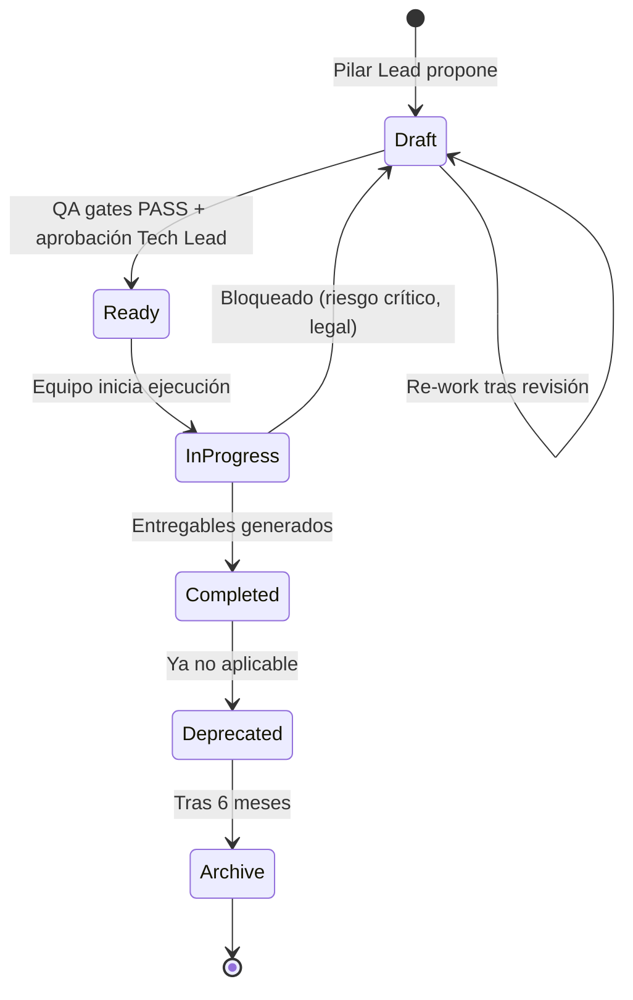

# Prompts Governance Policy — Política de Gobernanza

**Fecha:** 2025-11-08
**Versión:** 1.0
**Autor:** Tech Lead + PM
**Propósito:** Definir flujo de creación, actualización, aprobación y deprecación de prompts de desarrollo

---

## 1. Resumen Ejecutivo

Este documento establece la **política de gobernanza** para todos los prompts en `03_Prompts_Desarrollo/`, incluyendo:

- Roles y responsabilidades
- Flujo de ciclo de vida (creación → aprobación → ejecución → deprecación)
- QA Gates y criterios de aprobación
- Proceso de cambios y versionado
- Escalamiento y resolución conflictos

**Objetivo:** Asegurar que todos los prompts sean **completos, consistentes, trazables y legalmente conformes** antes de distribución a equipos ejecutores.

---

## 2. Roles y Responsabilidades

### 2.1 Tabla de Roles

| Rol | Responsabilidad | Autoridad | Ámbito |
|-----|-----------------|-----------|--------|
| **Tech Lead** | Diseño arquitectónico, coherencia técnica, aprobación final técnica | Aprobar/rechazar prompts técnicos (Phoenix, Quantum, DTE, Nómina) | Todos los pilares |
| **PM (Project Manager)** | Coordinación, cronograma, tracking, aprobación impacto presupuesto/tiempo | Aprobar/rechazar cambios que impacten cronograma o presupuesto | Global |
| **Legal Counsel** | Validación protocolo clean-room, aprobación legal | Aprobar/rechazar prompts con riesgo legal (OEEL-1 infraction) | Clean-room obligatorio |
| **QA Engineer** | Validación checklist QA, verificación lint/tests/criterios | Bloquear merge si QA gates fallan | Calidad |
| **Product Owner** | Priorización features, alineación negocio | Aprobar/rechazar prompts Business (estrategia) | Business pillar |
| **Pilar Lead** (Frontend/Backend/DTE/Payroll) | Creación/actualización prompts específicos pilar | Proponer prompts, ejecutar | Pilar específico |

### 2.2 Matriz RACI (Creación Prompt Nuevo)

| Actividad | Tech Lead | PM | Legal Counsel | QA Engineer | Pilar Lead | Product Owner |
|-----------|-----------|----|--------------| ------------|------------|---------------|
| **Proponer prompt** | C | I | - | - | R | C (si Business) |
| **Redactar borrador** | C | I | - | - | R/A | - |
| **Revisar técnica** | R/A | I | - | C | C | - |
| **Validar clean-room** | C | I | R/A | - | I | - |
| **Verificar QA gates** | I | I | - | R/A | I | - |
| **Aprobar presupuesto** | C | R/A | - | - | I | C (si Business) |
| **Merge a main** | A | C | C (si clean-room) | C (si QA PASS) | I | I |

**Leyenda RACI:**
- **R:** Responsible (ejecuta)
- **A:** Accountable (aprueba/rechaza)
- **C:** Consulted (consultado)
- **I:** Informed (informado)

---

## 3. Ciclo de Vida de Prompts

### 3.1 Estados Posibles

| Estado | Descripción | Owner | Siguiente Estado |
|--------|-------------|-------|------------------|
| **Draft** | Borrador en desarrollo, no completo | Pilar Lead | Ready |
| **Ready** | Completo, validado QA, esperando ejecución | Tech Lead + PM | In Progress |
| **In Progress** | En ejecución por equipo | Pilar Lead | Completed |
| **Completed** | Ejecutado, entregables generados | Pilar Lead | Deprecated (si ya no aplica) |
| **Deprecated** | No aplicable, reemplazado o ya ejecutado | Tech Lead | Archive (tras 6 meses) |
| **Archive** | Movido a carpeta histórica | PM | N/A |

### 3.2 Diagrama de Estados



---

## 4. Flujo de Creación de Prompt Nuevo

### 4.1 Proceso (9 pasos)

#### Paso 1: Propuesta Inicial

**Owner:** Pilar Lead (ej. Frontend Lead para Phoenix)

**Acciones:**
1. Identificar gap/feature que requiere prompt
2. Crear issue en GitHub: `[PROMPT] Nuevo - <Título>` (ejemplo: `[PROMPT] Nuevo - PHOENIX-02 Implementación Componentes OWL`)
3. Justificar necesidad (qué brecha cierra, relación Master Plan v2)
4. Estimar esfuerzo (horas)

**Entregable:** Issue GitHub con etiqueta `prompt-proposal`

---

#### Paso 2: Aprobación Preliminar

**Owner:** PM + Tech Lead

**Acciones:**
1. PM valida alineación roadmap + presupuesto
2. Tech Lead valida coherencia arquitectónica
3. Decisión: **Aprobar** (→ Paso 3) / **Rechazar** (cerrar issue) / **Diferir** (backlog P2)

**Entregable:** Comentario en issue con decisión

---

#### Paso 3: Redacción Borrador

**Owner:** Pilar Lead

**Acciones:**
1. Copiar plantilla de `01_PHOENIX_01_Analisis_Tecnico_Theme.md`
2. Actualizar front matter YAML (id único, pilar, fase, owner, fecha)
3. Completar 13 secciones según `CHECKLIST_QA_PROMPTS.md`
4. Crear PR: `[PROMPT-DRAFT] <ID> <Título>` (ejemplo: `[PROMPT-DRAFT] PHOENIX-02 Implementación Componentes`)

**Entregable:** PR en estado **Draft** con archivo `.md` completo

---

#### Paso 4: Auto-Validación QA

**Owner:** Pilar Lead

**Acciones:**
1. Ejecutar scripts validación:

```bash
./scripts/validate_front_matter.sh <archivo>.md
./scripts/validate_structure.sh <archivo>.md
./scripts/validate_lint.sh <archivo>.md
./scripts/validate_links.sh <archivo>.md
```

2. Corregir errores hasta 0 failures
3. Marcar PR como **Ready for Review**

**Entregable:** PR con checks CI ✅ (lint PASS, estructura PASS, etc.)

---

#### Paso 5: Revisión Técnica

**Owner:** Tech Lead

**Acciones:**
1. Revisar secciones técnicas (3, 4, 5, 6, 7):
   - Entradas y dependencias correctas
   - Tareas granulares y secuenciales
   - Criterios cuantitativos medibles (no cualitativos)
   - Pruebas específicas con datasets
2. Verificar trazabilidad a Master Plan v2 y artefactos relacionados
3. Comentar feedback en PR (si requiere cambios → Pilar Lead re-work)
4. Aprobar técnicamente: `LGTM - Aprobado técnicamente`

**Entregable:** Aprobación Tech Lead en PR

---

#### Paso 6: Revisión Legal (si Clean-Room aplica)

**Owner:** Legal Counsel

**Aplicable:** Prompts con sección 8 (Clean-Room) que acceden a código Enterprise

**Acciones:**
1. Revisar sección Clean-Room:
   - Roles claramente separados (Equipo A vs B)
   - Restricciones explícitas ("NO copiar...", "NO acceder...")
   - Evidencias requeridas (hash SHA-256, auditoría, screenshots anonimizados)
2. Validar que no se solicita copia literal código Enterprise
3. Aprobar: `LGTM - Aprobado legal (clean-room conforme)` o Rechazar: `Legal BLOCK - Riesgo infracción OEEL-1`

**Entregable:** Aprobación Legal Counsel en PR (o bloqueo)

---

#### Paso 7: Revisión QA

**Owner:** QA Engineer

**Acciones:**
1. Ejecutar checklist `CHECKLIST_QA_PROMPTS.md`:
   - ✅ Front matter YAML válido (8 campos)
   - ✅ 13 secciones completas
   - ✅ ≥3 criterios cuantitativos
   - ✅ ≥3 tests definidos
   - ✅ Clean-room completo (si aplica)
   - ✅ ≥3 riesgos identificados
   - ✅ Trazabilidad Master Plan
   - ✅ Markdown lint PASS
2. Aprobar: `QA PASS - Todos los gates ✅` o Rechazar: `QA FAIL - Ver checklist`

**Entregable:** Aprobación QA Engineer en PR

---

#### Paso 8: Aprobación Final y Merge

**Owner:** PM

**Requisitos para Merge:**
- ✅ Aprobación Tech Lead
- ✅ Aprobación Legal Counsel (si clean-room aplica)
- ✅ Aprobación QA Engineer (QA PASS)
- ✅ CI checks ✅ (lint, estructura, enlaces)
- ✅ Actualización `INDEX.md` incluida en PR

**Acciones:**
1. PM revisa aprobaciones
2. Merge PR a `main`
3. Actualizar estado en issue original: `Prompt Ready - Esperando ejecución`
4. Asignar a Pilar Lead para ejecución

**Entregable:** Prompt en `main` con estado `Ready` en front matter

---

#### Paso 9: Tracking Post-Merge

**Owner:** PM

**Acciones:**
1. Añadir prompt a dashboard Kanban (columna "Ready")
2. Planificar ejecución en próximo sprint
3. Notificar a equipo ejecutor (Pilar Lead + desarrolladores asignados)

**Entregable:** Kanban actualizado, notificación Slack/email

---

### 4.2 Tiempos Estimados (SLA)

| Paso | Owner | SLA (días laborales) | Acumulado |
|------|-------|----------------------|-----------|
| 1. Propuesta | Pilar Lead | 1 | 1d |
| 2. Aprobación preliminar | PM + Tech Lead | 2 | 3d |
| 3. Redacción borrador | Pilar Lead | 3-5 | 6-8d |
| 4. Auto-validación QA | Pilar Lead | 1 | 7-9d |
| 5. Revisión técnica | Tech Lead | 2 | 9-11d |
| 6. Revisión legal | Legal Counsel | 3 (si aplica) | 12-14d |
| 7. Revisión QA | QA Engineer | 1 | 13-15d |
| 8. Aprobación final | PM | 1 | 14-16d |
| 9. Tracking | PM | 0.5 | 14.5-16.5d |

**Total:** 2-3 semanas (10-16 días laborales) desde propuesta hasta prompt Ready.

---

## 5. Flujo de Actualización de Prompt Existente

### 5.1 Trigger de Actualización

**Cuándo actualizar:**
1. Cambio requisitos (ej. SII actualiza formato LRE)
2. Error detectado en criterios aceptación
3. Feedback post-ejecución (Pilar Lead reporta ambigüedades)
4. Cambio arquitectónico (ej. OWL 2 → OWL 3 en Odoo 20)

### 5.2 Proceso Actualización (Simplificado)

#### Paso 1: Propuesta Cambio

**Owner:** Pilar Lead o QA Engineer

**Acciones:**
1. Crear issue: `[PROMPT-UPDATE] <ID> - <Motivo>` (ejemplo: `[PROMPT-UPDATE] NOMINA-02 - Formato LRE 2026 DT`)
2. Justificar cambio (qué sección cambia, por qué)

**Entregable:** Issue con etiqueta `prompt-update`

---

#### Paso 2: Impacto y Aprobación

**Owner:** PM + Tech Lead

**Acciones:**
1. Evaluar impacto:
   - **Menor** (typo, clarificación): Solo Tech Lead aprueba
   - **Moderado** (criterios, tests): Tech Lead + QA aprueba
   - **Mayor** (cambio tareas, presupuesto): Tech Lead + PM + Legal aprueba
2. Decisión: Aprobar / Rechazar / Diferir

**Entregable:** Comentario issue con decisión + severidad

---

#### Paso 3: Actualización

**Owner:** Pilar Lead

**Acciones:**
1. Crear PR: `[PROMPT-UPDATE] <ID> v<X.Y>` (incrementar version en front matter)
2. Actualizar secciones afectadas
3. Actualizar `PROMPTS_DELTA_CHANGES.md` (nueva sección con cambios)
4. Ejecutar validación QA (scripts)

**Entregable:** PR con cambios + delta documentado

---

#### Paso 4: Revisiones y Merge

**Owner:** Según severidad

**Revisiones:**
- **Menor:** Solo Tech Lead
- **Moderado:** Tech Lead + QA
- **Mayor:** Tech Lead + QA + Legal + PM

**Merge:** PM aprueba tras revisiones completas

---

### 5.3 Versionado

**Semántico simple:**
- **X.0 (Major):** Cambio estructural significativo (nueva sección, cambio pilar, cambio fase)
- **X.Y (Minor):** Cambio moderado (criterios, tests, riesgos, tareas)

**Ejemplo:**
- v1.0 → v1.1 (añadir 2 tests nuevos)
- v1.1 → v2.0 (cambio de fase P1 → P0, re-estructuración tareas)

---

## 6. QA Gates y Criterios de Aprobación

### 6.1 Gates Obligatorios (4)

| Gate | Trigger | Owner | Criterio PASS | Acción FAIL |
|------|---------|-------|---------------|-------------|
| **Gate-Legal** | Prompts con clean-room | Legal Counsel | 0% contaminación código Enterprise, protocolo completo | BLOCK hasta aprobación legal |
| **Gate-Calidad** | Todos los prompts | QA Engineer | Markdown lint PASS, ≥3 criterios cuantitativos, ≥3 tests | Re-work Pilar Lead |
| **Gate-Docs** | Todos los prompts | Tech Writer / PM | Enlaces relativos válidos, INDEX.md actualizado | Re-work Pilar Lead |
| **Gate-Técnico** | Prompts con implementación código | Tech Lead | Arquitectura coherente, dependencias resueltas, datasets especificados | Re-work o re-diseño |

### 6.2 Criterios Aprobación por Rol

#### Tech Lead

**Aprueba si:**
- Arquitectura coherente con Master Plan v2 y stack Odoo 19
- Tareas secuenciales y granulares (no ambiguas)
- Criterios cuantitativos medibles (no cualitativos)
- Dependencias identificadas y resueltas
- Entregables claros (archivos, estructura, contenido)

**Rechaza si:**
- Riesgo técnico alto sin mitigación (ej. performance targets inalcanzables)
- Falta trazabilidad a artefactos críticos (POCS_PLAN, DATASET_SINTETICO_SPEC, etc.)
- Criterios vagos ("funciona bien", "se ve bien")

---

#### Legal Counsel

**Aprueba si:**
- Protocolo clean-room completo (roles, restricciones, secuencia, evidencias)
- No solicita copia literal código Enterprise
- Evidencias trazables (hash SHA-256, auditoría legal, screenshots anonimizados)

**Rechaza si:**
- Riesgo infracción licencia OEEL-1 >10%
- Falta separación Equipo A (Analista) vs Equipo B (Desarrollador)
- Ausencia auditoría legal en entregables

---

#### QA Engineer

**Aprueba si:**
- Checklist `CHECKLIST_QA_PROMPTS.md` 100% PASS
- Markdown lint 0 errores
- ≥3 criterios cuantitativos con umbrales numéricos
- ≥3 tests con datasets especificados

**Rechaza si:**
- Lint errors >0
- Criterios cualitativos ("aceptable", "correcto", "bien")
- Tests sin datasets o thresholds

---

#### PM

**Aprueba si:**
- Estimación horas coherente con presupuesto
- No impacta cronograma crítico sin justificación
- Priorización (P0/P1/P2) alineada con roadmap
- Todas las aprobaciones técnicas/legal/QA completas

**Rechaza si:**
- Sobrecosto >10% sin contingencia
- Delay cronograma >1 semana sin mitigación
- Falta aprobación crítica (ej. Legal en clean-room)

---

## 7. Escalamiento y Resolución Conflictos

### 7.1 Conflictos Comunes

| Conflicto | Ejemplo | Escalamiento |
|-----------|---------|--------------|
| **Técnico vs Presupuesto** | Tech Lead requiere PoC 2 semanas, PM solo aprueba 1 | Escalate a CTO + CFO |
| **Legal vs Timeline** | Legal Counsel requiere auditoría externa 30 días, PM necesita 15 | Escalate a CEO + Legal Counsel externo |
| **Calidad vs Velocidad** | QA rechaza por lint errors, Pilar Lead requiere urgencia | Tech Lead media, decisión final QA (calidad no negociable) |
| **Pilar Lead vs Tech Lead** | Desacuerdo arquitectónico (AbstractModel vs account.report extension) | Tech Lead decide, Pilar Lead documenta desacuerdo en Notas Adicionales |

### 7.2 Matriz de Escalamiento

| Nivel | Stakeholders | Autoridad | Timeframe |
|-------|--------------|-----------|-----------|
| **Nivel 1** | Pilar Lead + QA | QA Engineer decide | 1 día |
| **Nivel 2** | Tech Lead + PM | Tech Lead decide técnico, PM decide presupuesto | 3 días |
| **Nivel 3** | CTO + CFO | CTO decide técnico estratégico, CFO decide financiero | 5 días |
| **Nivel 4** | CEO + Comité Ejecutivo | CEO decisión final | 10 días |

---

## 8. Deprecación y Archivado

### 8.1 Cuándo Deprecar

**Trigger:**
1. Prompt ya ejecutado y entregables generados (ej. MASTER_PLAN_IMPROVEMENT_PROMPT.md → generó MASTER_PLAN_v2.md)
2. Prompt obsoleto por cambio tecnológico (ej. Odoo 19 → Odoo 20)
3. Prompt reemplazado por nuevo prompt más específico

### 8.2 Proceso Deprecación

#### Paso 1: Marcar Deprecated

**Owner:** Tech Lead o PM

**Acciones:**
1. Actualizar front matter: `estado: Deprecated`
2. Añadir nota al inicio del archivo:

```markdown
> **⚠️ DEPRECATED:** Este prompt fue ejecutado exitosamente el [fecha]. Resultado: [artefacto generado]. Se mantiene como referencia histórica. No ejecutar nuevamente.
```

3. Actualizar `INDEX.md`: estado = Deprecated

---

#### Paso 2: Notificación

**Owner:** PM

**Acciones:**
1. Notificar equipo vía Slack/email: "Prompt <ID> deprecated, ver [artefacto generado] para resultado"
2. Actualizar dashboard Kanban (mover a columna "Deprecated")

---

#### Paso 3: Archivado (tras 6 meses)

**Owner:** PM

**Acciones:**
1. Mover archivo a `03_Prompts_Desarrollo/archive/YYYY/`
2. Actualizar `INDEX.md`: eliminar entrada (mantener en `ARCHIVE_INDEX.md`)
3. Git commit: `archive: <ID> - Deprecated >6 meses`

---

## 9. Métricas y Reporting

### 9.1 KPIs de Gobernanza

| KPI | Métrica | Target | Frecuencia |
|-----|---------|--------|------------|
| **Tiempo Aprobación** | Días promedio propuesta → Ready | <16 días | Mensual |
| **QA Pass Rate** | % prompts PASS primera revisión | ≥80% | Sprint |
| **Legal Blocks** | Número bloqueos legales | <2/trimestre | Trimestral |
| **Deprecated Rate** | % prompts deprecated vs ejecutados | ≥90% (ejecutados completados) | Trimestral |
| **Actualización Frecuencia** | Promedio actualizaciones por prompt | <2/año | Anual |

### 9.2 Dashboard

**Tool:** Jira / GitHub Projects / Notion

**Columnas Kanban:**
1. Backlog (propuestas)
2. Draft (en redacción)
3. Review (en revisión Tech/Legal/QA)
4. Ready (aprobado, esperando ejecución)
5. In Progress (en ejecución)
6. Completed (ejecutado)
7. Deprecated (obsoleto)

**Filtros:**
- Por pilar (Phoenix, Quantum, SII, Nómina, Business)
- Por fase (P0, P1, P2)
- Por owner (Frontend Lead, Backend Lead, etc.)

---

## 10. Plantilla de Comunicación

### 10.1 Notificación Nuevo Prompt Ready

**Canal:** Slack #prompts-development + Email equipo

**Plantilla:**

```markdown
🎯 **Nuevo Prompt Ready para Ejecución**

**ID:** PHOENIX-02-COMPONENTES-OWL
**Pilar:** Phoenix
**Fase:** P0
**Owner:** Frontend Lead
**Estimación:** 60 horas
**Prioridad:** Alta (bloqueante POC-1)

**Descripción:** Implementación componentes OWL UI (menú apps, barra superior, navegación móvil)

**Relaciones:**
- Depende de: PHOENIX-01 (análisis completo)
- Bloquea: POC-1 (Phoenix UI Base)
- Contribuye a: Master Plan v2 Fase 1 "La Nueva Cara"

**Próximos Pasos:**
1. Frontend Lead asigna desarrolladores (2 FTE)
2. Kick-off planning viernes 10:00 (Zoom)
3. Target inicio: lunes próximo (Sprint 5)

**Enlaces:**
- Prompt: [03_Prompts_Desarrollo/02_PHOENIX_02_Componentes_OWL.md]
- Issue: [#234]
- Master Plan v2: [§3.1 Proyecto Phoenix]

cc: @frontend-lead @tech-lead @pm
```

---

### 10.2 Notificación Prompt Deprecated

**Canal:** Slack #prompts-development

**Plantilla:**

```markdown
📦 **Prompt Deprecated**

**ID:** MASTER_PLAN_IMPROVEMENT_PROMPT
**Motivo:** Ejecutado exitosamente el 2025-11-08
**Resultado:** [MASTER_PLAN_ODOO19_CE_PRO_v2.md](link)

**Acción Requerida:** NINGUNA (informativo)

**Nota:** El prompt se mantiene en repositorio como referencia histórica. No ejecutar nuevamente. Consultar MASTER_PLAN_v2.md para plan actualizado.

**Archivado:** Programado para 2025-05-08 (6 meses)
```

---

## 11. Anexos

### 11.1 Checklist Rápido Creación Prompt

```markdown
# Pre-Flight Checklist Nuevo Prompt

- [ ] Issue GitHub creado con etiqueta `prompt-proposal`
- [ ] Aprobación preliminar PM + Tech Lead
- [ ] Archivo `.md` creado desde plantilla
- [ ] Front matter YAML completo (8 campos)
- [ ] 13 secciones completadas
- [ ] ≥3 criterios cuantitativos
- [ ] ≥3 tests definidos
- [ ] Clean-room protocolo (si aplica)
- [ ] ≥3 riesgos identificados
- [ ] Trazabilidad Master Plan v2
- [ ] Scripts validación ejecutados (0 errors)
- [ ] PR creado con estado Ready for Review
- [ ] Revisiones completadas (Tech, Legal, QA)
- [ ] INDEX.md actualizado
- [ ] Merge a main completado
```

---

### 11.2 Plantilla Issue GitHub

**Título:** `[PROMPT] Nuevo - <Título Descriptivo>`

**Body:**

```markdown
## Propuesta Nuevo Prompt

**ID Propuesto:** <PILAR>-<NUM>-<ETIQUETA>
**Pilar:** Phoenix | Quantum | SII | Nómina | Business | Global
**Fase:** P0 | P1 | P2
**Owner:** <Rol>

### Justificación

**Brecha que cierra:** <Descripción gap identificado>
**Relación Master Plan v2:** <Sección específica>
**Artefactos relacionados:** <Enlaces a POCS_PLAN, MATRIZ_SII, etc.>

### Estimación

**Horas desarrollo:** <X horas>
**Timeframe:** <Semanas>
**Recursos:** <N FTE>

### Impacto

**Bloquea:** <Otros prompts/PoCs que dependen de este>
**Prioridad:** Alta | Media | Baja
**Riesgos:** <Riesgos identificados preliminarmente>

### Checklist

- [ ] Aprobación preliminar PM
- [ ] Aprobación preliminar Tech Lead
- [ ] Presupuesto disponible
- [ ] Equipo asignado

cc: @pm @tech-lead
```

---

## 12. Control de Versiones

| Versión | Fecha | Autor | Cambios |
|---------|-------|-------|---------|
| 1.0 | 2025-11-08 | Tech Lead + PM | Creación inicial política gobernanza |

---

## 13. Aprobaciones Requeridas

| Stakeholder | Rol | Aprobación | Fecha | Firma |
|-------------|-----|------------|-------|-------|
| **Tech Lead** | Arquitectura | ✅ Política técnica aprobada | _______ | _______ |
| **PM** | Coordinación | ✅ Flujos y SLA aprobados | _______ | _______ |
| **Legal Counsel** | Compliance | ✅ Protocolo legal aprobado | _______ | _______ |
| **QA Engineer** | Calidad | ✅ QA gates aprobados | _______ | _______ |
| **CTO** | Sponsor | ✅ Política global aprobada | _______ | _______ |

---

**Estado:** ✅ Política de Gobernanza Prompts v1.0 LISTA
**Próxima Revisión:** Post-ejecución Sprint 0 (POC-1, POC-2, POC-3) o +6 meses
**Vigencia:** Desde 2025-11-08 hasta revisión o actualización formal
